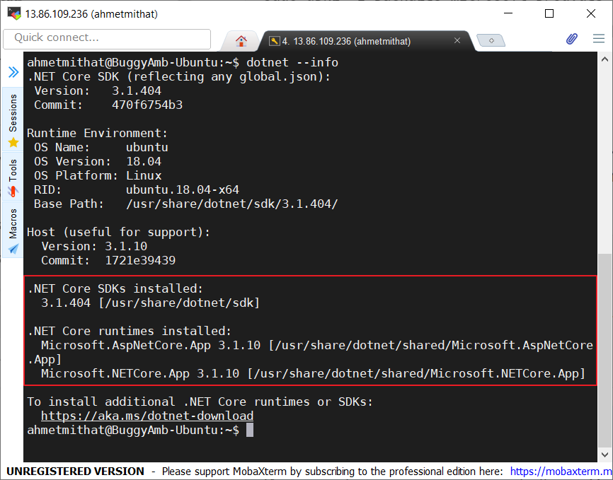
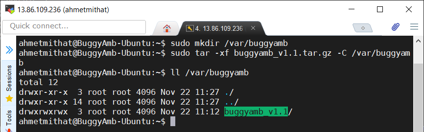
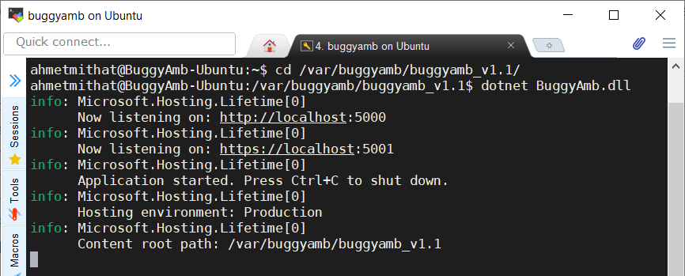
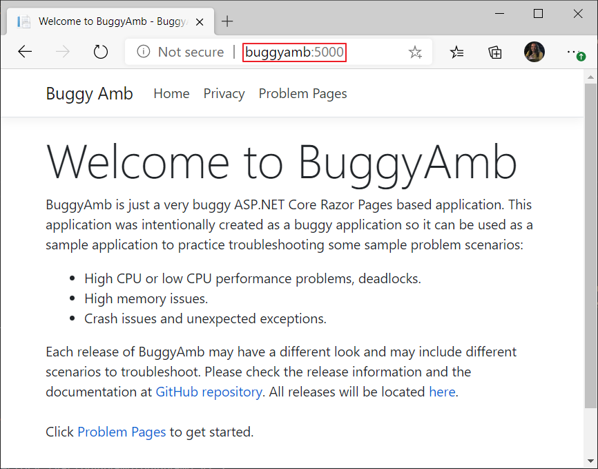
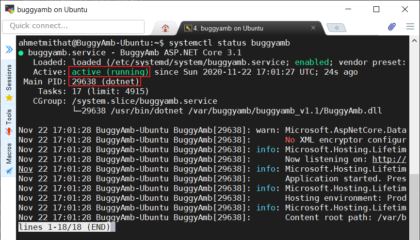
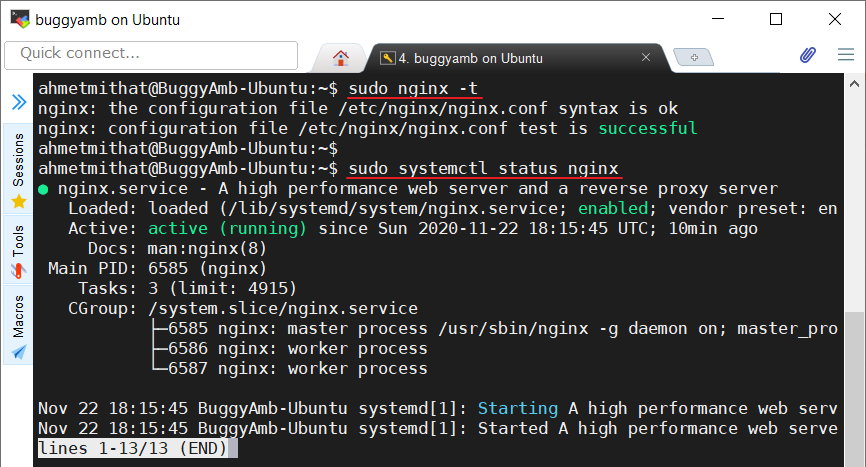
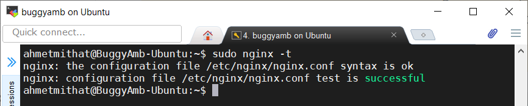
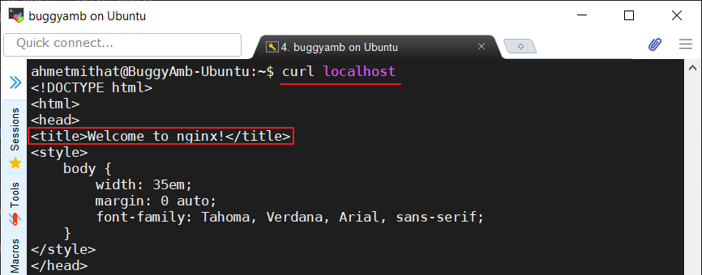
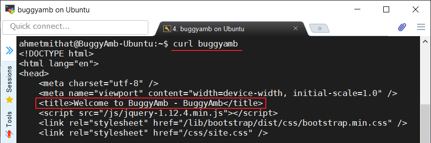

<h1>Linux Installation Instructions</h1>

* <a href="#net-core-version">.NET Core version</a>
* <a href="#how-to-run-buggyamb">How to run BuggyAmb</a>
    * <a href="#running-buggyamb-as-a-standalone-application-no-web-server-is-needed">Running BuggyAmb as a standalone application (no web server is needed)</a>
    * <a href="#running-buggyamb-behind-a-web-server-nginx-apache)">Running BuggyAmb behind a web server (Nginx or Apache)</a>

<h2>.NET Core version</h2>

BuggyAmb is an ASP.NET Core <b>framework-dependent</b> application so it means that the correct version of ASP.NET Core runtime should be installed on your machine.

The main reason for not publishing BuggyAmb as a self-contained application is simple: the size of the package will be much higher than the framework-dependent one when it is deployed as self-contained application because the required .NET Core libraries will also be included in the deployment package. If you want to deploy BuggyAmb as a self-contained application then you can download the source code and publish like that.

Please check the release information to find out which .NET Core version is required to run that release. The initial release of BuggyAmb is an ASP.NET Core 3.1 application so you will need .NET Core 3.1 runtime or SDK. You can run the following command on a terminal to see which versions are installed on your machine:

```dotnet --info```

If you don't have ASP.NET Core 3.1 runtime or SDK on your machine then you can find the installation instructions for different Linux distributions in this page: https://docs.microsoft.com/en-us/dotnet/core/install/linux

I have installed the .NET Core 3.1 SDK on Ubuntu 18.04 by following the instructions on https://docs.microsoft.com/en-us/dotnet/core/install/linux-ubuntu#1804 and replacing the dotnet-sdk-5.0 with dotnet-sdk-3.1:

```
sudo apt-get update;
sudo apt-get install -y apt-transport-https &&
sudo apt-get update &&
sudo apt-get install -y <b>dotnet-sdk-3.1</b>
```

And here is the ```dotnet --info``` output:



<h2>Downloading the BuggyAmb in Linux</h2>

Simply you can run the following <b>wget</b> command to download BuggyAmb bits on your Linux machine:

```wget https://github.com/ahmetmithat/buggyamb/releases/download/v1.1/buggyamb_v1.1.tar.gz```

Note that the command above downloads the first release of BuggyAmb and actually as of now it is the only release available :smiley:

After the BuggyAmb is downloaded you need to extract the tar.gz file. The file should be downloaded in the current folder you are in when running the <b>wget</b> command and now you need to use <b>tar</b> to extract the file. I chose extracting the all releases under <b>/var/buggyamb</b> directory so I use the following command to extract:

```
sudo mkdir /var/buggyamb
sudo tar -xf buggyamb_v1.1.tar.gz -C /var/buggyamb
```

The <b>buggyamb_v1.1</b> folder should have been created under <b>/var/buggyamb</b>:



<h2>How to run BuggyAmb</h2>

The first release of BuggyAmb runs over HTTP. If you need to configure it to run on HTTPS then you can download the source code and make the necessary changes based on your needs. 

You need to run BuggyAmb as a standalone application in Linux, there is no "in-process" hosting model for ASP.NET Core applications in Linux unlike what IIS offers when run on Windows.

To run BuggyAmb on Linux:

* Change directory to where BuggyAmb is extracted. In my case I change the directory to <b>/var/buggyamb/buggyamb_v1.1</b>
* And run the following command: ```dotnet BuggyAmb.dll```

You should see that the application is listening on port 5000 for HTTP requests:



Now you can test if it works. Open a browser and make a request to BuggyAmb, you should see the BuggyAmb Welcome Page:



Needless to say, "buggyamb" hostname resolves the IP address of my Linux machine and the port 5000 is the port where BuggyAmb listens on.

>This should be enough to get started with troubleshooting. You can start playing around problem scenarios and troubleshoot it. For a quick guide for the problematic scenarios and some troubleshooting tips, you can visit the <a href="quick_tour.md">quick tour</a>.

<h2>Ensuring BuggyAmb runs always</h2>

So far, if you are able to access the home page of BuggyAmb, then you are ready to start with troubleshooting. However if you restart the Linux machine or BuggyAmb crashes (and believe it is a buggy application and it crashes a lot), then you should start it manually by running the ```dotnet BuggyAmb.dll``` command. In a real world scenario you want applications to start automatically after a crash or reboot.

If you host an ASP.NET Core application on IIS, either in-process or out-process, IIS manages the process startups. In Linux, you can use <b>systemd</b> to manage the same. As described in https://docs.microsoft.com/en-us/aspnet/core/host-and-deploy/linux-nginx?view=aspnetcore-3.1;

 >systemd is an init system that provides many powerful features for starting, stopping, and managing processes.

<b>systemd</b> will use a service/unit file to manage an application. This is similar to the service concept in Windows and is called <b>daemons</b> in Linux world. The unit files are located in <b>/etc/systemd/system</b> directory.

Here is a sample Unit file that you can use:

```
[Unit]
Description=BuggyAmb ASP.NET Core 3.1

[Service]
WorkingDirectory=/var/buggyamb/buggyamb_v1.1
ExecStart= /usr/bin/dotnet /var/buggyamb/buggyamb_v1.1/BuggyAmb.dll
Restart=always
# Restart service after 10 seconds if the dotnet service crashes:
RestartSec=10
KillSignal=SIGINT
SyslogIdentifier=BuggyAmb
User=www-data
Environment=ASPNETCORE_ENVIRONMENT=Production

[Install]
WantedBy=multi-user.targe
```

Just create a <b>buggyamb.service</b> file in <b>/etc/systemd/system</b> directory, copy and paste the lines above in that file. You can use your favorite text editor, such as <b>nano</b> or <b>vi</b>, e.g.: ```sudo vi /etc/systemd/system/buggyamb.service```

Once you create the unit file, reload the daemon configurations so the system knows about this service:

```sudo systemctl daemon-reload```

Now you are ready to enable the service, start and check if it is running. Enabling a service means that the systemd will be aware of this service so it can be started once the machine is rebooted or the process is crashed. To enable the buggyamb service run this command:

```sudo systemctl enable buggyamb```

Enabling a service does not start it, so you need to start it now - don't worry you won't need to run this command once again unless you explicitly stop the service:

```sudo systemctl start buggyamb```

Now check if the service is started:

```sudo systemctl status buggyamb```

You should see the service is <b>active (running)</b>:



The process ID is an important information here because you will need that PID when you trobleshoot BuggyAmb application. You can get the same process ID using other tools like <b>top</b> or <b>htop</b> easily.

>If you are having problem with running the service, please make sure the unit file is correct. You should update <b>WorkingDirectory</b> and <b>ExecStart</b> parameters accordingly if you run the BuggyAmb in a directory other than <b>/var/buggyamb/buggyamb_v1.1</b>. If those are correct but it still does not correct than you may want to check the "journal" logs by running this command: <b>sudo journalctl -fu buggyamb.service</b>

Now BuggyAmb is ready to restart if it crashes or if the machine is rebooted.

<h2>Getting rid of port 5000 - running BuggyAmb behind Nginx</h2>

If you are not like "enough, I am done!" yet, there are some other things to do if you want.

Just like the previous "Ensuring BuggyAmb runs always" section, this one is not a requirement to get started, but...But, if you are like me you will probably want an environment as close to a real-world scenario as possible, and that port number at the hostname (:5000) will bother you: why not making requests like http://buggybits/Problem instead of http://buggybits:5000/Problem, right?

The idea is very simple, Nginx will listen on port 80 and act as a reverse proxy server, and it will send the requests to the BuggyAmb application which listens on port 5000. So, our lovely clients won't have to remember that port number and instead they will just use the hostname. Lovely.

This article explains how you can configure Nginx as a reverse proxy server: https://docs.microsoft.com/en-us/aspnet/core/host-and-deploy/linux-nginx?view=aspnetcore-3.1.

Let's quickly go through the steps:

<b>Installing Nginx</b>

Run the following command to install Nginx:

```sudo apt-get install nginx```

After the installation is completed, make sure that the Nginx works correctly:



> If it is not started you can try ```sudo systemctl start nginx``` or ```sudo service nginx start```. If you are still having trouble installing and running Nginx, please visit the official Nginx installation page: https://www.nginx.com/resources/wiki/start/topics/tutorials/install/

<b>Configuring Nginx to route the requests to BuggyAmb</b>

Nginx is a powerful web server and can be configured to act as a reverse proxy. We can add a "server" block to the configuration file to just tell the Nginx to route the requests to the BuggyAmb application which runs on http://localhost:5000. Following sample routes the requests made to http://buggyamb to http://localhost:5000:

```
server {
    listen        80;
    server_name   buggyamb;
    location / {
        proxy_pass         http://localhost:5000;
        proxy_http_version 1.1;
        proxy_set_header   Upgrade $http_upgrade;
        proxy_set_header   Connection keep-alive;
        proxy_set_header   Host $host;
        proxy_cache_bypass $http_upgrade;
        proxy_set_header   X-Forwarded-For $proxy_add_x_forwarded_for;
        proxy_set_header   X-Forwarded-Proto $scheme;
    }
}
```
 >Of course the <b>buggyamb</b> hostname should resolve to the IP address of the Linux machine on your client machine. You can simply add the <b>buggyamb</b> in the client's hosts file, or, if you have a DNS server you can update it there.
 
 Just open the ```/etc/nginx/sites-available/default``` file and add the server block above. After saving the changes, make sure that the Nginx configuration is correct by running ```sudo nginx -t``` command. You should see "configuration test is successfull" message: 



>If you are seeing an error then you probably made a mistake when adding the server block in previous step. Roll back from the configuration backup of Nginx and try again (what? you didn't take a backup before configuration change? You didn't take it because I didn't tell you take it? You are so brave, always take a backup before making an important change - luckily this should not be too difficult to fix :smiley:).

Once the Nginx is configured correctly, let the Nginx to read the configuration changes by running ```sudo nginx -s reload``` command.

<h2>Testing</h2> 

You configured Nginx and it is time for a test. First test I'd recommend would be to make a connection test using <code>curl</code> directly on the Linux server. The goal with this test is to make sure that everything works fine locally.

>curl just makes an HTTP get request to the destination and it just shows the result in plain text. So it should show the HTML output of the response.

 The first thing you need to configure is the hosts file so the <b>buggyamb</b> hostname resolves to <b>127.0.0.1</b>. Add <b>buggyamb</b> in ```/etc/hosts``` file so it resolves to 127.0.0.1. You can use <b>vi</b> or <b>nano</b> again.

Then run ```curl localhost``` command. Nginx should get the request and show its welcome page because we configured Nginx to route the requests to BuggyAmb if only the hostname is <b>buggyamb</b> and this request is not made to <b>buggyamb</b>, it is made to <b>localhost</b>:



Now run ```curl buggyamb``` command.  This time we make the request with <b>buggyamb</b> hostname so if Nginx is configured correctly, it should route the request to the BuggyAmb application running on port 5000. You should see the HTML of BuggyAmb Welcome Page:



>All working? Good. If not working, I'd recommend you to go through the steps above once again, you may be missing something very simple. There are really great articles on the Internet, if you cannot solve it, search for the resolution. Good searcing skills are very useful when troubleshooting problems. If you still cannot find your answer feel free to ask your questions here in the comments, keep in mind that asking questions is one of the necessary steps for troubleshooting. Don't be shy to ask questions.

If everything is working fine, then try to access BuggyAmb from your client machine. If you cannot get the page and instead you get "page cannot be displayed" or a similar error, it may be either a name resolution or a local firewall problem. I would recommend you to make sure <b>buggyamb</b> hostname is resolving to the IP address of your Linux machine first. If it is correct then go with the next step to configure local firewall to allow HTTP requests coming from remote machines.

<h3>Configuring Linux firewall</h3>

```iptables``` could be blocking the HTTP requests. Configuring iptables could be an easy task for most of the Linux admins but I am not a Linux expert and I found it a bit difficult, so, I prefer to use <a href="https://firewalld.org/">firewalld</a>. It makes it very easy to configure the local firewall with permanent rules. Steps are very easy:

* Install firewalld: ```sudo apt install firewalld```
* Add a permenant rule to allow all incoming HTTP requests: ```sudo firewall-cmd --zone=public --permanent --add-service=http```
* Reload firewall configuration: ```sudo firewall-cmd --reload```

After you configure the local firewall to allow incoming HTTP requests, try once again. Now you should be able to access the BuggyAmb hosted on Linux and running behind Nginx:


Congratulations. You are all done. Now you can start troubleshooting this buggy application.