# Quick Tour

When you first browse the BuggyAmb application you should see the following Welcome Page:

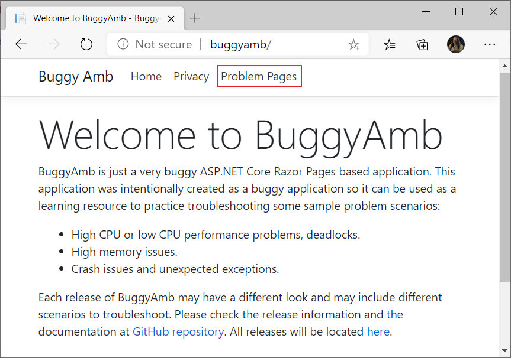

The problem scenarios are under "Problem Pages". If you click Problem Pages link you will see the following screen:

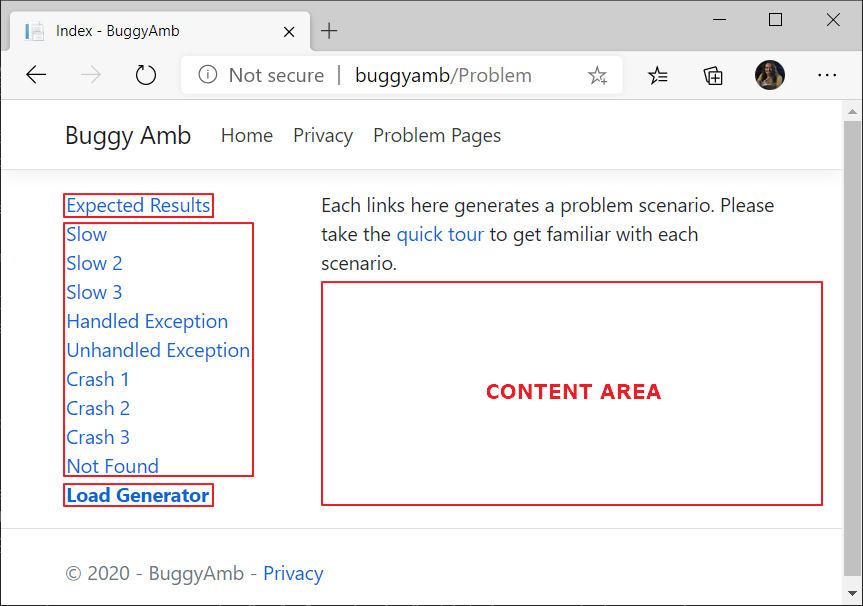

The `content area` is where you see the results when you click a link.

Links for the problem scenarios are located on the left pane along with a link to the "working" scenario and a link to an experimental "load generator" page.

`Expected Results`, as its name suggests, is the page which is working fine. You can use this page to compare the results with the slow scenarios. You may sometimes see that the "expected results" would also take longer than expected when you reproduce problems with other pages so this page may be affected because of other problems happening in the application. See it in action in the screenshot below, do you see how fast it loads under a second?

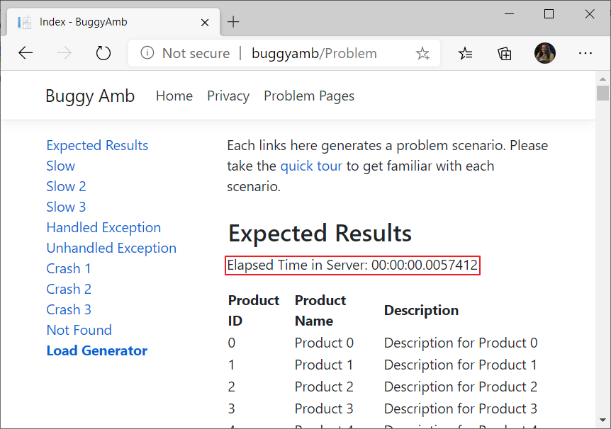

## Performance Problem Scenarios

BuggyAmb is a very slow application. You may see low CPU or high CPU performance problems. You may also see unexpected memory usages when some pages are requested.

### Slow Scenario 1

`Slow` scenario is where things start going wrong. When you click the link you should see that loading the same content takes much more than the fast one:

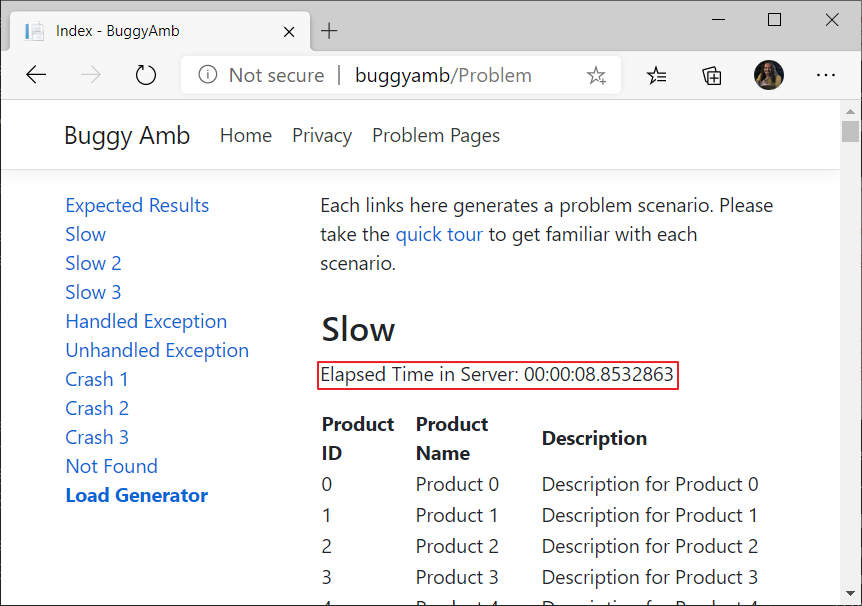

### Slow Scenario 2 & 3

Things go weirder if you run the `Slow 2` or `Slow 3` scenarios. In those scenarios the page keeps loading but never finishes:

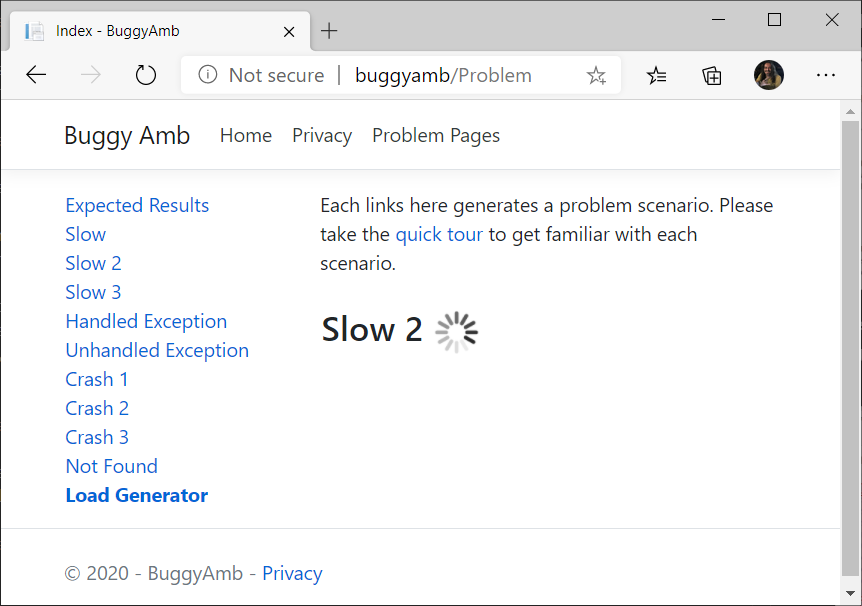

### Some tips for troubleshooting

Although there is a small chance to see a good amount of information in the event logs when you host BuggyAmb on Windows, if you host BuggyAmb on IIS then you may still want to check the event logs first. Because there is a WAS service which manages the process startup and shutdowns and it also montiors the application pools to check if those are healthy and capable to process requests.

You can open event logs if you run BuggyAmb on Windows and see if there is any symptom / information about the problem. You may see that the IIS WAS sevice thinks that the process is unhealthy and may also see some signs that the process is restarted by WAS service.

You may also want to "define the problem" by understanding how the requests are slow, or, if they end up with successfully (even slowly) with HTTP 200 or if they end up with an error like HTTP 500 status codes. For this, if you are on IIS, you have IIS logs or FREB logs, and you can also look at the active running requests by using IIS Manager => Worker Processes window. If you are running BuggyAmb on Linux behind an Nginx or Apache server then you may want to check the Nginx or Apache logs to see how long it takes for the application to process the requests.

A good approach would also be to check the performance counters to undertstand what is unexpected: is CPU / memory usage high? Are exceptions increasing? Is there any race condition symtpoms? etc...

A good problem troubleshooting starts with defining problem but all of the above would likely provide you a big picture of the problem but it may not give you a good amount of information about the root cause of the actual problem.

You may want to troubleshoot these kind of performance issues by analyzing memory dumps or profiler traces depending on how the symptoms surface.

## Crash Problem Scenarios

BuggyAmb is not only slow but also does crash because of different reasons. Why? Because it is buggy.

It is actually so buggy that some of the crash scenarios may show different results on different platforms. For example, take the first `Crash 1` scenario: in this scenario the process crashes if I run the application on Windows, BUT, strangely enough (at least for me, maybe it is too obvious for some of you), the process "may" crash or "hang" if I run it on Linux. Of course there should be a reasonable explanation for it - feel free to make comments on this.

### Symptoms

The way you run the BuggyAmb directly affects the symptoms you are seeing with crash scenarios. You may be incorrectly assuming that the application works fine and there is no crash because the symptoms of the crash may be hidden from the end users. For example:

#### Hosting on IIS or as a Linux daemon

In these cases the process will be started automatically once it is crashed.

* If you are hosting on IIS then the WAS service will manage the process startup, shutdown and restarts so if a crash happens when hosted on IIS, you may not see the symptoms on browser since the process may be restarted so quickly once it crashes that new requests would be handled by new one.
* Similarly, if you are hosting the application on Linux as a service (or as a daemon?) on Linux then the OS may restart the application after a crash and once again new request would be handled by new one.

>There could be multiple instances of the application running at the same time if you are hosting the application in a web farm behind a load balancer. Or, you may be running in a "web garden" scenario on IIS, etc...and the new requests would be handled by another process.

As a result, the symptoms may not be directly visible for the end users.

>When hosted on IIS, you may see ```HTTP 503 - Service Unavailable``` errors if the process crashes frequently enough for ```IIS Rapid Fail Protection``` to kick in and disable the application pool - just thinking that the application cannot be recovered from this frequent crashes as it happens one after the other in the "failure interval" defined for the application pool. The default policy for Rapid Fail Protection is "5 crashes in 5 minutes".

#### Running as a stand-alone application

If you are running BuggyAmb as a stand-alone application and if there is no tool / process to manage automatic startups you may directly notice the process crash because no one will restart the process once it is crashed and the requests will end up with an error.

Let's take a look at the crash scenarios. Note that I assumed that the process startups are handled by IIS WAS or OS in the following descriptions.

### Crash Scenario 1

If you click ```Crash 1``` scenario you may confuse it with a performance problem because you may see the exact symptoms you see when you run Slow 2 or Slow 3 scenarios - page keeps loading but never finishes:

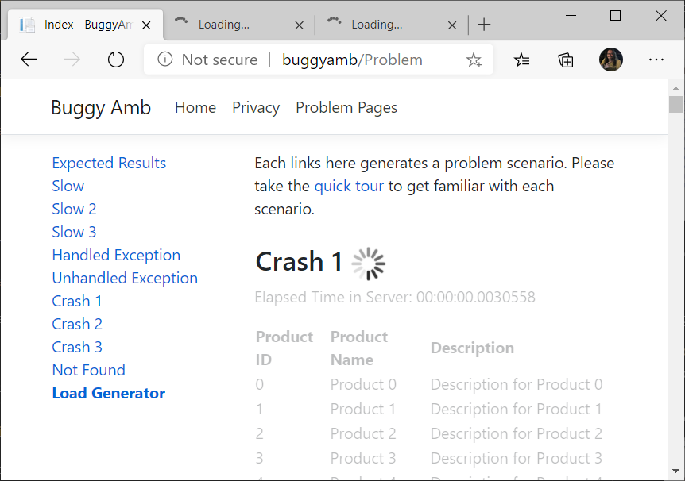

Also you may see another symptom and the following error may occur if you make requests to any other page when you run this scenario. I made a few requests to home page and the expected results page in new browser tabs after I run this scenario and I eventually ended up with this page:

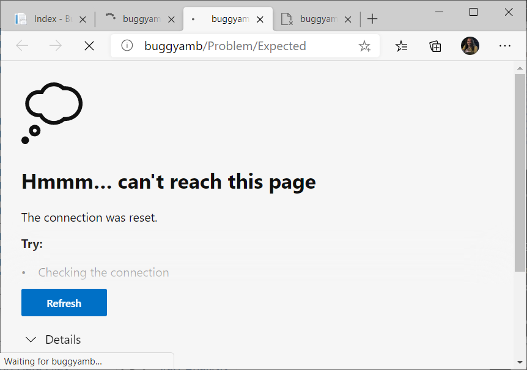

Note that, when hosted on IIS, you may see ```HTTP 503 - Service Unavailable``` errors quickly if crashes happen frequently enough and IIS Rapid Fail Protection kicks in and disables the application pool.

### Troubleshooting tips for Crash Scenario 1

If you try to capture manual memory dumps which are mostly useful for troubleshooting performance issues, you may not get what you want because this is actually not a performance problem.

You may want to open task manager before running this scenario and see if the process ID changes. If it is changing then either the process is crashed or the process is restarted by the "system", e.g.: by WAS service if BuggyAmb is hosted on IIS.

You can review the "event logs" if you are on Windows and "journal logs" if you are on Linux to see if there is any information about the problem.

You may need to capture a crash dump to troubleshoot this crash issue.

### Crash Scenario 2 & 3

If you click ```Crash 2``` or ```Crash 3``` scenario, you will see a fancy message:

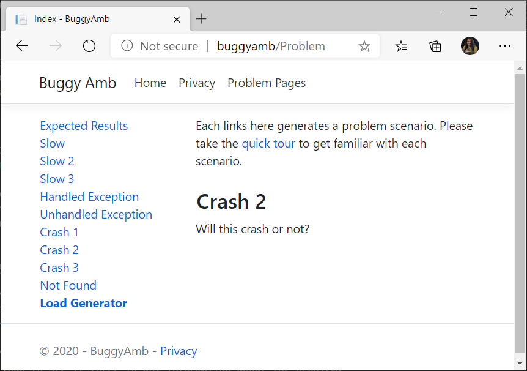

The message will be different in Crash 3 scenario.

What kind of developer would ask the users if that request will cause a process crash or not? Probably a buggy developer, right?

Anyways, if you want to answer the developer's weird question, you may want to keep browsing the other pages to see if it is working fine or not.

When I run this scenario on my development environment where Visual Studio is installed, the application kept working for some time but then the Visual Studio JIT Debugger is launched because it acted as my default debugger and it captured the process crash:

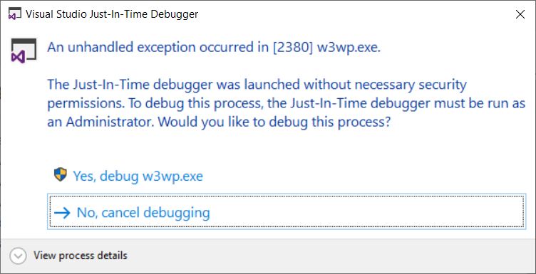

However, if I disable the VS JIT Debugger, or, if I run this on a server where JIT Debugging is not enabled at all, I do not see any symptom and I can access the Expected Results and home page fine. However, if I first send a few requests to ```Slow``` page and then click the ```Crash 2``` then I see that the requests for the ```Slow``` pages ended up with an error:

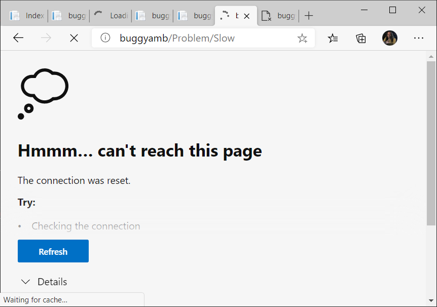

The symptoms of this scenario is more visible when there are several requests made to the application. For example, if you use that experimental ```Load Generator``` page to send multiple requests to different pages, you would see the errors more frequently.

Note that, when hosted on IIS, you may see ```HTTP 503 - Service Unavailable``` errors quickly if crashes happen frequently enough and IIS Rapid Fail Protection kicks in and disables the application pool.

So to answer the developer's question: that page is not innocent my friend, keep an eye on it.

### Troubleshooting tips for Crash Scenario 2 & 3

This scenario can hide the symptoms from end users easily. You may see that the application is working fine but it may be crashing in the background.

Troubleshooting tips are no different than the first scenario. You may want to confirm the PID changes, check the event logs on Windows or journal logs on Linux, and so on...Again, you may need to capture a crash dump to troubleshoot this issue although in this case the event logs (or journal logs) will give you the reason of the crash. I still recommend you to use a debugger to find the reason of the crash to practice data collection and dump analysis.

## The other scenarios

The other scenarios should be self self-explanatory. In this release there are three scenarios that you can use:

* Unhandled exceptions
* Handled exceptions
* Random HTTP 400 and HTTP 500 errors

Note that if you look at the source code, you will see that the reasons of the above are very obvious. I would like to remind you that the goal of this buggy application is not to teach you how to write code. The goal is to get familiar with some scenarios where you may see some symptoms you would see with real world scenarios. So please use these to practice capturing data and making analysis.

### Handled Exception & Unhandled Exception

If you click ```Handled Exception``` you will see this:


And you will see this if you click the ```Unhandled Exception``` one:

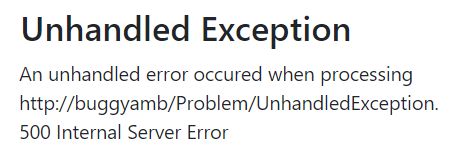

### Random HTTP 404 and HTTP 500 errors

If you click `Not Found`, you'll see this most of the time:

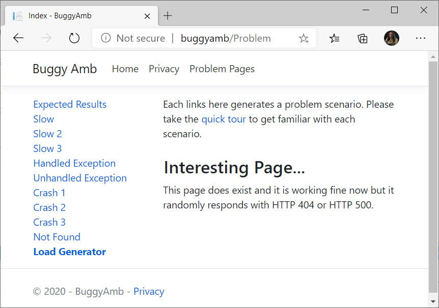

However, if you keep clicking the same link (or use "Load Generator" to send multiple requests to the `Not Found` page), you will see that it will respond with HTTP 404 or HTTP 500 errors intermittently:

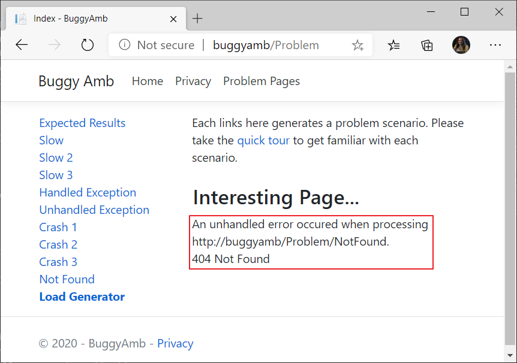

### Troubleshooting tips for the handled/unhandled exception and the HTTP 404/500 errors

#### Handled Exception

The `Unhandled Exception` error message seen in the browser is pretty obvious to give you a starting point:

>An exception occured but it is handled: System.IO.DirectoryNotFoundException

Obviously BuggyAmb should be trying to access a directory which is not exist. Since this is a directory, you may want to capture a **Process Monitor** log to see which directory the process is trying to access to.

This is a good approach and you may even able to see a call stack for the thread accessing to the directory, if you set the correct symbols on Process Monitor.

However, this may be difficult to find what you are looking for unless you use filters in Process Monitor and the call stack may not show the managed represantion - you may see the native side only.

You can configure debuggers to capture 1st chance memory dumps if the tools support this. For example, you can use Debug Diagnostic on Windows and configure it to create a dump when a `System.IO.DirectoryNotFoundException` exception happens.

#### Unhandled Exception

For the `Handled Exception` one, you may first "define" the problem: what is the exception thrown? Then you can use the same approach (creating a 1st chance rule on debugger) to capture dumps. To find the type of the exception thrown you may want to look at the event logs (especially the application event logs). If you cannot see any information, the next step would be to capture a debugger to the process and get the exception names without getting a memory dump. Debug Diagnostic tool on Windows is capable to generate a summary for the exceptions thrown in a process. You may try to use profilers to get the same information.

#### HTTP 404/500

The `Not Found` page randomly responds with HTTP 404 and HTTP 500. You may want to take action just like you do for the exceptions and check the event logs or attach a debugger.

If you are hosting BuggyAmb on IIS then you have a powerful tool: `Failed Request Tracing (FREB)`. You may want to create a FREB rule and look at the report. Note that the FREB can be configured to create a memory dump when it is triggered.

## Experimental Load Generator

"Load Generator" is nothing but some jQuery scripts that can send multiple requests to the BuggyAmb application so you can easily reproduce the problems.


But there is one thing:

> You can use this tool to send multiple requests to different pages of BuggyAmb but there is one important limitation: browsers can send maximum 6 concurrent Ajax requests to a unique endpoint in one session.

However this tool is still quite useful for reproducing the scenarios because most of the times the problems are very easy to reproduce for BuggyAmb application. If, for some reason, you need more requests to test a scenario then there may be workarounds such as opening an inPrivate browsing session to have six more concurrent requests.

For more information about Load Generator, please click [here](load_generator.md). You will find some recommendations about how to use it to run different scenarios easily.
