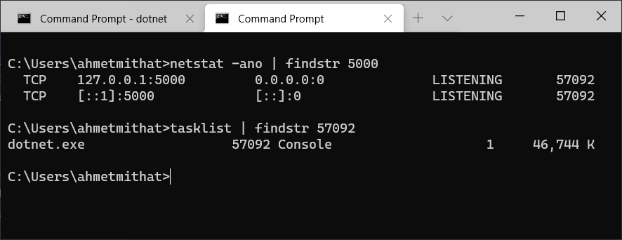
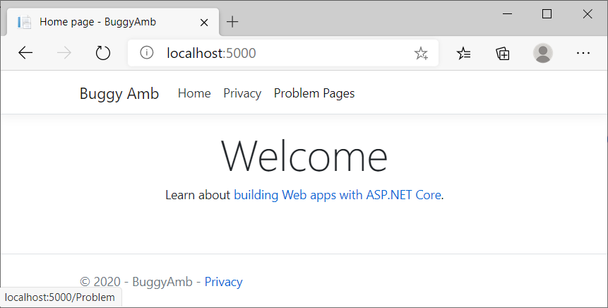
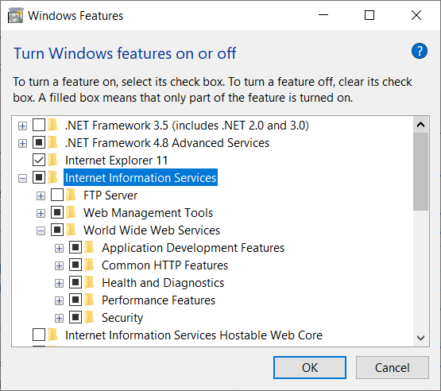
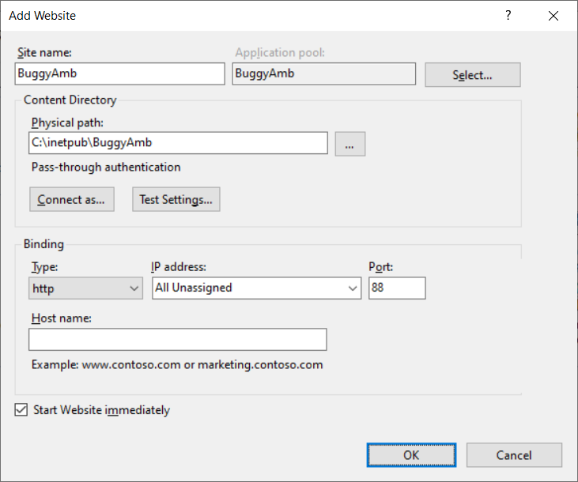
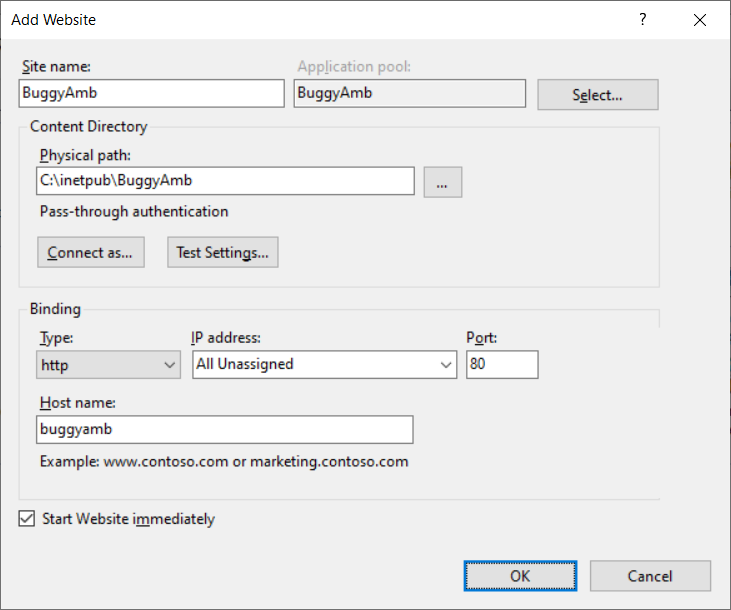
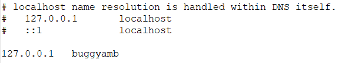
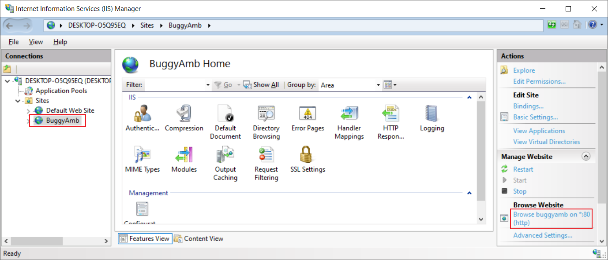
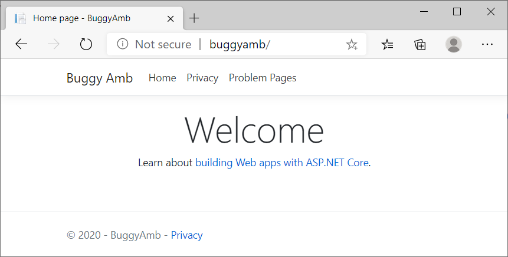

# Windows Installation Instructions

In this page, you will find the following information:

* .NET Core version required to run BuggyAmb
* How to run BuggyAmb
  * Running BuggyAmb as a standalone application (no web server is needed)
  * Hosting on Internet Information Services (IIS)
    * Installing IIS<
    * Creating BuggyAmb web site on IIS

## .NET Core version

BuggyAmb is an ASP.NET Core ```framework-dependent``` application so it means that the correct version of ASP.NET Core runtime should be installed on your machine.

The main reason for not publishing BuggyAmb as a self-contained application is simple: the size of the package will be much higher than the framework-dependent one when it is deployed as self-contained application because the required .NET Core libraries will also be included in the deployment package. If you want to deploy BuggyAmb as a self-contained application then you can download the source code and publish like that.

Please check the release information to find out which .NET Core version is required to run that release. The initial release of BuggyAmb is an ASP.NET Core 3.1 application so you will need .NET Core 3.1 runtime / SDK / IIS hosting bundle.

If you are going to host BuggyAmb on IIS then I recommended you to install the IIS Hosting Bundle which includes both 32bit and 64bit versions of .NET Core runtime and IIS support (ASP.NET Core Module - ANCM).

You can run the following command on a command prompt to see which versions are installed on your machine:

```dotnetcli
dotnet --info
```

To install .NET Core SDK, Runtime or IIS Hosting Bundle, get them [here](https://dotnet.microsoft.com/download/dotnet-core/).

If you are using the first release of BuggyAmb then you need [.NET Core 3.1](https://dotnet.microsoft.com/download/dotnet-core/3.1).

Once again, please install IIS Hosting Bundle if you are going to host BuggyAmb on IIS.

## How to run BuggyAmb

This release of BuggyAmb runs over HTTP. If you need to configure it to run on HTTPS then you can download the source code and make the necessary changes based on your needs.

You can run BuggyAmb as a standalone application or you can host it on IIS.

I personally prefer to host it on IIS but it really does not matter where and how you host it (you can even host it on Linux or macOS). This is true because you just need a process that you can investigate - it is not important if the process running the application is dotnet.exe or w3wp.exe.

There are advantages and disadvantages of both, e.g.:

* Running as stand alone application is very easy. You do not need to deal with installing IIS and creating a web site.
* When you run as stand alone, you will need to manage to start BuggyAmb once it stops / crashes.
* Hosting on IIS is usually the preferred way for several people in real world scenarios where the OS is Windows so if you want more close environment to real world scenarios you should choose hosting on IIS.
* IIS (actually the WAS service) will manage the process startups so if BuggyAmb crashes then IIS will start it without you to take action (unless the application is pool is disabled due to Rapid Fail Protection) if you host on IIS.

So make your choice, it is all up to you.

### Running BuggyAmb as a standalone application (no web server is needed)

This is the easiest way to run BuggyAmb if you don't want to install IIS.

Here are the instructions to run BuggyAmb as a standalone application:

* Download the BuggyAmb [here](https://buggyambfiles.blob.core.windows.net/bin/buggyamb_v1.1.zip)
* Extract it to a folder.
* Open a command prompt and change directory to the installation folder.
* Run the BuggyAmb application by running `dotnet BuggyAmb` command. BuggyAmb application will run on Kestrel and listen for the HTTP requests on port 5000.

Here is a screenshot showing it in action:


In this case BuggyAmb application will run in a dotnet.exe process:



As an alternative, you can run as a standalone by just running `BuggyAmb.exe` on command prompt. If you run that way then the BuggyAmb will run in (surprise surprise) BuggyAmb.exe process and you would need to investigate that process.

Once you run the BuggyAmb as a stand alone application, open a browser and test accessing to `http://localhost:5000`. You should see the following web site:



### Hosting on Internet Information Services (IIS)

Hosting on IIS is also easy and I prefer this option over running as a standalone application.

### Installing IIS

IIS is part of the Windows operating system and it can be installed at Control Panel\Programs\Programs and Features window by clicking "Turn Windows features on or off" on client Windows operating systems such as Windows 10. Default installation of IIS should be enough for hosting ASP.NET Core applications:



If you are on a server SKU, such as Windows Server 2019, you can install the IIS by adding the web server role in Server Manager.

After installation is completed you should be able to see the welcome page of IIS when you browse `http://localhost/`. If you don't see the welcome page then it means that something is  wrong and I'd recommend to check the steps again.

### Creating BuggyAmb web site on IIS

Here are the instructions:

* [Download BuggyAmb](https://github.com/dotnet/samples/core/tutorials/buggyamb/dumps/buggyamb_v1.1.zip)
* Extract it to `c:\inetpub\BuggyAmb` folder.
* Open IIS manager (`Start => Run => inetmgr`), right click on Sites and choose Add Website to create a new site. You can use similar settings as seen below:



In the sample screenshot above, I create the "BuggyAmb" web site which uses an application pool with the same name. The key part above is the port number: 88. This web site will listen on port 88 for the incoming requests and you will browse `http://localhost:88` to access the BuggyAmb application.

If you want to use the default port 80 to avoid putting the port number when making requests, then you can stop the "Default Web Site" which is created when IIS is installed. If you are familiar with IIS configuration then you can keep the Default Web Site running and use a ```hostname``` when creating the BuggyAmb site, for example:



In the case above, the requests made via `http://buggyamb/` will be routed to this web site. Of course, buggyamb name should resolve the IP address of your machine and you can easily do so by editing the `hosts` file under `C:\Windows\System32\drivers\etc` folder:



After clicking OK and creating the web site, you should see it in IIS manager:



Once you create the web site you can test it by either cliking "Browse Website" link in IIS manager or opening a browser and browsing to `http://buggyamb`. You should see the following:



Note that if you do not configure hostname then you will access to the BuggyAmb web site via `http://localhost:88` if you configure the  BuggyAmb web site to run on port 88, or via `http://localhost` if you stop the Default Web Site and configure the BuggyAmb web site to run on port 80.
