<!-- markdownlint-capture -->
<!-- markdownlint-disable -->

# Code Metrics

This file is dynamically maintained by a bot, *please do not* edit this by hand. It represents various [code metrics](https://aka.ms/dotnet/code-metrics), such as cyclomatic complexity, maintainability index, and so on.

<div id='dotnet-codeanalysis'></div>

## DotNet.CodeAnalysis :feelsgood:

The *DotNet.CodeAnalysis.csproj* project file contains:

- 3 namespaces.
- 16 named types.
- 2,590 total lines of source code.
- Approximately 643 lines of executable code.
- The highest cyclomatic complexity is 17 :feelsgood:.

<details>
<summary>
  <strong id="dotnet-codeanalysis">
    DotNet.CodeAnalysis :feelsgood:
  </strong>
</summary>
<br>

The `DotNet.CodeAnalysis` namespace contains 14 named types.

- 14 named types.
- 2,568 total lines of source code.
- Approximately 639 lines of executable code.
- The highest cyclomatic complexity is 17 :feelsgood:.

<details>
<summary>
  <strong id="documentfileinfo">
    DocumentFileInfo :heavy_check_mark:
  </strong>
</summary>
<br>

- The `DocumentFileInfo` contains 6 members.
- 33 total lines of source code.
- Approximately 0 lines of executable code.
- The highest cyclomatic complexity is 1 :heavy_check_mark:.

| Member kind | Line number | Maintainability index | Cyclomatic complexity | Depth of inheritance | Class coupling | Lines of source / executable code |
| :-: | :-: | :-: | :-: | :-: | :-: | :-: |
| Method | [8](https%3A%2F%2Fgithub.com%2Fdotnet%2Fsamples%2Fblob%2Fmain%2Fgithub-actions%2FDotNet.GitHubAction%2FDotNet.CodeAnalysis%2FDocumentFileInfo.cs%23L8 "DocumentFileInfo.DocumentFileInfo(string FilePath, string LogicalPath, bool IsLinked, bool IsGenerated, SourceCodeKind SourceCodeKind)") | 100 | 1 :heavy_check_mark: | 0 | 1 | 33 / 0 |
| Property | [12](https%3A%2F%2Fgithub.com%2Fdotnet%2Fsamples%2Fblob%2Fmain%2Fgithub-actions%2FDotNet.GitHubAction%2FDotNet.CodeAnalysis%2FDocumentFileInfo.cs%23L12 "string DocumentFileInfo.FilePath") | 100 | 0 :heavy_check_mark: | 0 | 0 | 3 / 0 |
| Property | [30](https%3A%2F%2Fgithub.com%2Fdotnet%2Fsamples%2Fblob%2Fmain%2Fgithub-actions%2FDotNet.GitHubAction%2FDotNet.CodeAnalysis%2FDocumentFileInfo.cs%23L30 "bool DocumentFileInfo.IsGenerated") | 100 | 0 :heavy_check_mark: | 0 | 0 | 4 / 0 |
| Property | [25](https%3A%2F%2Fgithub.com%2Fdotnet%2Fsamples%2Fblob%2Fmain%2Fgithub-actions%2FDotNet.GitHubAction%2FDotNet.CodeAnalysis%2FDocumentFileInfo.cs%23L25 "bool DocumentFileInfo.IsLinked") | 100 | 0 :heavy_check_mark: | 0 | 0 | 5 / 0 |
| Property | [19](https%3A%2F%2Fgithub.com%2Fdotnet%2Fsamples%2Fblob%2Fmain%2Fgithub-actions%2FDotNet.GitHubAction%2FDotNet.CodeAnalysis%2FDocumentFileInfo.cs%23L19 "string DocumentFileInfo.LogicalPath") | 100 | 0 :heavy_check_mark: | 0 | 0 | 6 / 0 |
| Property | [35](https%3A%2F%2Fgithub.com%2Fdotnet%2Fsamples%2Fblob%2Fmain%2Fgithub-actions%2FDotNet.GitHubAction%2FDotNet.CodeAnalysis%2FDocumentFileInfo.cs%23L35 "SourceCodeKind DocumentFileInfo.SourceCodeKind") | 100 | 0 :heavy_check_mark: | 0 | 1 | 4 / 0 |

<a href="#DocumentFileInfo-class-diagram">:link: to `DocumentFileInfo` class diagram</a>

<a href="#dotnet-codeanalysis">:top: back to DotNet.CodeAnalysis</a>

</details>

<details>
<summary>
  <strong id="filenameutilities">
    FileNameUtilities :warning:
  </strong>
</summary>
<br>

- The `FileNameUtilities` contains 10 members.
- 183 total lines of source code.
- Approximately 51 lines of executable code.
- The highest cyclomatic complexity is 8 :warning:.

| Member kind | Line number | Maintainability index | Cyclomatic complexity | Depth of inheritance | Class coupling | Lines of source / executable code |
| :-: | :-: | :-: | :-: | :-: | :-: | :-: |
| Field | [15](https%3A%2F%2Fgithub.com%2Fdotnet%2Fsamples%2Fblob%2Fmain%2Fgithub-actions%2FDotNet.GitHubAction%2FDotNet.CodeAnalysis%2FFileNameUtilities.cs%23L15 "char FileNameUtilities.AltDirectorySeparatorChar") | 93 | 0 :heavy_check_mark: | 0 | 0 | 1 / 1 |
| Method | [130](https%3A%2F%2Fgithub.com%2Fdotnet%2Fsamples%2Fblob%2Fmain%2Fgithub-actions%2FDotNet.GitHubAction%2FDotNet.CodeAnalysis%2FFileNameUtilities.cs%23L130 "string? FileNameUtilities.ChangeExtension(string? path, string? extension)") | 63 | 6 :heavy_check_mark: | 0 | 3 | 31 / 9 |
| Field | [14](https%3A%2F%2Fgithub.com%2Fdotnet%2Fsamples%2Fblob%2Fmain%2Fgithub-actions%2FDotNet.GitHubAction%2FDotNet.CodeAnalysis%2FFileNameUtilities.cs%23L14 "char FileNameUtilities.DirectorySeparatorChar") | 93 | 0 :heavy_check_mark: | 0 | 0 | 1 / 1 |
| Method | [78](https%3A%2F%2Fgithub.com%2Fdotnet%2Fsamples%2Fblob%2Fmain%2Fgithub-actions%2FDotNet.GitHubAction%2FDotNet.CodeAnalysis%2FFileNameUtilities.cs%23L78 "string? FileNameUtilities.GetExtension(string? path)") | 72 | 3 :heavy_check_mark: | 0 | 3 | 18 / 5 |
| Method | [179](https%3A%2F%2Fgithub.com%2Fdotnet%2Fsamples%2Fblob%2Fmain%2Fgithub-actions%2FDotNet.GitHubAction%2FDotNet.CodeAnalysis%2FFileNameUtilities.cs%23L179 "string? FileNameUtilities.GetFileName(string? path, bool includeExtension = true)") | 70 | 3 :heavy_check_mark: | 0 | 3 | 11 / 5 |
| Method | [38](https%3A%2F%2Fgithub.com%2Fdotnet%2Fsamples%2Fblob%2Fmain%2Fgithub-actions%2FDotNet.GitHubAction%2FDotNet.CodeAnalysis%2FFileNameUtilities.cs%23L38 "int FileNameUtilities.IndexOfExtension(string? path)") | 58 | 8 :warning: | 0 | 2 | 38 / 13 |
| Method | [155](https%3A%2F%2Fgithub.com%2Fdotnet%2Fsamples%2Fblob%2Fmain%2Fgithub-actions%2FDotNet.GitHubAction%2FDotNet.CodeAnalysis%2FFileNameUtilities.cs%23L155 "int FileNameUtilities.IndexOfFileName(string? path)") | 65 | 6 :heavy_check_mark: | 0 | 2 | 22 / 7 |
| Method | [26](https%3A%2F%2Fgithub.com%2Fdotnet%2Fsamples%2Fblob%2Fmain%2Fgithub-actions%2FDotNet.GitHubAction%2FDotNet.CodeAnalysis%2FFileNameUtilities.cs%23L26 "bool FileNameUtilities.IsFileName(string? path)") | 92 | 1 :heavy_check_mark: | 0 | 2 | 12 / 1 |
| Method | [97](https%3A%2F%2Fgithub.com%2Fdotnet%2Fsamples%2Fblob%2Fmain%2Fgithub-actions%2FDotNet.GitHubAction%2FDotNet.CodeAnalysis%2FFileNameUtilities.cs%23L97 "string? FileNameUtilities.RemoveExtension(string? path)") | 63 | 5 :heavy_check_mark: | 0 | 3 | 29 / 9 |
| Field | [16](https%3A%2F%2Fgithub.com%2Fdotnet%2Fsamples%2Fblob%2Fmain%2Fgithub-actions%2FDotNet.GitHubAction%2FDotNet.CodeAnalysis%2FFileNameUtilities.cs%23L16 "char FileNameUtilities.VolumeSeparatorChar") | 93 | 0 :heavy_check_mark: | 0 | 0 | 1 / 1 |

<a href="#FileNameUtilities-class-diagram">:link: to `FileNameUtilities` class diagram</a>

<a href="#dotnet-codeanalysis">:top: back to DotNet.CodeAnalysis</a>

</details>

<details>
<summary>
  <strong id="fileutilities">
    FileUtilities :feelsgood:
  </strong>
</summary>
<br>

- The `FileUtilities` contains 17 members.
- 392 total lines of source code.
- Approximately 82 lines of executable code.
- The highest cyclomatic complexity is 17 :feelsgood:.

| Member kind | Line number | Maintainability index | Cyclomatic complexity | Depth of inheritance | Class coupling | Lines of source / executable code |
| :-: | :-: | :-: | :-: | :-: | :-: | :-: |
| Method | [298](https%3A%2F%2Fgithub.com%2Fdotnet%2Fsamples%2Fblob%2Fmain%2Fgithub-actions%2FDotNet.GitHubAction%2FDotNet.CodeAnalysis%2FFileUtilities.cs%23L298 "Stream FileUtilities.CreateFileStreamChecked(Func<string, Stream> factory, string path, string? paramName = null)") | 66 | 3 :heavy_check_mark: | 0 | 9 | 41 / 8 |
| Method | [168](https%3A%2F%2Fgithub.com%2Fdotnet%2Fsamples%2Fblob%2Fmain%2Fgithub-actions%2FDotNet.GitHubAction%2FDotNet.CodeAnalysis%2FFileUtilities.cs%23L168 "string? FileUtilities.GetBaseDirectory(string? basePath, string? baseDirectory)") | 72 | 2 :heavy_check_mark: | 0 | 2 | 19 / 6 |
| Method | [354](https%3A%2F%2Fgithub.com%2Fdotnet%2Fsamples%2Fblob%2Fmain%2Fgithub-actions%2FDotNet.GitHubAction%2FDotNet.CodeAnalysis%2FFileUtilities.cs%23L354 "long FileUtilities.GetFileLength(string fullPath)") | 79 | 1 :heavy_check_mark: | 0 | 5 | 17 / 4 |
| Method | [337](https%3A%2F%2Fgithub.com%2Fdotnet%2Fsamples%2Fblob%2Fmain%2Fgithub-actions%2FDotNet.GitHubAction%2FDotNet.CodeAnalysis%2FFileUtilities.cs%23L337 "DateTime FileUtilities.GetFileTimeStamp(string fullPath)") | 84 | 1 :heavy_check_mark: | 0 | 5 | 16 / 3 |
| Method | [219](https%3A%2F%2Fgithub.com%2Fdotnet%2Fsamples%2Fblob%2Fmain%2Fgithub-actions%2FDotNet.GitHubAction%2FDotNet.CodeAnalysis%2FFileUtilities.cs%23L219 "string FileUtilities.NormalizeAbsolutePath(string path)") | 75 | 1 :heavy_check_mark: | 0 | 6 | 26 / 5 |
| Method | [240](https%3A%2F%2Fgithub.com%2Fdotnet%2Fsamples%2Fblob%2Fmain%2Fgithub-actions%2FDotNet.GitHubAction%2FDotNet.CodeAnalysis%2FFileUtilities.cs%23L240 "string FileUtilities.NormalizeDirectoryPath(string path)") | 96 | 1 :heavy_check_mark: | 0 | 1 | 4 / 1 |
| Method | [190](https%3A%2F%2Fgithub.com%2Fdotnet%2Fsamples%2Fblob%2Fmain%2Fgithub-actions%2FDotNet.GitHubAction%2FDotNet.CodeAnalysis%2FFileUtilities.cs%23L190 "string? FileUtilities.NormalizeRelativePath(string path, string? basePath, string? baseDirectory)") | 64 | 5 :heavy_check_mark: | 0 | 2 | 22 / 9 |
| Method | [273](https%3A%2F%2Fgithub.com%2Fdotnet%2Fsamples%2Fblob%2Fmain%2Fgithub-actions%2FDotNet.GitHubAction%2FDotNet.CodeAnalysis%2FFileUtilities.cs%23L273 "Stream FileUtilities.OpenAsyncRead(string fullPath)") | 90 | 1 :heavy_check_mark: | 0 | 3 | 4 / 2 |
| Method | [371](https%3A%2F%2Fgithub.com%2Fdotnet%2Fsamples%2Fblob%2Fmain%2Fgithub-actions%2FDotNet.GitHubAction%2FDotNet.CodeAnalysis%2FFileUtilities.cs%23L371 "Stream FileUtilities.OpenFileStream(string path)") | 78 | 1 :heavy_check_mark: | 0 | 7 | 23 / 4 |
| Method | [257](https%3A%2F%2Fgithub.com%2Fdotnet%2Fsamples%2Fblob%2Fmain%2Fgithub-actions%2FDotNet.GitHubAction%2FDotNet.CodeAnalysis%2FFileUtilities.cs%23L257 "Stream FileUtilities.OpenRead(string fullPath)") | 84 | 1 :heavy_check_mark: | 0 | 6 | 15 / 3 |
| Method | [33](https%3A%2F%2Fgithub.com%2Fdotnet%2Fsamples%2Fblob%2Fmain%2Fgithub-actions%2FDotNet.GitHubAction%2FDotNet.CodeAnalysis%2FFileUtilities.cs%23L33 "string? FileUtilities.ResolveRelativePath(string path, string? basePath, string? baseDirectory, IEnumerable<string> searchPaths, Func<string, bool> fileExists)") | 56 | 8 :warning: | 0 | 6 | 72 / 17 |
| Method | [80](https%3A%2F%2Fgithub.com%2Fdotnet%2Fsamples%2Fblob%2Fmain%2Fgithub-actions%2FDotNet.GitHubAction%2FDotNet.CodeAnalysis%2FFileUtilities.cs%23L80 "string? FileUtilities.ResolveRelativePath(string? path, string? baseDirectory)") | 93 | 1 :heavy_check_mark: | 0 | 1 | 2 / 1 |
| Method | [83](https%3A%2F%2Fgithub.com%2Fdotnet%2Fsamples%2Fblob%2Fmain%2Fgithub-actions%2FDotNet.GitHubAction%2FDotNet.CodeAnalysis%2FFileUtilities.cs%23L83 "string? FileUtilities.ResolveRelativePath(string? path, string? basePath, string? baseDirectory)") | 91 | 1 :heavy_check_mark: | 0 | 3 | 4 / 1 |
| Method | [88](https%3A%2F%2Fgithub.com%2Fdotnet%2Fsamples%2Fblob%2Fmain%2Fgithub-actions%2FDotNet.GitHubAction%2FDotNet.CodeAnalysis%2FFileUtilities.cs%23L88 "string? FileUtilities.ResolveRelativePath(PathKind kind, string? path, string? basePath, string? baseDirectory)") | 57 | 17 :feelsgood: | 0 | 6 | 79 / 11 |
| Method | [278](https%3A%2F%2Fgithub.com%2Fdotnet%2Fsamples%2Fblob%2Fmain%2Fgithub-actions%2FDotNet.GitHubAction%2FDotNet.CodeAnalysis%2FFileUtilities.cs%23L278 "T FileUtilities.RethrowExceptionsAsIOException<T>(Func<T> operation)") | 84 | 1 :heavy_check_mark: | 0 | 5 | 15 / 3 |
| Field | [188](https%3A%2F%2Fgithub.com%2Fdotnet%2Fsamples%2Fblob%2Fmain%2Fgithub-actions%2FDotNet.GitHubAction%2FDotNet.CodeAnalysis%2FFileUtilities.cs%23L188 "char[] FileUtilities.s_invalidPathChars") | 93 | 0 :heavy_check_mark: | 0 | 1 | 1 / 1 |
| Method | [245](https%3A%2F%2Fgithub.com%2Fdotnet%2Fsamples%2Fblob%2Fmain%2Fgithub-actions%2FDotNet.GitHubAction%2FDotNet.CodeAnalysis%2FFileUtilities.cs%23L245 "string? FileUtilities.TryNormalizeAbsolutePath(string path)") | 85 | 1 :heavy_check_mark: | 0 | 2 | 11 / 3 |

<a href="#FileUtilities-class-diagram">:link: to `FileUtilities` class diagram</a>

<a href="#dotnet-codeanalysis">:top: back to DotNet.CodeAnalysis</a>

</details>

<details>
<summary>
  <strong id="hash">
    Hash :heavy_check_mark:
  </strong>
</summary>
<br>

- The `Hash` contains 23 members.
- 368 total lines of source code.
- Approximately 94 lines of executable code.
- The highest cyclomatic complexity is 5 :heavy_check_mark:.

| Member kind | Line number | Maintainability index | Cyclomatic complexity | Depth of inheritance | Class coupling | Lines of source / executable code |
| :-: | :-: | :-: | :-: | :-: | :-: | :-: |
| Method | [10](https%3A%2F%2Fgithub.com%2Fdotnet%2Fsamples%2Fblob%2Fmain%2Fgithub-actions%2FDotNet.GitHubAction%2FDotNet.CodeAnalysis%2FHash.cs%23L10 "int Hash.Combine(int newKey, int currentKey)") | 91 | 1 :heavy_check_mark: | 0 | 1 | 7 / 1 |
| Method | [15](https%3A%2F%2Fgithub.com%2Fdotnet%2Fsamples%2Fblob%2Fmain%2Fgithub-actions%2FDotNet.GitHubAction%2FDotNet.CodeAnalysis%2FHash.cs%23L15 "int Hash.Combine(bool newKeyPart, int currentKey)") | 91 | 2 :heavy_check_mark: | 0 | 0 | 4 / 1 |
| Method | [26](https%3A%2F%2Fgithub.com%2Fdotnet%2Fsamples%2Fblob%2Fmain%2Fgithub-actions%2FDotNet.GitHubAction%2FDotNet.CodeAnalysis%2FHash.cs%23L26 "int Hash.Combine<T>(T newKeyPart, int currentKey)") | 75 | 2 :heavy_check_mark: | 0 | 1 | 17 / 4 |
| Method | [349](https%3A%2F%2Fgithub.com%2Fdotnet%2Fsamples%2Fblob%2Fmain%2Fgithub-actions%2FDotNet.GitHubAction%2FDotNet.CodeAnalysis%2FHash.cs%23L349 "int Hash.CombineFNVHash(int hashCode, string text)") | 79 | 2 :heavy_check_mark: | 0 | 1 | 16 / 3 |
| Method | [366](https%3A%2F%2Fgithub.com%2Fdotnet%2Fsamples%2Fblob%2Fmain%2Fgithub-actions%2FDotNet.GitHubAction%2FDotNet.CodeAnalysis%2FHash.cs%23L366 "int Hash.CombineFNVHash(int hashCode, char ch)") | 91 | 1 :heavy_check_mark: | 0 | 1 | 11 / 1 |
| Method | [38](https%3A%2F%2Fgithub.com%2Fdotnet%2Fsamples%2Fblob%2Fmain%2Fgithub-actions%2FDotNet.GitHubAction%2FDotNet.CodeAnalysis%2FHash.cs%23L38 "int Hash.CombineValues<T>(IEnumerable<T>? values, int maxItemsToHash = null)") | 62 | 5 :heavy_check_mark: | 0 | 4 | 25 / 11 |
| Method | [64](https%3A%2F%2Fgithub.com%2Fdotnet%2Fsamples%2Fblob%2Fmain%2Fgithub-actions%2FDotNet.GitHubAction%2FDotNet.CodeAnalysis%2FHash.cs%23L64 "int Hash.CombineValues<T>(T[]? values, int maxItemsToHash = null)") | 62 | 4 :heavy_check_mark: | 0 | 1 | 23 / 10 |
| Method | [88](https%3A%2F%2Fgithub.com%2Fdotnet%2Fsamples%2Fblob%2Fmain%2Fgithub-actions%2FDotNet.GitHubAction%2FDotNet.CodeAnalysis%2FHash.cs%23L88 "int Hash.CombineValues<T>(ImmutableArray<T> values, int maxItemsToHash = null)") | 63 | 5 :heavy_check_mark: | 0 | 3 | 25 / 11 |
| Method | [114](https%3A%2F%2Fgithub.com%2Fdotnet%2Fsamples%2Fblob%2Fmain%2Fgithub-actions%2FDotNet.GitHubAction%2FDotNet.CodeAnalysis%2FHash.cs%23L114 "int Hash.CombineValues(IEnumerable<string?>? values, StringComparer stringComparer, int maxItemsToHash = null)") | 62 | 5 :heavy_check_mark: | 0 | 5 | 24 / 11 |
| Field | [143](https%3A%2F%2Fgithub.com%2Fdotnet%2Fsamples%2Fblob%2Fmain%2Fgithub-actions%2FDotNet.GitHubAction%2FDotNet.CodeAnalysis%2FHash.cs%23L143 "int Hash.FnvOffsetBias") | 93 | 0 :heavy_check_mark: | 0 | 0 | 1 / 1 |
| Field | [149](https%3A%2F%2Fgithub.com%2Fdotnet%2Fsamples%2Fblob%2Fmain%2Fgithub-actions%2FDotNet.GitHubAction%2FDotNet.CodeAnalysis%2FHash.cs%23L149 "int Hash.FnvPrime") | 93 | 0 :heavy_check_mark: | 0 | 0 | 1 / 1 |
| Method | [248](https%3A%2F%2Fgithub.com%2Fdotnet%2Fsamples%2Fblob%2Fmain%2Fgithub-actions%2FDotNet.GitHubAction%2FDotNet.CodeAnalysis%2FHash.cs%23L248 "int Hash.GetCaseInsensitiveFNVHashCode(string text)") | 96 | 1 :heavy_check_mark: | 0 | 1 | 4 / 1 |
| Method | [253](https%3A%2F%2Fgithub.com%2Fdotnet%2Fsamples%2Fblob%2Fmain%2Fgithub-actions%2FDotNet.GitHubAction%2FDotNet.CodeAnalysis%2FHash.cs%23L253 "int Hash.GetCaseInsensitiveFNVHashCode(ReadOnlySpan<char> data)") | 73 | 2 :heavy_check_mark: | 0 | 2 | 11 / 4 |
| Method | [157](https%3A%2F%2Fgithub.com%2Fdotnet%2Fsamples%2Fblob%2Fmain%2Fgithub-actions%2FDotNet.GitHubAction%2FDotNet.CodeAnalysis%2FHash.cs%23L157 "int Hash.GetFNVHashCode(byte[] data)") | 73 | 2 :heavy_check_mark: | 0 | 1 | 17 / 4 |
| Method | [178](https%3A%2F%2Fgithub.com%2Fdotnet%2Fsamples%2Fblob%2Fmain%2Fgithub-actions%2FDotNet.GitHubAction%2FDotNet.CodeAnalysis%2FHash.cs%23L178 "int Hash.GetFNVHashCode(ReadOnlySpan<byte> data, out bool isAscii)") | 64 | 2 :heavy_check_mark: | 0 | 2 | 25 / 8 |
| Method | [201](https%3A%2F%2Fgithub.com%2Fdotnet%2Fsamples%2Fblob%2Fmain%2Fgithub-actions%2FDotNet.GitHubAction%2FDotNet.CodeAnalysis%2FHash.cs%23L201 "int Hash.GetFNVHashCode(ImmutableArray<byte> data)") | 73 | 2 :heavy_check_mark: | 0 | 2 | 17 / 4 |
| Method | [221](https%3A%2F%2Fgithub.com%2Fdotnet%2Fsamples%2Fblob%2Fmain%2Fgithub-actions%2FDotNet.GitHubAction%2FDotNet.CodeAnalysis%2FHash.cs%23L221 "int Hash.GetFNVHashCode(ReadOnlySpan<char> data)") | 73 | 2 :heavy_check_mark: | 0 | 2 | 19 / 4 |
| Method | [245](https%3A%2F%2Fgithub.com%2Fdotnet%2Fsamples%2Fblob%2Fmain%2Fgithub-actions%2FDotNet.GitHubAction%2FDotNet.CodeAnalysis%2FHash.cs%23L245 "int Hash.GetFNVHashCode(string text, int start, int length)") | 95 | 1 :heavy_check_mark: | 0 | 1 | 14 / 1 |
| Method | [272](https%3A%2F%2Fgithub.com%2Fdotnet%2Fsamples%2Fblob%2Fmain%2Fgithub-actions%2FDotNet.GitHubAction%2FDotNet.CodeAnalysis%2FHash.cs%23L272 "int Hash.GetFNVHashCode(string text, int start)") | 93 | 1 :heavy_check_mark: | 0 | 1 | 11 / 1 |
| Method | [283](https%3A%2F%2Fgithub.com%2Fdotnet%2Fsamples%2Fblob%2Fmain%2Fgithub-actions%2FDotNet.GitHubAction%2FDotNet.CodeAnalysis%2FHash.cs%23L283 "int Hash.GetFNVHashCode(string text)") | 93 | 1 :heavy_check_mark: | 0 | 0 | 10 / 1 |
| Method | [294](https%3A%2F%2Fgithub.com%2Fdotnet%2Fsamples%2Fblob%2Fmain%2Fgithub-actions%2FDotNet.GitHubAction%2FDotNet.CodeAnalysis%2FHash.cs%23L294 "int Hash.GetFNVHashCode(StringBuilder text)") | 71 | 2 :heavy_check_mark: | 0 | 4 | 18 / 5 |
| Method | [315](https%3A%2F%2Fgithub.com%2Fdotnet%2Fsamples%2Fblob%2Fmain%2Fgithub-actions%2FDotNet.GitHubAction%2FDotNet.CodeAnalysis%2FHash.cs%23L315 "int Hash.GetFNVHashCode(char[] text, int start, int length)") | 70 | 2 :heavy_check_mark: | 0 | 1 | 20 / 5 |
| Method | [337](https%3A%2F%2Fgithub.com%2Fdotnet%2Fsamples%2Fblob%2Fmain%2Fgithub-actions%2FDotNet.GitHubAction%2FDotNet.CodeAnalysis%2FHash.cs%23L337 "int Hash.GetFNVHashCode(char ch)") | 93 | 1 :heavy_check_mark: | 0 | 0 | 13 / 1 |

<a href="#Hash-class-diagram">:link: to `Hash` class diagram</a>

<a href="#dotnet-codeanalysis">:top: back to DotNet.CodeAnalysis</a>

</details>

<details>
<summary>
  <strong id="pathutilities-pathcomparer">
    PathUtilities.PathComparer :heavy_check_mark:
  </strong>
</summary>
<br>

- The `PathUtilities.PathComparer` contains 2 members.
- 22 total lines of source code.
- Approximately 6 lines of executable code.
- The highest cyclomatic complexity is 5 :heavy_check_mark:.

| Member kind | Line number | Maintainability index | Cyclomatic complexity | Depth of inheritance | Class coupling | Lines of source / executable code |
| :-: | :-: | :-: | :-: | :-: | :-: | :-: |
| Method | [721](https%3A%2F%2Fgithub.com%2Fdotnet%2Fsamples%2Fblob%2Fmain%2Fgithub-actions%2FDotNet.GitHubAction%2FDotNet.CodeAnalysis%2FPathUtilities.cs%23L721 "bool PathComparer.Equals(string? x, string? y)") | 71 | 5 :heavy_check_mark: | 0 | 1 | 14 / 5 |
| Method | [736](https%3A%2F%2Fgithub.com%2Fdotnet%2Fsamples%2Fblob%2Fmain%2Fgithub-actions%2FDotNet.GitHubAction%2FDotNet.CodeAnalysis%2FPathUtilities.cs%23L736 "int PathComparer.GetHashCode(string? s)") | 96 | 1 :heavy_check_mark: | 0 | 1 | 4 / 1 |

<a href="#PathUtilities.PathComparer-class-diagram">:link: to `PathUtilities.PathComparer` class diagram</a>

<a href="#dotnet-codeanalysis">:top: back to DotNet.CodeAnalysis</a>

</details>

<details>
<summary>
  <strong id="pathkind">
    PathKind :heavy_check_mark:
  </strong>
</summary>
<br>

- The `PathKind` contains 7 members.
- 39 total lines of source code.
- Approximately 0 lines of executable code.
- The highest cyclomatic complexity is 0 :heavy_check_mark:.

| Member kind | Line number | Maintainability index | Cyclomatic complexity | Depth of inheritance | Class coupling | Lines of source / executable code |
| :-: | :-: | :-: | :-: | :-: | :-: | :-: |
| Field | [40](https%3A%2F%2Fgithub.com%2Fdotnet%2Fsamples%2Fblob%2Fmain%2Fgithub-actions%2FDotNet.GitHubAction%2FDotNet.CodeAnalysis%2FPathKind.cs%23L40 "PathKind.Absolute") | 100 | 0 :heavy_check_mark: | 0 | 0 | 4 / 0 |
| Field | [10](https%3A%2F%2Fgithub.com%2Fdotnet%2Fsamples%2Fblob%2Fmain%2Fgithub-actions%2FDotNet.GitHubAction%2FDotNet.CodeAnalysis%2FPathKind.cs%23L10 "PathKind.Empty") | 100 | 0 :heavy_check_mark: | 0 | 0 | 3 / 0 |
| Field | [15](https%3A%2F%2Fgithub.com%2Fdotnet%2Fsamples%2Fblob%2Fmain%2Fgithub-actions%2FDotNet.GitHubAction%2FDotNet.CodeAnalysis%2FPathKind.cs%23L15 "PathKind.Relative") | 100 | 0 :heavy_check_mark: | 0 | 0 | 4 / 0 |
| Field | [20](https%3A%2F%2Fgithub.com%2Fdotnet%2Fsamples%2Fblob%2Fmain%2Fgithub-actions%2FDotNet.GitHubAction%2FDotNet.CodeAnalysis%2FPathKind.cs%23L20 "PathKind.RelativeToCurrentDirectory") | 100 | 0 :heavy_check_mark: | 0 | 0 | 4 / 0 |
| Field | [25](https%3A%2F%2Fgithub.com%2Fdotnet%2Fsamples%2Fblob%2Fmain%2Fgithub-actions%2FDotNet.GitHubAction%2FDotNet.CodeAnalysis%2FPathKind.cs%23L25 "PathKind.RelativeToCurrentParent") | 100 | 0 :heavy_check_mark: | 0 | 0 | 4 / 0 |
| Field | [30](https%3A%2F%2Fgithub.com%2Fdotnet%2Fsamples%2Fblob%2Fmain%2Fgithub-actions%2FDotNet.GitHubAction%2FDotNet.CodeAnalysis%2FPathKind.cs%23L30 "PathKind.RelativeToCurrentRoot") | 100 | 0 :heavy_check_mark: | 0 | 0 | 4 / 0 |
| Field | [35](https%3A%2F%2Fgithub.com%2Fdotnet%2Fsamples%2Fblob%2Fmain%2Fgithub-actions%2FDotNet.GitHubAction%2FDotNet.CodeAnalysis%2FPathKind.cs%23L35 "PathKind.RelativeToDriveDirectory") | 100 | 0 :heavy_check_mark: | 0 | 0 | 4 / 0 |

<a href="#PathKind-class-diagram">:link: to `PathKind` class diagram</a>

<a href="#dotnet-codeanalysis">:top: back to DotNet.CodeAnalysis</a>

</details>

<details>
<summary>
  <strong id="pathutilities">
    PathUtilities :feelsgood:
  </strong>
</summary>
<br>

- The `PathUtilities` contains 45 members.
- 745 total lines of source code.
- Approximately 198 lines of executable code.
- The highest cyclomatic complexity is 17 :feelsgood:.

| Member kind | Line number | Maintainability index | Cyclomatic complexity | Depth of inheritance | Class coupling | Lines of source / executable code |
| :-: | :-: | :-: | :-: | :-: | :-: | :-: |
| Field | [13](https%3A%2F%2Fgithub.com%2Fdotnet%2Fsamples%2Fblob%2Fmain%2Fgithub-actions%2FDotNet.GitHubAction%2FDotNet.CodeAnalysis%2FPathUtilities.cs%23L13 "char PathUtilities.AltDirectorySeparatorChar") | 93 | 0 :heavy_check_mark: | 0 | 0 | 1 / 1 |
| Method | [86](https%3A%2F%2Fgithub.com%2Fdotnet%2Fsamples%2Fblob%2Fmain%2Fgithub-actions%2FDotNet.GitHubAction%2FDotNet.CodeAnalysis%2FPathUtilities.cs%23L86 "string PathUtilities.ChangeExtension(string path, string? extension)") | 97 | 1 :heavy_check_mark: | 0 | 1 | 4 / 1 |
| Method | [380](https%3A%2F%2Fgithub.com%2Fdotnet%2Fsamples%2Fblob%2Fmain%2Fgithub-actions%2FDotNet.GitHubAction%2FDotNet.CodeAnalysis%2FPathUtilities.cs%23L380 "string? PathUtilities.CombineAbsoluteAndRelativePaths(string root, string relativePath)") | 97 | 1 :heavy_check_mark: | 0 | 1 | 16 / 1 |
| Method | [407](https%3A%2F%2Fgithub.com%2Fdotnet%2Fsamples%2Fblob%2Fmain%2Fgithub-actions%2FDotNet.GitHubAction%2FDotNet.CodeAnalysis%2FPathUtilities.cs%23L407 "string PathUtilities.CombinePathsUnchecked(string root, string? relativePath)") | 72 | 3 :heavy_check_mark: | 0 | 2 | 10 / 4 |
| Method | [392](https%3A%2F%2Fgithub.com%2Fdotnet%2Fsamples%2Fblob%2Fmain%2Fgithub-actions%2FDotNet.GitHubAction%2FDotNet.CodeAnalysis%2FPathUtilities.cs%23L392 "string? PathUtilities.CombinePossiblyRelativeAndRelativePaths(string? root, string? relativePath)") | 78 | 2 :heavy_check_mark: | 0 | 3 | 21 / 3 |
| Field | [717](https%3A%2F%2Fgithub.com%2Fdotnet%2Fsamples%2Fblob%2Fmain%2Fgithub-actions%2FDotNet.GitHubAction%2FDotNet.CodeAnalysis%2FPathUtilities.cs%23L717 "IEqualityComparer<string> PathUtilities.Comparer") | 93 | 0 :heavy_check_mark: | 0 | 2 | 1 / 1 |
| Method | [254](https%3A%2F%2Fgithub.com%2Fdotnet%2Fsamples%2Fblob%2Fmain%2Fgithub-actions%2FDotNet.GitHubAction%2FDotNet.CodeAnalysis%2FPathUtilities.cs%23L254 "int PathUtilities.ConsumeDirectorySeparators(string path, int length, int i)") | 79 | 3 :heavy_check_mark: | 0 | 1 | 9 / 3 |
| Method | [454](https%3A%2F%2Fgithub.com%2Fdotnet%2Fsamples%2Fblob%2Fmain%2Fgithub-actions%2FDotNet.GitHubAction%2FDotNet.CodeAnalysis%2FPathUtilities.cs%23L454 "bool PathUtilities.ContainsPathComponent(string? path, string component, bool ignoreCase)") | 60 | 7 :heavy_check_mark: | 0 | 2 | 35 / 12 |
| Field | [12](https%3A%2F%2Fgithub.com%2Fdotnet%2Fsamples%2Fblob%2Fmain%2Fgithub-actions%2FDotNet.GitHubAction%2FDotNet.CodeAnalysis%2FPathUtilities.cs%23L12 "char PathUtilities.DirectorySeparatorChar") | 88 | 1 :heavy_check_mark: | 0 | 1 | 1 / 1 |
| Field | [16](https%3A%2F%2Fgithub.com%2Fdotnet%2Fsamples%2Fblob%2Fmain%2Fgithub-actions%2FDotNet.GitHubAction%2FDotNet.CodeAnalysis%2FPathUtilities.cs%23L16 "string PathUtilities.DirectorySeparatorStr") | 90 | 0 :heavy_check_mark: | 0 | 0 | 1 / 1 |
| Method | [56](https%3A%2F%2Fgithub.com%2Fdotnet%2Fsamples%2Fblob%2Fmain%2Fgithub-actions%2FDotNet.GitHubAction%2FDotNet.CodeAnalysis%2FPathUtilities.cs%23L56 "string PathUtilities.EnsureTrailingSeparator(string s)") | 62 | 7 :heavy_check_mark: | 0 | 1 | 27 / 9 |
| Method | [109](https%3A%2F%2Fgithub.com%2Fdotnet%2Fsamples%2Fblob%2Fmain%2Fgithub-actions%2FDotNet.GitHubAction%2FDotNet.CodeAnalysis%2FPathUtilities.cs%23L109 "string? PathUtilities.GetDirectoryName(string? path)") | 93 | 1 :heavy_check_mark: | 0 | 1 | 11 / 1 |
| Method | [114](https%3A%2F%2Fgithub.com%2Fdotnet%2Fsamples%2Fblob%2Fmain%2Fgithub-actions%2FDotNet.GitHubAction%2FDotNet.CodeAnalysis%2FPathUtilities.cs%23L114 "string? PathUtilities.GetDirectoryName(string? path, bool isUnixLike)") | 60 | 7 :heavy_check_mark: | 0 | 2 | 28 / 12 |
| Method | [81](https%3A%2F%2Fgithub.com%2Fdotnet%2Fsamples%2Fblob%2Fmain%2Fgithub-actions%2FDotNet.GitHubAction%2FDotNet.CodeAnalysis%2FPathUtilities.cs%23L81 "string PathUtilities.GetExtension(string path)") | 100 | 1 :heavy_check_mark: | 0 | 1 | 4 / 1 |
| Method | [97](https%3A%2F%2Fgithub.com%2Fdotnet%2Fsamples%2Fblob%2Fmain%2Fgithub-actions%2FDotNet.GitHubAction%2FDotNet.CodeAnalysis%2FPathUtilities.cs%23L97 "string? PathUtilities.GetFileName(string? path, bool includeExtension = true)") | 78 | 1 :heavy_check_mark: | 0 | 3 | 5 / 3 |
| Method | [275](https%3A%2F%2Fgithub.com%2Fdotnet%2Fsamples%2Fblob%2Fmain%2Fgithub-actions%2FDotNet.GitHubAction%2FDotNet.CodeAnalysis%2FPathUtilities.cs%23L275 "PathKind PathUtilities.GetPathKind(string? path)") | 54 | 17 :feelsgood: | 0 | 3 | 58 / 16 |
| Method | [563](https%3A%2F%2Fgithub.com%2Fdotnet%2Fsamples%2Fblob%2Fmain%2Fgithub-actions%2FDotNet.GitHubAction%2FDotNet.CodeAnalysis%2FPathUtilities.cs%23L563 "string[] PathUtilities.GetPathParts(string path)") | 73 | 2 :heavy_check_mark: | 0 | 1 | 12 / 5 |
| Method | [166](https%3A%2F%2Fgithub.com%2Fdotnet%2Fsamples%2Fblob%2Fmain%2Fgithub-actions%2FDotNet.GitHubAction%2FDotNet.CodeAnalysis%2FPathUtilities.cs%23L166 "string? PathUtilities.GetPathRoot(string? path)") | 85 | 1 :heavy_check_mark: | 0 | 2 | 8 / 2 |
| Method | [172](https%3A%2F%2Fgithub.com%2Fdotnet%2Fsamples%2Fblob%2Fmain%2Fgithub-actions%2FDotNet.GitHubAction%2FDotNet.CodeAnalysis%2FPathUtilities.cs%23L172 "string? PathUtilities.GetPathRoot(string? path, bool isUnixLike)") | 73 | 3 :heavy_check_mark: | 0 | 2 | 17 / 6 |
| Method | [547](https%3A%2F%2Fgithub.com%2Fdotnet%2Fsamples%2Fblob%2Fmain%2Fgithub-actions%2FDotNet.GitHubAction%2FDotNet.CodeAnalysis%2FPathUtilities.cs%23L547 "string PathUtilities.GetRelativeChildPath(string parentPath, string childPath)") | 73 | 2 :heavy_check_mark: | 0 | 1 | 13 / 5 |
| Method | [482](https%3A%2F%2Fgithub.com%2Fdotnet%2Fsamples%2Fblob%2Fmain%2Fgithub-actions%2FDotNet.GitHubAction%2FDotNet.CodeAnalysis%2FPathUtilities.cs%23L482 "string PathUtilities.GetRelativePath(string directory, string fullPath)") | 52 | 10 :radioactive: | 0 | 1 | 56 / 20 |
| Method | [264](https%3A%2F%2Fgithub.com%2Fdotnet%2Fsamples%2Fblob%2Fmain%2Fgithub-actions%2FDotNet.GitHubAction%2FDotNet.CodeAnalysis%2FPathUtilities.cs%23L264 "string PathUtilities.GetUnixRoot(string path)") | 89 | 3 :heavy_check_mark: | 0 | 1 | 7 / 1 |
| Method | [189](https%3A%2F%2Fgithub.com%2Fdotnet%2Fsamples%2Fblob%2Fmain%2Fgithub-actions%2FDotNet.GitHubAction%2FDotNet.CodeAnalysis%2FPathUtilities.cs%23L189 "string PathUtilities.GetWindowsRoot(string path)") | 51 | 13 :feelsgood: | 0 | 1 | 64 / 21 |
| Method | [334](https%3A%2F%2Fgithub.com%2Fdotnet%2Fsamples%2Fblob%2Fmain%2Fgithub-actions%2FDotNet.GitHubAction%2FDotNet.CodeAnalysis%2FPathUtilities.cs%23L334 "bool PathUtilities.IsAbsolute(string? path)") | 67 | 6 :heavy_check_mark: | 0 | 3 | 28 / 7 |
| Method | [28](https%3A%2F%2Fgithub.com%2Fdotnet%2Fsamples%2Fblob%2Fmain%2Fgithub-actions%2FDotNet.GitHubAction%2FDotNet.CodeAnalysis%2FPathUtilities.cs%23L28 "bool PathUtilities.IsAnyDirectorySeparator(char c)") | 91 | 2 :heavy_check_mark: | 0 | 0 | 4 / 1 |
| Method | [539](https%3A%2F%2Fgithub.com%2Fdotnet%2Fsamples%2Fblob%2Fmain%2Fgithub-actions%2FDotNet.GitHubAction%2FDotNet.CodeAnalysis%2FPathUtilities.cs%23L539 "bool PathUtilities.IsChildPath(string parentPath, string childPath)") | 86 | 5 :heavy_check_mark: | 0 | 1 | 10 / 1 |
| Method | [23](https%3A%2F%2Fgithub.com%2Fdotnet%2Fsamples%2Fblob%2Fmain%2Fgithub-actions%2FDotNet.GitHubAction%2FDotNet.CodeAnalysis%2FPathUtilities.cs%23L23 "bool PathUtilities.IsDirectorySeparator(char c)") | 90 | 2 :heavy_check_mark: | 0 | 0 | 4 / 1 |
| Method | [363](https%3A%2F%2Fgithub.com%2Fdotnet%2Fsamples%2Fblob%2Fmain%2Fgithub-actions%2FDotNet.GitHubAction%2FDotNet.CodeAnalysis%2FPathUtilities.cs%23L363 "bool PathUtilities.IsDriveRootedAbsolutePath(string path)") | 88 | 3 :heavy_check_mark: | 0 | 1 | 7 / 1 |
| Method | [434](https%3A%2F%2Fgithub.com%2Fdotnet%2Fsamples%2Fblob%2Fmain%2Fgithub-actions%2FDotNet.GitHubAction%2FDotNet.CodeAnalysis%2FPathUtilities.cs%23L434 "bool PathUtilities.IsFilePath(string assemblyDisplayNameOrPath)") | 80 | 4 :heavy_check_mark: | 0 | 2 | 12 / 2 |
| Method | [143](https%3A%2F%2Fgithub.com%2Fdotnet%2Fsamples%2Fblob%2Fmain%2Fgithub-actions%2FDotNet.GitHubAction%2FDotNet.CodeAnalysis%2FPathUtilities.cs%23L143 "bool PathUtilities.IsSameDirectoryOrChildOf(string child, string parent)") | 67 | 3 :heavy_check_mark: | 0 | 2 | 18 / 8 |
| Property | [18](https%3A%2F%2Fgithub.com%2Fdotnet%2Fsamples%2Fblob%2Fmain%2Fgithub-actions%2FDotNet.GitHubAction%2FDotNet.CodeAnalysis%2FPathUtilities.cs%23L18 "bool PathUtilities.IsUnixLikePlatform") | 100 | 2 :heavy_check_mark: | 0 | 1 | 1 / 2 |
| Method | [682](https%3A%2F%2Fgithub.com%2Fdotnet%2Fsamples%2Fblob%2Fmain%2Fgithub-actions%2FDotNet.GitHubAction%2FDotNet.CodeAnalysis%2FPathUtilities.cs%23L682 "bool PathUtilities.IsValidFilePath(string? fullPath)") | 71 | 4 :heavy_check_mark: | 0 | 5 | 34 / 6 |
| Method | [635](https%3A%2F%2Fgithub.com%2Fdotnet%2Fsamples%2Fblob%2Fmain%2Fgithub-actions%2FDotNet.GitHubAction%2FDotNet.CodeAnalysis%2FPathUtilities.cs%23L635 "string PathUtilities.NormalizePathPrefix(string filePath, ImmutableArray<KeyValuePair<string, string>> pathMap)") | 58 | 10 :radioactive: | 0 | 4 | 35 / 13 |
| Method | [714](https%3A%2F%2Fgithub.com%2Fdotnet%2Fsamples%2Fblob%2Fmain%2Fgithub-actions%2FDotNet.GitHubAction%2FDotNet.CodeAnalysis%2FPathUtilities.cs%23L714 "string PathUtilities.NormalizeWithForwardSlash(string p)") | 91 | 2 :heavy_check_mark: | 0 | 1 | 10 / 1 |
| Field | [14](https%3A%2F%2Fgithub.com%2Fdotnet%2Fsamples%2Fblob%2Fmain%2Fgithub-actions%2FDotNet.GitHubAction%2FDotNet.CodeAnalysis%2FPathUtilities.cs%23L14 "string PathUtilities.ParentRelativeDirectory") | 93 | 0 :heavy_check_mark: | 0 | 0 | 1 / 1 |
| Method | [605](https%3A%2F%2Fgithub.com%2Fdotnet%2Fsamples%2Fblob%2Fmain%2Fgithub-actions%2FDotNet.GitHubAction%2FDotNet.CodeAnalysis%2FPathUtilities.cs%23L605 "bool PathUtilities.PathCharEqual(char x, char y)") | 77 | 4 :heavy_check_mark: | 0 | 1 | 11 / 3 |
| Method | [617](https%3A%2F%2Fgithub.com%2Fdotnet%2Fsamples%2Fblob%2Fmain%2Fgithub-actions%2FDotNet.GitHubAction%2FDotNet.CodeAnalysis%2FPathUtilities.cs%23L617 "int PathUtilities.PathHashCode(string? path)") | 71 | 4 :heavy_check_mark: | 0 | 4 | 17 / 6 |
| Method | [579](https%3A%2F%2Fgithub.com%2Fdotnet%2Fsamples%2Fblob%2Fmain%2Fgithub-actions%2FDotNet.GitHubAction%2FDotNet.CodeAnalysis%2FPathUtilities.cs%23L579 "bool PathUtilities.PathsEqual(string path1, string path2)") | 95 | 1 :heavy_check_mark: | 0 | 1 | 7 / 1 |
| Method | [587](https%3A%2F%2Fgithub.com%2Fdotnet%2Fsamples%2Fblob%2Fmain%2Fgithub-actions%2FDotNet.GitHubAction%2FDotNet.CodeAnalysis%2FPathUtilities.cs%23L587 "bool PathUtilities.PathsEqual(string path1, string path2, int length)") | 69 | 5 :heavy_check_mark: | 0 | 1 | 20 / 6 |
| Method | [91](https%3A%2F%2Fgithub.com%2Fdotnet%2Fsamples%2Fblob%2Fmain%2Fgithub-actions%2FDotNet.GitHubAction%2FDotNet.CodeAnalysis%2FPathUtilities.cs%23L91 "string PathUtilities.RemoveExtension(string path)") | 97 | 1 :heavy_check_mark: | 0 | 1 | 4 / 1 |
| Method | [418](https%3A%2F%2Fgithub.com%2Fdotnet%2Fsamples%2Fblob%2Fmain%2Fgithub-actions%2FDotNet.GitHubAction%2FDotNet.CodeAnalysis%2FPathUtilities.cs%23L418 "string PathUtilities.RemoveTrailingDirectorySeparator(string path)") | 77 | 3 :heavy_check_mark: | 0 | 1 | 11 / 3 |
| Field | [561](https%3A%2F%2Fgithub.com%2Fdotnet%2Fsamples%2Fblob%2Fmain%2Fgithub-actions%2FDotNet.GitHubAction%2FDotNet.CodeAnalysis%2FPathUtilities.cs%23L561 "char[] PathUtilities.s_pathChars") | 86 | 0 :heavy_check_mark: | 0 | 0 | 1 / 1 |
| Field | [15](https%3A%2F%2Fgithub.com%2Fdotnet%2Fsamples%2Fblob%2Fmain%2Fgithub-actions%2FDotNet.GitHubAction%2FDotNet.CodeAnalysis%2FPathUtilities.cs%23L15 "string PathUtilities.ThisDirectory") | 93 | 0 :heavy_check_mark: | 0 | 0 | 1 / 1 |
| Method | [37](https%3A%2F%2Fgithub.com%2Fdotnet%2Fsamples%2Fblob%2Fmain%2Fgithub-actions%2FDotNet.GitHubAction%2FDotNet.CodeAnalysis%2FPathUtilities.cs%23L37 "string PathUtilities.TrimTrailingSeparators(string s)") | 69 | 4 :heavy_check_mark: | 0 | 1 | 22 / 6 |
| Field | [17](https%3A%2F%2Fgithub.com%2Fdotnet%2Fsamples%2Fblob%2Fmain%2Fgithub-actions%2FDotNet.GitHubAction%2FDotNet.CodeAnalysis%2FPathUtilities.cs%23L17 "char PathUtilities.VolumeSeparatorChar") | 93 | 0 :heavy_check_mark: | 0 | 0 | 1 / 1 |

<a href="#PathUtilities-class-diagram">:link: to `PathUtilities` class diagram</a>

<a href="#dotnet-codeanalysis">:top: back to DotNet.CodeAnalysis</a>

</details>

<details>
<summary>
  <strong id="platforminformation">
    PlatformInformation :heavy_check_mark:
  </strong>
</summary>
<br>

- The `PlatformInformation` contains 3 members.
- 27 total lines of source code.
- Approximately 7 lines of executable code.
- The highest cyclomatic complexity is 2 :heavy_check_mark:.

| Member kind | Line number | Maintainability index | Cyclomatic complexity | Depth of inheritance | Class coupling | Lines of source / executable code |
| :-: | :-: | :-: | :-: | :-: | :-: | :-: |
| Property | [14](https%3A%2F%2Fgithub.com%2Fdotnet%2Fsamples%2Fblob%2Fmain%2Fgithub-actions%2FDotNet.GitHubAction%2FDotNet.CodeAnalysis%2FPlatformInformation.cs%23L14 "bool PlatformInformation.IsRunningOnMono") | 82 | 1 :heavy_check_mark: | 0 | 1 | 15 / 3 |
| Property | [13](https%3A%2F%2Fgithub.com%2Fdotnet%2Fsamples%2Fblob%2Fmain%2Fgithub-actions%2FDotNet.GitHubAction%2FDotNet.CodeAnalysis%2FPlatformInformation.cs%23L13 "bool PlatformInformation.IsUnix") | 98 | 2 :heavy_check_mark: | 0 | 1 | 1 / 2 |
| Property | [12](https%3A%2F%2Fgithub.com%2Fdotnet%2Fsamples%2Fblob%2Fmain%2Fgithub-actions%2FDotNet.GitHubAction%2FDotNet.CodeAnalysis%2FPlatformInformation.cs%23L12 "bool PlatformInformation.IsWindows") | 98 | 2 :heavy_check_mark: | 0 | 1 | 1 / 2 |

<a href="#PlatformInformation-class-diagram">:link: to `PlatformInformation` class diagram</a>

<a href="#dotnet-codeanalysis">:top: back to DotNet.CodeAnalysis</a>

</details>

<details>
<summary>
  <strong id="projectfileinfo">
    ProjectFileInfo :heavy_check_mark:
  </strong>
</summary>
<br>

- The `ProjectFileInfo` contains 16 members.
- 149 total lines of source code.
- Approximately 15 lines of executable code.
- The highest cyclomatic complexity is 2 :heavy_check_mark:.

| Member kind | Line number | Maintainability index | Cyclomatic complexity | Depth of inheritance | Class coupling | Lines of source / executable code |
| :-: | :-: | :-: | :-: | :-: | :-: | :-: |
| Method | [83](https%3A%2F%2Fgithub.com%2Fdotnet%2Fsamples%2Fblob%2Fmain%2Fgithub-actions%2FDotNet.GitHubAction%2FDotNet.CodeAnalysis%2FProjectFileInfo.cs%23L83 "ProjectFileInfo.ProjectFileInfo(bool isEmpty, string language, string filePath, string outputFilePath, string outputRefFilePath, string defaultNamespace, string targetFramework, ImmutableArray<string> commandLineArgs, ImmutableArray<DocumentFileInfo> documents, ImmutableArray<DocumentFileInfo> additionalDocuments, ImmutableArray<DocumentFileInfo> analyzerConfigDocuments, ImmutableArray<ProjectFileReference> projectReferences)") | 60 | 1 :heavy_check_mark: | 0 | 3 | 27 / 12 |
| Property | [66](https%3A%2F%2Fgithub.com%2Fdotnet%2Fsamples%2Fblob%2Fmain%2Fgithub-actions%2FDotNet.GitHubAction%2FDotNet.CodeAnalysis%2FProjectFileInfo.cs%23L66 "ImmutableArray<DocumentFileInfo> ProjectFileInfo.AdditionalDocuments") | 100 | 1 :heavy_check_mark: | 0 | 2 | 4 / 0 |
| Property | [71](https%3A%2F%2Fgithub.com%2Fdotnet%2Fsamples%2Fblob%2Fmain%2Fgithub-actions%2FDotNet.GitHubAction%2FDotNet.CodeAnalysis%2FProjectFileInfo.cs%23L71 "ImmutableArray<DocumentFileInfo> ProjectFileInfo.AnalyzerConfigDocuments") | 100 | 1 :heavy_check_mark: | 0 | 2 | 4 / 0 |
| Property | [56](https%3A%2F%2Fgithub.com%2Fdotnet%2Fsamples%2Fblob%2Fmain%2Fgithub-actions%2FDotNet.GitHubAction%2FDotNet.CodeAnalysis%2FProjectFileInfo.cs%23L56 "ImmutableArray<string> ProjectFileInfo.CommandLineArgs") | 100 | 1 :heavy_check_mark: | 0 | 1 | 4 / 0 |
| Method | [111](https%3A%2F%2Fgithub.com%2Fdotnet%2Fsamples%2Fblob%2Fmain%2Fgithub-actions%2FDotNet.GitHubAction%2FDotNet.CodeAnalysis%2FProjectFileInfo.cs%23L111 "ProjectFileInfo ProjectFileInfo.Create(string language, string filePath, string outputFilePath, string outputRefFilePath, string defaultNamespace, string targetFramework, ImmutableArray<string> commandLineArgs, ImmutableArray<DocumentFileInfo> documents, ImmutableArray<DocumentFileInfo> additionalDocuments, ImmutableArray<DocumentFileInfo> analyzerConfigDocuments, ImmutableArray<ProjectFileReference> projectReferences)") | 88 | 1 :heavy_check_mark: | 0 | 3 | 25 / 1 |
| Method | [137](https%3A%2F%2Fgithub.com%2Fdotnet%2Fsamples%2Fblob%2Fmain%2Fgithub-actions%2FDotNet.GitHubAction%2FDotNet.CodeAnalysis%2FProjectFileInfo.cs%23L137 "ProjectFileInfo ProjectFileInfo.CreateEmpty(string language, string filePath)") | 92 | 1 :heavy_check_mark: | 0 | 1 | 14 / 1 |
| Property | [45](https%3A%2F%2Fgithub.com%2Fdotnet%2Fsamples%2Fblob%2Fmain%2Fgithub-actions%2FDotNet.GitHubAction%2FDotNet.CodeAnalysis%2FProjectFileInfo.cs%23L45 "string ProjectFileInfo.DefaultNamespace") | 100 | 1 :heavy_check_mark: | 0 | 0 | 12 / 0 |
| Property | [61](https%3A%2F%2Fgithub.com%2Fdotnet%2Fsamples%2Fblob%2Fmain%2Fgithub-actions%2FDotNet.GitHubAction%2FDotNet.CodeAnalysis%2FProjectFileInfo.cs%23L61 "ImmutableArray<DocumentFileInfo> ProjectFileInfo.Documents") | 100 | 1 :heavy_check_mark: | 0 | 2 | 4 / 0 |
| Property | [22](https%3A%2F%2Fgithub.com%2Fdotnet%2Fsamples%2Fblob%2Fmain%2Fgithub-actions%2FDotNet.GitHubAction%2FDotNet.CodeAnalysis%2FProjectFileInfo.cs%23L22 "string ProjectFileInfo.FilePath") | 100 | 1 :heavy_check_mark: | 0 | 0 | 4 / 0 |
| Property | [12](https%3A%2F%2Fgithub.com%2Fdotnet%2Fsamples%2Fblob%2Fmain%2Fgithub-actions%2FDotNet.GitHubAction%2FDotNet.CodeAnalysis%2FProjectFileInfo.cs%23L12 "bool ProjectFileInfo.IsEmpty") | 100 | 1 :heavy_check_mark: | 0 | 0 | 1 / 0 |
| Property | [17](https%3A%2F%2Fgithub.com%2Fdotnet%2Fsamples%2Fblob%2Fmain%2Fgithub-actions%2FDotNet.GitHubAction%2FDotNet.CodeAnalysis%2FProjectFileInfo.cs%23L17 "string ProjectFileInfo.Language") | 100 | 1 :heavy_check_mark: | 0 | 0 | 4 / 0 |
| Property | [27](https%3A%2F%2Fgithub.com%2Fdotnet%2Fsamples%2Fblob%2Fmain%2Fgithub-actions%2FDotNet.GitHubAction%2FDotNet.CodeAnalysis%2FProjectFileInfo.cs%23L27 "string ProjectFileInfo.OutputFilePath") | 100 | 1 :heavy_check_mark: | 0 | 0 | 4 / 0 |
| Property | [32](https%3A%2F%2Fgithub.com%2Fdotnet%2Fsamples%2Fblob%2Fmain%2Fgithub-actions%2FDotNet.GitHubAction%2FDotNet.CodeAnalysis%2FProjectFileInfo.cs%23L32 "string ProjectFileInfo.OutputRefFilePath") | 100 | 1 :heavy_check_mark: | 0 | 0 | 4 / 0 |
| Property | [76](https%3A%2F%2Fgithub.com%2Fdotnet%2Fsamples%2Fblob%2Fmain%2Fgithub-actions%2FDotNet.GitHubAction%2FDotNet.CodeAnalysis%2FProjectFileInfo.cs%23L76 "ImmutableArray<ProjectFileReference> ProjectFileInfo.ProjectReferences") | 100 | 1 :heavy_check_mark: | 0 | 2 | 4 / 0 |
| Property | [51](https%3A%2F%2Fgithub.com%2Fdotnet%2Fsamples%2Fblob%2Fmain%2Fgithub-actions%2FDotNet.GitHubAction%2FDotNet.CodeAnalysis%2FProjectFileInfo.cs%23L51 "string ProjectFileInfo.TargetFramework") | 100 | 1 :heavy_check_mark: | 0 | 0 | 5 / 0 |
| Method | [78](https%3A%2F%2Fgithub.com%2Fdotnet%2Fsamples%2Fblob%2Fmain%2Fgithub-actions%2FDotNet.GitHubAction%2FDotNet.CodeAnalysis%2FProjectFileInfo.cs%23L78 "string ProjectFileInfo.ToString()") | 93 | 2 :heavy_check_mark: | 0 | 1 | 4 / 1 |

<a href="#ProjectFileInfo-class-diagram">:link: to `ProjectFileInfo` class diagram</a>

<a href="#dotnet-codeanalysis">:top: back to DotNet.CodeAnalysis</a>

</details>

<details>
<summary>
  <strong id="projectfilereference">
    ProjectFileReference :heavy_check_mark:
  </strong>
</summary>
<br>

- The `ProjectFileReference` contains 3 members.
- 13 total lines of source code.
- Approximately 0 lines of executable code.
- The highest cyclomatic complexity is 1 :heavy_check_mark:.

| Member kind | Line number | Maintainability index | Cyclomatic complexity | Depth of inheritance | Class coupling | Lines of source / executable code |
| :-: | :-: | :-: | :-: | :-: | :-: | :-: |
| Method | [5](https%3A%2F%2Fgithub.com%2Fdotnet%2Fsamples%2Fblob%2Fmain%2Fgithub-actions%2FDotNet.GitHubAction%2FDotNet.CodeAnalysis%2FProjectFileReference.cs%23L5 "ProjectFileReference.ProjectFileReference(string Path, ImmutableArray<string> Aliases)") | 100 | 1 :heavy_check_mark: | 0 | 1 | 13 / 0 |
| Property | [15](https%3A%2F%2Fgithub.com%2Fdotnet%2Fsamples%2Fblob%2Fmain%2Fgithub-actions%2FDotNet.GitHubAction%2FDotNet.CodeAnalysis%2FProjectFileReference.cs%23L15 "ImmutableArray<string> ProjectFileReference.Aliases") | 100 | 0 :heavy_check_mark: | 0 | 1 | 4 / 0 |
| Property | [10](https%3A%2F%2Fgithub.com%2Fdotnet%2Fsamples%2Fblob%2Fmain%2Fgithub-actions%2FDotNet.GitHubAction%2FDotNet.CodeAnalysis%2FProjectFileReference.cs%23L10 "string ProjectFileReference.Path") | 100 | 0 :heavy_check_mark: | 0 | 0 | 4 / 0 |

<a href="#ProjectFileReference-class-diagram">:link: to `ProjectFileReference` class diagram</a>

<a href="#dotnet-codeanalysis">:top: back to DotNet.CodeAnalysis</a>

</details>

<details>
<summary>
  <strong id="projectloader">
    ProjectLoader :heavy_check_mark:
  </strong>
</summary>
<br>

- The `ProjectLoader` contains 2 members.
- 24 total lines of source code.
- Approximately 7 lines of executable code.
- The highest cyclomatic complexity is 1 :heavy_check_mark:.

| Member kind | Line number | Maintainability index | Cyclomatic complexity | Depth of inheritance | Class coupling | Lines of source / executable code |
| :-: | :-: | :-: | :-: | :-: | :-: | :-: |
| Method | [16](https%3A%2F%2Fgithub.com%2Fdotnet%2Fsamples%2Fblob%2Fmain%2Fgithub-actions%2FDotNet.GitHubAction%2FDotNet.CodeAnalysis%2FProjectLoader.cs%23L16 "Project ProjectLoader.LoadProject(string path)") | 71 | 1 :heavy_check_mark: | 0 | 5 | 13 / 6 |
| Field | [10](https%3A%2F%2Fgithub.com%2Fdotnet%2Fsamples%2Fblob%2Fmain%2Fgithub-actions%2FDotNet.GitHubAction%2FDotNet.CodeAnalysis%2FProjectLoader.cs%23L10 "XmlReaderSettings ProjectLoader.s_xmlReaderSettings") | 93 | 0 :heavy_check_mark: | 0 | 2 | 4 / 1 |

<a href="#ProjectLoader-class-diagram">:link: to `ProjectLoader` class diagram</a>

<a href="#dotnet-codeanalysis">:top: back to DotNet.CodeAnalysis</a>

</details>

<details>
<summary>
  <strong id="projectworkspace">
    ProjectWorkspace :warning:
  </strong>
</summary>
<br>

- The `ProjectWorkspace` contains 28 members.
- 551 total lines of source code.
- Approximately 176 lines of executable code.
- The highest cyclomatic complexity is 8 :warning:.

| Member kind | Line number | Maintainability index | Cyclomatic complexity | Depth of inheritance | Class coupling | Lines of source / executable code |
| :-: | :-: | :-: | :-: | :-: | :-: | :-: |
| Field | [11](https%3A%2F%2Fgithub.com%2Fdotnet%2Fsamples%2Fblob%2Fmain%2Fgithub-actions%2FDotNet.GitHubAction%2FDotNet.CodeAnalysis%2FProjectWorkspace.cs%23L11 "BuildManager ProjectWorkspace._buildManager") | 93 | 0 :heavy_check_mark: | 0 | 2 | 1 / 1 |
| Field | [17](https%3A%2F%2Fgithub.com%2Fdotnet%2Fsamples%2Fblob%2Fmain%2Fgithub-actions%2FDotNet.GitHubAction%2FDotNet.CodeAnalysis%2FProjectWorkspace.cs%23L17 "Dictionary<string, ProjectItem> ProjectWorkspace._documents") | 93 | 0 :heavy_check_mark: | 0 | 3 | 1 / 1 |
| Field | [16](https%3A%2F%2Fgithub.com%2Fdotnet%2Fsamples%2Fblob%2Fmain%2Fgithub-actions%2FDotNet.GitHubAction%2FDotNet.CodeAnalysis%2FProjectWorkspace.cs%23L16 "ILogger<ProjectWorkspace> ProjectWorkspace._logger") | 100 | 0 :heavy_check_mark: | 0 | 1 | 1 / 0 |
| Field | [15](https%3A%2F%2Fgithub.com%2Fdotnet%2Fsamples%2Fblob%2Fmain%2Fgithub-actions%2FDotNet.GitHubAction%2FDotNet.CodeAnalysis%2FProjectWorkspace.cs%23L15 "ProjectLoader ProjectWorkspace._projectLoader") | 100 | 0 :heavy_check_mark: | 0 | 1 | 1 / 0 |
| Field | [13](https%3A%2F%2Fgithub.com%2Fdotnet%2Fsamples%2Fblob%2Fmain%2Fgithub-actions%2FDotNet.GitHubAction%2FDotNet.CodeAnalysis%2FProjectWorkspace.cs%23L13 "AdhocWorkspace ProjectWorkspace._workspace") | 93 | 0 :heavy_check_mark: | 0 | 1 | 1 / 1 |
| Field | [14](https%3A%2F%2Fgithub.com%2Fdotnet%2Fsamples%2Fblob%2Fmain%2Fgithub-actions%2FDotNet.GitHubAction%2FDotNet.CodeAnalysis%2FProjectWorkspace.cs%23L14 "HostWorkspaceServices ProjectWorkspace._workspaceServices") | 93 | 0 :heavy_check_mark: | 0 | 1 | 1 / 1 |
| Method | [35](https%3A%2F%2Fgithub.com%2Fdotnet%2Fsamples%2Fblob%2Fmain%2Fgithub-actions%2FDotNet.GitHubAction%2FDotNet.CodeAnalysis%2FProjectWorkspace.cs%23L35 "ProjectWorkspace.ProjectWorkspace(ProjectLoader projectLoader, ILogger<ProjectWorkspace> logger)") | 89 | 1 :heavy_check_mark: | 0 | 6 | 3 / 1 |
| Method | [286](https%3A%2F%2Fgithub.com%2Fdotnet%2Fsamples%2Fblob%2Fmain%2Fgithub-actions%2FDotNet.GitHubAction%2FDotNet.CodeAnalysis%2FProjectWorkspace.cs%23L286 "Task<BuildResult> ProjectWorkspace.BuildAsync(BuildRequestData requestData, CancellationToken cancellationToken)") | 60 | 2 :heavy_check_mark: | 0 | 9 | 38 / 16 |
| Method | [258](https%3A%2F%2Fgithub.com%2Fdotnet%2Fsamples%2Fblob%2Fmain%2Fgithub-actions%2FDotNet.GitHubAction%2FDotNet.CodeAnalysis%2FProjectWorkspace.cs%23L258 "Task<ProjectInstance> ProjectWorkspace.BuildProjectAsync(Project project, CancellationToken cancellationToken)") | 61 | 5 :heavy_check_mark: | 0 | 8 | 27 / 11 |
| Method | [247](https%3A%2F%2Fgithub.com%2Fdotnet%2Fsamples%2Fblob%2Fmain%2Fgithub-actions%2FDotNet.GitHubAction%2FDotNet.CodeAnalysis%2FProjectWorkspace.cs%23L247 "Task<ProjectFileInfo> ProjectWorkspace.BuildProjectFileInfoAsync(Project loadedProject, string language, string projectDirectory, CancellationToken cancellationToken)") | 81 | 2 :heavy_check_mark: | 0 | 6 | 10 / 2 |
| Method | [524](https%3A%2F%2Fgithub.com%2Fdotnet%2Fsamples%2Fblob%2Fmain%2Fgithub-actions%2FDotNet.GitHubAction%2FDotNet.CodeAnalysis%2FProjectWorkspace.cs%23L524 "void ProjectWorkspace.CheckForDuplicateDocuments(ImmutableArray<DocumentInfo> documents)") | 70 | 4 :heavy_check_mark: | 0 | 8 | 18 / 7 |
| Method | [476](https%3A%2F%2Fgithub.com%2Fdotnet%2Fsamples%2Fblob%2Fmain%2Fgithub-actions%2FDotNet.GitHubAction%2FDotNet.CodeAnalysis%2FProjectWorkspace.cs%23L476 "ImmutableArray<DocumentInfo> ProjectWorkspace.CreateDocumentInfos(IReadOnlyList<DocumentFileInfo> documentFileInfos, ProjectId projectId, Encoding? encoding)") | 70 | 2 :heavy_check_mark: | 0 | 10 | 23 / 6 |
| Method | [325](https%3A%2F%2Fgithub.com%2Fdotnet%2Fsamples%2Fblob%2Fmain%2Fgithub-actions%2FDotNet.GitHubAction%2FDotNet.CodeAnalysis%2FProjectWorkspace.cs%23L325 "ProjectFileInfo ProjectWorkspace.CreateProjectFileInfo(ProjectInstance projectInstance, Project loadedProject, string language, string projectDirectory)") | 50 | 8 :warning: | 0 | 7 | 68 / 23 |
| Method | [139](https%3A%2F%2Fgithub.com%2Fdotnet%2Fsamples%2Fblob%2Fmain%2Fgithub-actions%2FDotNet.GitHubAction%2FDotNet.CodeAnalysis%2FProjectWorkspace.cs%23L139 "Task<ProjectInfo> ProjectWorkspace.CreateProjectInfoAsync(ProjectFileInfo projectFileInfo, string projectDirectory)") | 46 | 7 :heavy_check_mark: | 0 | 14 | 107 / 30 |
| Method | [552](https%3A%2F%2Fgithub.com%2Fdotnet%2Fsamples%2Fblob%2Fmain%2Fgithub-actions%2FDotNet.GitHubAction%2FDotNet.CodeAnalysis%2FProjectWorkspace.cs%23L552 "void ProjectWorkspace.Dispose()") | 87 | 2 :heavy_check_mark: | 0 | 2 | 5 / 2 |
| Method | [405](https%3A%2F%2Fgithub.com%2Fdotnet%2Fsamples%2Fblob%2Fmain%2Fgithub-actions%2FDotNet.GitHubAction%2FDotNet.CodeAnalysis%2FProjectWorkspace.cs%23L405 "string ProjectWorkspace.GetAbsolutePathRelativeToProject(string path, string projectDirectory)") | 85 | 3 :heavy_check_mark: | 0 | 2 | 5 / 2 |
| Method | [470](https%3A%2F%2Fgithub.com%2Fdotnet%2Fsamples%2Fblob%2Fmain%2Fgithub-actions%2FDotNet.GitHubAction%2FDotNet.CodeAnalysis%2FProjectWorkspace.cs%23L470 "string ProjectWorkspace.GetAssemblyNameFromProjectPath(string projectFilePath)") | 86 | 2 :heavy_check_mark: | 0 | 1 | 5 / 2 |
| Method | [394](https%3A%2F%2Fgithub.com%2Fdotnet%2Fsamples%2Fblob%2Fmain%2Fgithub-actions%2FDotNet.GitHubAction%2FDotNet.CodeAnalysis%2FProjectWorkspace.cs%23L394 "ImmutableArray<string> ProjectWorkspace.GetCommandLineArgs(ProjectInstance project, string language)") | 75 | 2 :heavy_check_mark: | 0 | 3 | 10 / 4 |
| Method | [422](https%3A%2F%2Fgithub.com%2Fdotnet%2Fsamples%2Fblob%2Fmain%2Fgithub-actions%2FDotNet.GitHubAction%2FDotNet.CodeAnalysis%2FProjectWorkspace.cs%23L422 "string ProjectWorkspace.GetDocumentLogicalPath(ITaskItem documentItem, string projectDirectory)") | 62 | 5 :heavy_check_mark: | 0 | 4 | 36 / 12 |
| Method | [500](https%3A%2F%2Fgithub.com%2Fdotnet%2Fsamples%2Fblob%2Fmain%2Fgithub-actions%2FDotNet.GitHubAction%2FDotNet.CodeAnalysis%2FProjectWorkspace.cs%23L500 "void ProjectWorkspace.GetDocumentNameAndFolders(string logicalPath, out string name, out ImmutableArray<string> folders)") | 66 | 3 :heavy_check_mark: | 0 | 2 | 23 / 8 |
| Method | [543](https%3A%2F%2Fgithub.com%2Fdotnet%2Fsamples%2Fblob%2Fmain%2Fgithub-actions%2FDotNet.GitHubAction%2FDotNet.CodeAnalysis%2FProjectWorkspace.cs%23L543 "TLanguageService? ProjectWorkspace.GetLanguageService<TLanguageService>(string languageName)") | 97 | 1 :heavy_check_mark: | 0 | 2 | 4 / 1 |
| Method | [548](https%3A%2F%2Fgithub.com%2Fdotnet%2Fsamples%2Fblob%2Fmain%2Fgithub-actions%2FDotNet.GitHubAction%2FDotNet.CodeAnalysis%2FProjectWorkspace.cs%23L548 "TWorkspaceService? ProjectWorkspace.GetWorkspaceService<TWorkspaceService>()") | 100 | 1 :heavy_check_mark: | 0 | 2 | 3 / 1 |
| Method | [459](https%3A%2F%2Fgithub.com%2Fdotnet%2Fsamples%2Fblob%2Fmain%2Fgithub-actions%2FDotNet.GitHubAction%2FDotNet.CodeAnalysis%2FProjectWorkspace.cs%23L459 "bool ProjectWorkspace.IsDocumentGenerated(Project project, ITaskItem documentItem, string projectDirectory)") | 78 | 2 :heavy_check_mark: | 0 | 6 | 10 / 3 |
| Method | [39](https%3A%2F%2Fgithub.com%2Fdotnet%2Fsamples%2Fblob%2Fmain%2Fgithub-actions%2FDotNet.GitHubAction%2FDotNet.CodeAnalysis%2FProjectWorkspace.cs%23L39 "Task<ImmutableArray<Project>> ProjectWorkspace.LoadProjectAsync(string path, CancellationToken cancellationToken)") | 56 | 3 :heavy_check_mark: | 0 | 18 | 45 / 17 |
| Method | [85](https%3A%2F%2Fgithub.com%2Fdotnet%2Fsamples%2Fblob%2Fmain%2Fgithub-actions%2FDotNet.GitHubAction%2FDotNet.CodeAnalysis%2FProjectWorkspace.cs%23L85 "Task<ImmutableArray<ProjectInfo>> ProjectWorkspace.LoadProjectInfosAsync(Project project, string language, string projectDirectory, CancellationToken cancellationToken)") | 53 | 6 :heavy_check_mark: | 0 | 8 | 53 / 21 |
| Method | [411](https%3A%2F%2Fgithub.com%2Fdotnet%2Fsamples%2Fblob%2Fmain%2Fgithub-actions%2FDotNet.GitHubAction%2FDotNet.CodeAnalysis%2FProjectWorkspace.cs%23L411 "DocumentFileInfo ProjectWorkspace.MakeDocumentFileInfo(Project project, ITaskItem documentItem, string projectDirectory)") | 71 | 1 :heavy_check_mark: | 0 | 4 | 10 / 5 |
| Field | [22](https%3A%2F%2Fgithub.com%2Fdotnet%2Fsamples%2Fblob%2Fmain%2Fgithub-actions%2FDotNet.GitHubAction%2FDotNet.CodeAnalysis%2FProjectWorkspace.cs%23L22 "ImmutableDictionary<string, string> ProjectWorkspace.s_defaultGlobalProperties") | 81 | 0 :heavy_check_mark: | 0 | 3 | 11 / 1 |
| Field | [19](https%3A%2F%2Fgithub.com%2Fdotnet%2Fsamples%2Fblob%2Fmain%2Fgithub-actions%2FDotNet.GitHubAction%2FDotNet.CodeAnalysis%2FProjectWorkspace.cs%23L19 "char[] ProjectWorkspace.s_directorySplitChars") | 93 | 0 :heavy_check_mark: | 0 | 1 | 1 / 1 |

<a href="#ProjectWorkspace-class-diagram">:link: to `ProjectWorkspace` class diagram</a>

<a href="#dotnet-codeanalysis">:top: back to DotNet.CodeAnalysis</a>

</details>

<details>
<summary>
  <strong id="servicecollectionextensions">
    ServiceCollectionExtensions :heavy_check_mark:
  </strong>
</summary>
<br>

- The `ServiceCollectionExtensions` contains 1 members.
- 11 total lines of source code.
- Approximately 2 lines of executable code.
- The highest cyclomatic complexity is 1 :heavy_check_mark:.

| Member kind | Line number | Maintainability index | Cyclomatic complexity | Depth of inheritance | Class coupling | Lines of source / executable code |
| :-: | :-: | :-: | :-: | :-: | :-: | :-: |
| Method | [5](https%3A%2F%2Fgithub.com%2Fdotnet%2Fsamples%2Fblob%2Fmain%2Fgithub-actions%2FDotNet.GitHubAction%2FDotNet.CodeAnalysis%2FServiceCollectionExtensions.cs%23L5 "IServiceCollection ServiceCollectionExtensions.AddDotNetCodeAnalysisServices(IServiceCollection services)") | 93 | 1 :heavy_check_mark: | 0 | 2 | 8 / 2 |

<a href="#ServiceCollectionExtensions-class-diagram">:link: to `ServiceCollectionExtensions` class diagram</a>

<a href="#dotnet-codeanalysis">:top: back to DotNet.CodeAnalysis</a>

</details>

<details>
<summary>
  <strong id="pathutilities-testaccessor">
    PathUtilities.TestAccessor :heavy_check_mark:
  </strong>
</summary>
<br>

- The `PathUtilities.TestAccessor` contains 1 members.
- 5 total lines of source code.
- Approximately 1 lines of executable code.
- The highest cyclomatic complexity is 1 :heavy_check_mark:.

| Member kind | Line number | Maintainability index | Cyclomatic complexity | Depth of inheritance | Class coupling | Lines of source / executable code |
| :-: | :-: | :-: | :-: | :-: | :-: | :-: |
| Method | [744](https%3A%2F%2Fgithub.com%2Fdotnet%2Fsamples%2Fblob%2Fmain%2Fgithub-actions%2FDotNet.GitHubAction%2FDotNet.CodeAnalysis%2FPathUtilities.cs%23L744 "string? TestAccessor.GetDirectoryName(string path, bool isUnixLike)") | 98 | 1 :heavy_check_mark: | 0 | 1 | 2 / 1 |

<a href="#PathUtilities.TestAccessor-class-diagram">:link: to `PathUtilities.TestAccessor` class diagram</a>

<a href="#dotnet-codeanalysis">:top: back to DotNet.CodeAnalysis</a>

</details>

</details>

<details>
<summary>
  <strong id="dotnet-codeanalysis-csharp">
    DotNet.CodeAnalysis.CSharp :heavy_check_mark:
  </strong>
</summary>
<br>

The `DotNet.CodeAnalysis.CSharp` namespace contains 1 named types.

- 1 named types.
- 11 total lines of source code.
- Approximately 2 lines of executable code.
- The highest cyclomatic complexity is 1 :heavy_check_mark:.

<details>
<summary>
  <strong id="csharpdefaults">
    CSharpDefaults :heavy_check_mark:
  </strong>
</summary>
<br>

- The `CSharpDefaults` contains 2 members.
- 8 total lines of source code.
- Approximately 2 lines of executable code.
- The highest cyclomatic complexity is 1 :heavy_check_mark:.

| Member kind | Line number | Maintainability index | Cyclomatic complexity | Depth of inheritance | Class coupling | Lines of source / executable code |
| :-: | :-: | :-: | :-: | :-: | :-: | :-: |
| Property | [10](https%3A%2F%2Fgithub.com%2Fdotnet%2Fsamples%2Fblob%2Fmain%2Fgithub-actions%2FDotNet.GitHubAction%2FDotNet.CodeAnalysis%2FCSharp%2FCSharpDefaults.cs%23L10 "CSharpCommandLineParser CSharpDefaults.CommandLineParser") | 100 | 1 :heavy_check_mark: | 0 | 2 | 2 / 1 |
| Property | [7](https%3A%2F%2Fgithub.com%2Fdotnet%2Fsamples%2Fblob%2Fmain%2Fgithub-actions%2FDotNet.GitHubAction%2FDotNet.CodeAnalysis%2FCSharp%2FCSharpDefaults.cs%23L7 "CSharpCompilationOptions CSharpDefaults.CompilationOptions") | 100 | 1 :heavy_check_mark: | 0 | 2 | 2 / 1 |

<a href="#CSharpDefaults-class-diagram">:link: to `CSharpDefaults` class diagram</a>

<a href="#dotnet-codeanalysis-csharp">:top: back to DotNet.CodeAnalysis.CSharp</a>

</details>

</details>

<details>
<summary>
  <strong id="dotnet-codeanalysis-visualbasic">
    DotNet.CodeAnalysis.VisualBasic :heavy_check_mark:
  </strong>
</summary>
<br>

The `DotNet.CodeAnalysis.VisualBasic` namespace contains 1 named types.

- 1 named types.
- 11 total lines of source code.
- Approximately 2 lines of executable code.
- The highest cyclomatic complexity is 1 :heavy_check_mark:.

<details>
<summary>
  <strong id="visualbasicdefaults">
    VisualBasicDefaults :heavy_check_mark:
  </strong>
</summary>
<br>

- The `VisualBasicDefaults` contains 2 members.
- 8 total lines of source code.
- Approximately 2 lines of executable code.
- The highest cyclomatic complexity is 1 :heavy_check_mark:.

| Member kind | Line number | Maintainability index | Cyclomatic complexity | Depth of inheritance | Class coupling | Lines of source / executable code |
| :-: | :-: | :-: | :-: | :-: | :-: | :-: |
| Property | [10](https%3A%2F%2Fgithub.com%2Fdotnet%2Fsamples%2Fblob%2Fmain%2Fgithub-actions%2FDotNet.GitHubAction%2FDotNet.CodeAnalysis%2FVisualBasic%2FVisualBasicDefaults.cs%23L10 "VisualBasicCommandLineParser VisualBasicDefaults.CommandLineParser") | 100 | 1 :heavy_check_mark: | 0 | 2 | 2 / 1 |
| Property | [7](https%3A%2F%2Fgithub.com%2Fdotnet%2Fsamples%2Fblob%2Fmain%2Fgithub-actions%2FDotNet.GitHubAction%2FDotNet.CodeAnalysis%2FVisualBasic%2FVisualBasicDefaults.cs%23L7 "VisualBasicCompilationOptions VisualBasicDefaults.CompilationOptions") | 100 | 1 :heavy_check_mark: | 0 | 2 | 2 / 1 |

<a href="#VisualBasicDefaults-class-diagram">:link: to `VisualBasicDefaults` class diagram</a>

<a href="#dotnet-codeanalysis-visualbasic">:top: back to DotNet.CodeAnalysis.VisualBasic</a>

</details>

</details>

<a href="#dotnet-codeanalysis">:top: back to DotNet.CodeAnalysis</a>

<div id='dotnet-githubaction'></div>

## DotNet.GitHubAction :feelsgood:

The *DotNet.GitHubAction.csproj* project file contains:

- 4 namespaces.
- 6 named types.
- 669 total lines of source code.
- Approximately 288 lines of executable code.
- The highest cyclomatic complexity is 13 :feelsgood:.

<details>
<summary>
  <strong id="global+namespace">
    &lt;global namespace&gt; :heavy_check_mark:
  </strong>
</summary>
<br>

The `<global namespace>` namespace contains 1 named types.

- 1 named types.
- 94 total lines of source code.
- Approximately 94 lines of executable code.
- The highest cyclomatic complexity is 7 :heavy_check_mark:.

<details>
<summary>
  <strong id="program$">
    &lt;Program&gt;$ :heavy_check_mark:
  </strong>
</summary>
<br>

- The `<Program>$` contains 1 members.
- 94 total lines of source code.
- Approximately 94 lines of executable code.
- The highest cyclomatic complexity is 7 :heavy_check_mark:.

| Member kind | Line number | Maintainability index | Cyclomatic complexity | Depth of inheritance | Class coupling | Lines of source / executable code |
| :-: | :-: | :-: | :-: | :-: | :-: | :-: |
| Method | [1](https%3A%2F%2Fgithub.com%2Fdotnet%2Fsamples%2Fblob%2Fmain%2Fgithub-actions%2FDotNet.GitHubAction%2FDotNet.GitHubAction%2FProgram.cs%23L1 "<top-level-statements-entry-point>") | 42 | 7 :heavy_check_mark: | 0 | 15 | 94 / 47 |

<a href="#global+namespace">:top: back to &lt;global namespace&gt;</a>

</details>

</details>

<details>
<summary>
  <strong id="dotnet-githubaction-analyzers">
    DotNet.GitHubAction.Analyzers :heavy_check_mark:
  </strong>
</summary>
<br>

The `DotNet.GitHubAction.Analyzers` namespace contains 1 named types.

- 1 named types.
- 47 total lines of source code.
- Approximately 13 lines of executable code.
- The highest cyclomatic complexity is 3 :heavy_check_mark:.

<details>
<summary>
  <strong id="projectmetricdataanalyzer">
    ProjectMetricDataAnalyzer :heavy_check_mark:
  </strong>
</summary>
<br>

- The `ProjectMetricDataAnalyzer` contains 3 members.
- 44 total lines of source code.
- Approximately 13 lines of executable code.
- The highest cyclomatic complexity is 3 :heavy_check_mark:.

| Member kind | Line number | Maintainability index | Cyclomatic complexity | Depth of inheritance | Class coupling | Lines of source / executable code |
| :-: | :-: | :-: | :-: | :-: | :-: | :-: |
| Field | [7](https%3A%2F%2Fgithub.com%2Fdotnet%2Fsamples%2Fblob%2Fmain%2Fgithub-actions%2FDotNet.GitHubAction%2FDotNet.GitHubAction%2FAnalyzers%2FProjectMetricDataAnalyzer.cs%23L7 "ILogger<ProjectMetricDataAnalyzer> ProjectMetricDataAnalyzer._logger") | 100 | 0 :heavy_check_mark: | 0 | 1 | 1 / 0 |
| Method | [9](https%3A%2F%2Fgithub.com%2Fdotnet%2Fsamples%2Fblob%2Fmain%2Fgithub-actions%2FDotNet.GitHubAction%2FDotNet.GitHubAction%2FAnalyzers%2FProjectMetricDataAnalyzer.cs%23L9 "ProjectMetricDataAnalyzer.ProjectMetricDataAnalyzer(ILogger<ProjectMetricDataAnalyzer> logger)") | 96 | 1 :heavy_check_mark: | 0 | 1 | 1 / 1 |
| Method | [11](https%3A%2F%2Fgithub.com%2Fdotnet%2Fsamples%2Fblob%2Fmain%2Fgithub-actions%2FDotNet.GitHubAction%2FDotNet.GitHubAction%2FAnalyzers%2FProjectMetricDataAnalyzer.cs%23L11 "Task<ImmutableArray<(string, CodeAnalysisMetricData)>> ProjectMetricDataAnalyzer.AnalyzeAsync(ProjectWorkspace workspace, string path, CancellationToken cancellation)") | 61 | 3 :heavy_check_mark: | 0 | 10 | 37 / 12 |

<a href="#ProjectMetricDataAnalyzer-class-diagram">:link: to `ProjectMetricDataAnalyzer` class diagram</a>

<a href="#dotnet-githubaction-analyzers">:top: back to DotNet.GitHubAction.Analyzers</a>

</details>

</details>

<details>
<summary>
  <strong id="dotnet-githubaction-extensions">
    DotNet.GitHubAction.Extensions :feelsgood:
  </strong>
</summary>
<br>

The `DotNet.GitHubAction.Extensions` namespace contains 3 named types.

- 3 named types.
- 471 total lines of source code.
- Approximately 156 lines of executable code.
- The highest cyclomatic complexity is 13 :feelsgood:.

<details>
<summary>
  <strong id="codeanalysismetricdataextensions">
    CodeAnalysisMetricDataExtensions :feelsgood:
  </strong>
</summary>
<br>

- The `CodeAnalysisMetricDataExtensions` contains 9 members.
- 208 total lines of source code.
- Approximately 67 lines of executable code.
- The highest cyclomatic complexity is 13 :feelsgood:.

| Member kind | Line number | Maintainability index | Cyclomatic complexity | Depth of inheritance | Class coupling | Lines of source / executable code |
| :-: | :-: | :-: | :-: | :-: | :-: | :-: |
| Method | [24](https%3A%2F%2Fgithub.com%2Fdotnet%2Fsamples%2Fblob%2Fmain%2Fgithub-actions%2FDotNet.GitHubAction%2FDotNet.GitHubAction%2FExtensions%2FCodeAnalysisMetricDataExtensions.cs%23L24 "int CodeAnalysisMetricDataExtensions.CountKind(CodeAnalysisMetricData metric, SymbolKind kind)") | 82 | 1 :heavy_check_mark: | 0 | 4 | 4 / 3 |
| Method | [21](https%3A%2F%2Fgithub.com%2Fdotnet%2Fsamples%2Fblob%2Fmain%2Fgithub-actions%2FDotNet.GitHubAction%2FDotNet.GitHubAction%2FExtensions%2FCodeAnalysisMetricDataExtensions.cs%23L21 "int CodeAnalysisMetricDataExtensions.CountNamedTypes(CodeAnalysisMetricData metric)") | 100 | 1 :heavy_check_mark: | 0 | 2 | 2 / 1 |
| Method | [18](https%3A%2F%2Fgithub.com%2Fdotnet%2Fsamples%2Fblob%2Fmain%2Fgithub-actions%2FDotNet.GitHubAction%2FDotNet.GitHubAction%2FExtensions%2FCodeAnalysisMetricDataExtensions.cs%23L18 "int CodeAnalysisMetricDataExtensions.CountNamespaces(CodeAnalysisMetricData metric)") | 100 | 1 :heavy_check_mark: | 0 | 2 | 2 / 1 |
| Method | [196](https%3A%2F%2Fgithub.com%2Fdotnet%2Fsamples%2Fblob%2Fmain%2Fgithub-actions%2FDotNet.GitHubAction%2FDotNet.GitHubAction%2FExtensions%2FCodeAnalysisMetricDataExtensions.cs%23L196 "string CodeAnalysisMetricDataExtensions.DisplayName(ISymbol symbol)") | 69 | 2 :heavy_check_mark: | 0 | 3 | 17 / 7 |
| Method | [29](https%3A%2F%2Fgithub.com%2Fdotnet%2Fsamples%2Fblob%2Fmain%2Fgithub-actions%2FDotNet.GitHubAction%2FDotNet.GitHubAction%2FExtensions%2FCodeAnalysisMetricDataExtensions.cs%23L29 "(int Complexity, string Emoji) CodeAnalysisMetricDataExtensions.FindHighestCyclomaticComplexity(CodeAnalysisMetricData metric)") | 73 | 1 :heavy_check_mark: | 0 | 4 | 12 / 6 |
| Method | [42](https%3A%2F%2Fgithub.com%2Fdotnet%2Fsamples%2Fblob%2Fmain%2Fgithub-actions%2FDotNet.GitHubAction%2FDotNet.GitHubAction%2FExtensions%2FCodeAnalysisMetricDataExtensions.cs%23L42 "IEnumerable<TSource> CodeAnalysisMetricDataExtensions.Flatten<TSource>(IEnumerable<TSource> parent, Func<TSource, IEnumerable<TSource>> childSelector)") | 87 | 1 :heavy_check_mark: | 0 | 3 | 5 / 2 |
| Method | [8](https%3A%2F%2Fgithub.com%2Fdotnet%2Fsamples%2Fblob%2Fmain%2Fgithub-actions%2FDotNet.GitHubAction%2FDotNet.GitHubAction%2FExtensions%2FCodeAnalysisMetricDataExtensions.cs%23L8 "string CodeAnalysisMetricDataExtensions.ToCyclomaticComplexityEmoji(CodeAnalysisMetricData metric)") | 88 | 1 :heavy_check_mark: | 0 | 2 | 9 / 1 |
| Method | [181](https%3A%2F%2Fgithub.com%2Fdotnet%2Fsamples%2Fblob%2Fmain%2Fgithub-actions%2FDotNet.GitHubAction%2FDotNet.GitHubAction%2FExtensions%2FCodeAnalysisMetricDataExtensions.cs%23L181 "string CodeAnalysisMetricDataExtensions.ToDisplayName(CodeAnalysisMetricData metric)") | 100 | 1 :heavy_check_mark: | 0 | 2 | 14 / 1 |
| Method | [48](https%3A%2F%2Fgithub.com%2Fdotnet%2Fsamples%2Fblob%2Fmain%2Fgithub-actions%2FDotNet.GitHubAction%2FDotNet.GitHubAction%2FExtensions%2FCodeAnalysisMetricDataExtensions.cs%23L48 "string CodeAnalysisMetricDataExtensions.ToMermaidClassDiagram(CodeAnalysisMetricData classMetric, string className)") | 41 | 13 :feelsgood: | 0 | 9 | 132 / 45 |

<a href="#CodeAnalysisMetricDataExtensions-class-diagram">:link: to `CodeAnalysisMetricDataExtensions` class diagram</a>

<a href="#dotnet-githubaction-extensions">:top: back to DotNet.GitHubAction.Extensions</a>

</details>

<details>
<summary>
  <strong id="codemetricsreportextensions">
    CodeMetricsReportExtensions :heavy_check_mark:
  </strong>
</summary>
<br>

- The `CodeMetricsReportExtensions` contains 12 members.
- 248 total lines of source code.
- Approximately 88 lines of executable code.
- The highest cyclomatic complexity is 6 :heavy_check_mark:.

| Member kind | Line number | Maintainability index | Cyclomatic complexity | Depth of inheritance | Class coupling | Lines of source / executable code |
| :-: | :-: | :-: | :-: | :-: | :-: | :-: |
| Method | [157](https%3A%2F%2Fgithub.com%2Fdotnet%2Fsamples%2Fblob%2Fmain%2Fgithub-actions%2FDotNet.GitHubAction%2FDotNet.GitHubAction%2FExtensions%2FCodeMetricsReportExtensions.cs%23L157 "void CodeMetricsReportExtensions.AppendMaintainedByBotMessage(MarkdownDocument document)") | 98 | 1 :heavy_check_mark: | 0 | 3 | 3 / 1 |
| Method | [144](https%3A%2F%2Fgithub.com%2Fdotnet%2Fsamples%2Fblob%2Fmain%2Fgithub-actions%2FDotNet.GitHubAction%2FDotNet.GitHubAction%2FExtensions%2FCodeMetricsReportExtensions.cs%23L144 "void CodeMetricsReportExtensions.AppendMermaidClassDiagrams(MarkdownDocument document, List<(string Id, string Class, string MermaidCode)> diagrams)") | 72 | 2 :heavy_check_mark: | 0 | 5 | 12 / 5 |
| Method | [119](https%3A%2F%2Fgithub.com%2Fdotnet%2Fsamples%2Fblob%2Fmain%2Fgithub-actions%2FDotNet.GitHubAction%2FDotNet.GitHubAction%2FExtensions%2FCodeMetricsReportExtensions.cs%23L119 "void CodeMetricsReportExtensions.AppendMetricDefinitions(MarkdownDocument document)") | 66 | 2 :heavy_check_mark: | 0 | 5 | 24 / 7 |
| Method | [214](https%3A%2F%2Fgithub.com%2Fdotnet%2Fsamples%2Fblob%2Fmain%2Fgithub-actions%2FDotNet.GitHubAction%2FDotNet.GitHubAction%2FExtensions%2FCodeMetricsReportExtensions.cs%23L214 "IMarkdownDocument CodeMetricsReportExtensions.CloseCollapsibleSection(IMarkdownDocument document)") | 98 | 1 :heavy_check_mark: | 0 | 2 | 2 / 1 |
| Method | [217](https%3A%2F%2Fgithub.com%2Fdotnet%2Fsamples%2Fblob%2Fmain%2Fgithub-actions%2FDotNet.GitHubAction%2FDotNet.GitHubAction%2FExtensions%2FCodeMetricsReportExtensions.cs%23L217 "IMarkdownDocument CodeMetricsReportExtensions.DisableMarkdownLinterAndCaptureConfig(IMarkdownDocument document)") | 98 | 1 :heavy_check_mark: | 0 | 2 | 4 / 1 |
| Method | [195](https%3A%2F%2Fgithub.com%2Fdotnet%2Fsamples%2Fblob%2Fmain%2Fgithub-actions%2FDotNet.GitHubAction%2FDotNet.GitHubAction%2FExtensions%2FCodeMetricsReportExtensions.cs%23L195 "IMarkdownDocument CodeMetricsReportExtensions.OpenCollapsibleSection(IMarkdownDocument document, string elementId, string symbolName, string highestComplexity)") | 91 | 1 :heavy_check_mark: | 0 | 2 | 9 / 1 |
| Method | [205](https%3A%2F%2Fgithub.com%2Fdotnet%2Fsamples%2Fblob%2Fmain%2Fgithub-actions%2FDotNet.GitHubAction%2FDotNet.GitHubAction%2FExtensions%2FCodeMetricsReportExtensions.cs%23L205 "string CodeMetricsReportExtensions.PrepareElementId(string value)") | 88 | 1 :heavy_check_mark: | 0 | 1 | 8 / 1 |
| Method | [222](https%3A%2F%2Fgithub.com%2Fdotnet%2Fsamples%2Fblob%2Fmain%2Fgithub-actions%2FDotNet.GitHubAction%2FDotNet.GitHubAction%2FExtensions%2FCodeMetricsReportExtensions.cs%23L222 "IMarkdownDocument CodeMetricsReportExtensions.RestoreMarkdownLinter(IMarkdownDocument document)") | 98 | 1 :heavy_check_mark: | 0 | 2 | 3 / 1 |
| Method | [184](https%3A%2F%2Fgithub.com%2Fdotnet%2Fsamples%2Fblob%2Fmain%2Fgithub-actions%2FDotNet.GitHubAction%2FDotNet.GitHubAction%2FExtensions%2FCodeMetricsReportExtensions.cs%23L184 "(string elementId, string displayName, string anchorLink, (int highestComplexity, string emoji)) CodeMetricsReportExtensions.ToIdAndAnchorPair(CodeAnalysisMetricData metric)") | 71 | 2 :heavy_check_mark: | 0 | 5 | 10 / 5 |
| Method | [226](https%3A%2F%2Fgithub.com%2Fdotnet%2Fsamples%2Fblob%2Fmain%2Fgithub-actions%2FDotNet.GitHubAction%2FDotNet.GitHubAction%2FExtensions%2FCodeMetricsReportExtensions.cs%23L226 "string CodeMetricsReportExtensions.ToLineNumberUrl(ISymbol symbol, string symbolDisplayName, ActionInputs actionInputs)") | 61 | 4 :heavy_check_mark: | 0 | 3 | 26 / 10 |
| Method | [7](https%3A%2F%2Fgithub.com%2Fdotnet%2Fsamples%2Fblob%2Fmain%2Fgithub-actions%2FDotNet.GitHubAction%2FDotNet.GitHubAction%2FExtensions%2FCodeMetricsReportExtensions.cs%23L7 "string CodeMetricsReportExtensions.ToMarkDownBody(Dictionary<string, CodeAnalysisMetricData> metricData, ActionInputs actionInputs)") | 42 | 6 :heavy_check_mark: | 0 | 15 | 111 / 47 |
| Method | [161](https%3A%2F%2Fgithub.com%2Fdotnet%2Fsamples%2Fblob%2Fmain%2Fgithub-actions%2FDotNet.GitHubAction%2FDotNet.GitHubAction%2FExtensions%2FCodeMetricsReportExtensions.cs%23L161 "MarkdownTableRow CodeMetricsReportExtensions.ToTableRowFrom(CodeAnalysisMetricData metric, ActionInputs actionInputs)") | 65 | 1 :heavy_check_mark: | 0 | 5 | 22 / 8 |

<a href="#CodeMetricsReportExtensions-class-diagram">:link: to `CodeMetricsReportExtensions` class diagram</a>

<a href="#dotnet-githubaction-extensions">:top: back to DotNet.GitHubAction.Extensions</a>

</details>

<details>
<summary>
  <strong id="servicecollectionextensions">
    ServiceCollectionExtensions :heavy_check_mark:
  </strong>
</summary>
<br>

- The `ServiceCollectionExtensions` contains 1 members.
- 7 total lines of source code.
- Approximately 1 lines of executable code.
- The highest cyclomatic complexity is 1 :heavy_check_mark:.

| Member kind | Line number | Maintainability index | Cyclomatic complexity | Depth of inheritance | Class coupling | Lines of source / executable code |
| :-: | :-: | :-: | :-: | :-: | :-: | :-: |
| Method | [5](https%3A%2F%2Fgithub.com%2Fdotnet%2Fsamples%2Fblob%2Fmain%2Fgithub-actions%2FDotNet.GitHubAction%2FDotNet.GitHubAction%2FExtensions%2FServiceCollectionExtensions.cs%23L5 "IServiceCollection ServiceCollectionExtensions.AddGitHubActionServices(IServiceCollection services)") | 100 | 1 :heavy_check_mark: | 0 | 2 | 4 / 1 |

<a href="#ServiceCollectionExtensions-class-diagram">:link: to `ServiceCollectionExtensions` class diagram</a>

<a href="#dotnet-githubaction-extensions">:top: back to DotNet.GitHubAction.Extensions</a>

</details>

</details>

<details>
<summary>
  <strong id="dotnet-githubaction">
    DotNet.GitHubAction :heavy_check_mark:
  </strong>
</summary>
<br>

The `DotNet.GitHubAction` namespace contains 1 named types.

- 1 named types.
- 57 total lines of source code.
- Approximately 25 lines of executable code.
- The highest cyclomatic complexity is 3 :heavy_check_mark:.

<details>
<summary>
  <strong id="actioninputs">
    ActionInputs :heavy_check_mark:
  </strong>
</summary>
<br>

- The `ActionInputs` contains 9 members.
- 55 total lines of source code.
- Approximately 25 lines of executable code.
- The highest cyclomatic complexity is 3 :heavy_check_mark:.

| Member kind | Line number | Maintainability index | Cyclomatic complexity | Depth of inheritance | Class coupling | Lines of source / executable code |
| :-: | :-: | :-: | :-: | :-: | :-: | :-: |
| Field | [6](https%3A%2F%2Fgithub.com%2Fdotnet%2Fsamples%2Fblob%2Fmain%2Fgithub-actions%2FDotNet.GitHubAction%2FDotNet.GitHubAction%2FActionInputs.cs%23L6 "string ActionInputs._branchName") | 93 | 0 :heavy_check_mark: | 0 | 0 | 1 / 1 |
| Field | [5](https%3A%2F%2Fgithub.com%2Fdotnet%2Fsamples%2Fblob%2Fmain%2Fgithub-actions%2FDotNet.GitHubAction%2FDotNet.GitHubAction%2FActionInputs.cs%23L5 "string ActionInputs._repositoryName") | 93 | 0 :heavy_check_mark: | 0 | 0 | 1 / 1 |
| Method | [8](https%3A%2F%2Fgithub.com%2Fdotnet%2Fsamples%2Fblob%2Fmain%2Fgithub-actions%2FDotNet.GitHubAction%2FDotNet.GitHubAction%2FActionInputs.cs%23L8 "ActionInputs.ActionInputs()") | 88 | 2 :heavy_check_mark: | 0 | 1 | 8 / 2 |
| Property | [34](https%3A%2F%2Fgithub.com%2Fdotnet%2Fsamples%2Fblob%2Fmain%2Fgithub-actions%2FDotNet.GitHubAction%2FDotNet.GitHubAction%2FActionInputs.cs%23L34 "string ActionInputs.Branch") | 93 | 2 :heavy_check_mark: | 0 | 2 | 8 / 5 |
| Property | [43](https%3A%2F%2Fgithub.com%2Fdotnet%2Fsamples%2Fblob%2Fmain%2Fgithub-actions%2FDotNet.GitHubAction%2FDotNet.GitHubAction%2FActionInputs.cs%23L43 "string ActionInputs.Directory") | 100 | 2 :heavy_check_mark: | 0 | 2 | 4 / 3 |
| Property | [25](https%3A%2F%2Fgithub.com%2Fdotnet%2Fsamples%2Fblob%2Fmain%2Fgithub-actions%2FDotNet.GitHubAction%2FDotNet.GitHubAction%2FActionInputs.cs%23L25 "string ActionInputs.Name") | 93 | 2 :heavy_check_mark: | 0 | 2 | 8 / 5 |
| Property | [20](https%3A%2F%2Fgithub.com%2Fdotnet%2Fsamples%2Fblob%2Fmain%2Fgithub-actions%2FDotNet.GitHubAction%2FDotNet.GitHubAction%2FActionInputs.cs%23L20 "string ActionInputs.Owner") | 100 | 2 :heavy_check_mark: | 0 | 2 | 4 / 3 |
| Method | [50](https%3A%2F%2Fgithub.com%2Fdotnet%2Fsamples%2Fblob%2Fmain%2Fgithub-actions%2FDotNet.GitHubAction%2FDotNet.GitHubAction%2FActionInputs.cs%23L50 "void ActionInputs.ParseAndAssign(string? value, Action<string> assign)") | 82 | 3 :heavy_check_mark: | 0 | 4 | 7 / 2 |
| Property | [48](https%3A%2F%2Fgithub.com%2Fdotnet%2Fsamples%2Fblob%2Fmain%2Fgithub-actions%2FDotNet.GitHubAction%2FDotNet.GitHubAction%2FActionInputs.cs%23L48 "string ActionInputs.WorkspaceDirectory") | 100 | 2 :heavy_check_mark: | 0 | 2 | 4 / 3 |

<a href="#ActionInputs-class-diagram">:link: to `ActionInputs` class diagram</a>

<a href="#dotnet-githubaction">:top: back to DotNet.GitHubAction</a>

</details>

</details>

<a href="#dotnet-githubaction">:top: back to DotNet.GitHubAction</a>

## Metric definitions

  - **Maintainability index**: Measures ease of code maintenance. Higher values are better.
  - **Cyclomatic complexity**: Measures the number of branches. Lower values are better.
  - **Depth of inheritance**: Measures length of object inheritance hierarchy. Lower values are better.
  - **Class coupling**: Measures the number of classes that are referenced. Lower values are better.
  - **Lines of source code**: Exact number of lines of source code. Lower values are better.
  - **Lines of executable code**: Approximates the lines of executable code. Lower values are better.

## Mermaid class diagrams

<div id="DocumentFileInfo-class-diagram"></div>

##### `DocumentFileInfo` class diagram

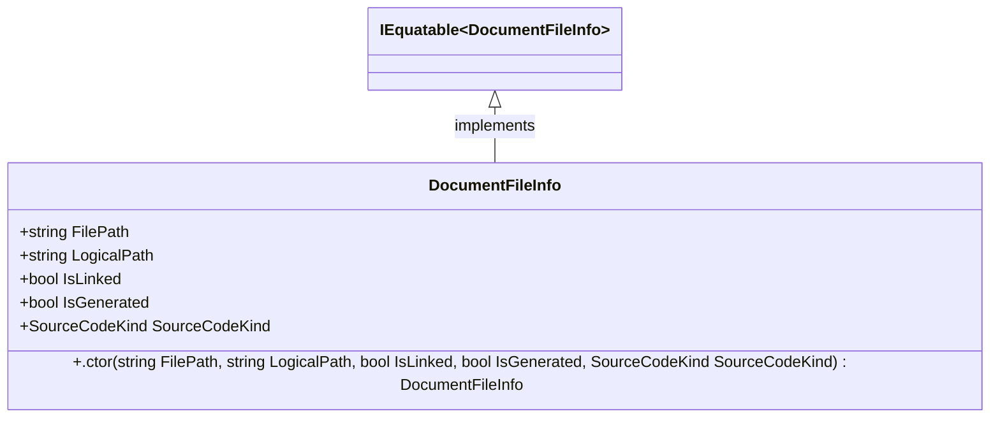

<div id="FileNameUtilities-class-diagram"></div>

##### `FileNameUtilities` class diagram

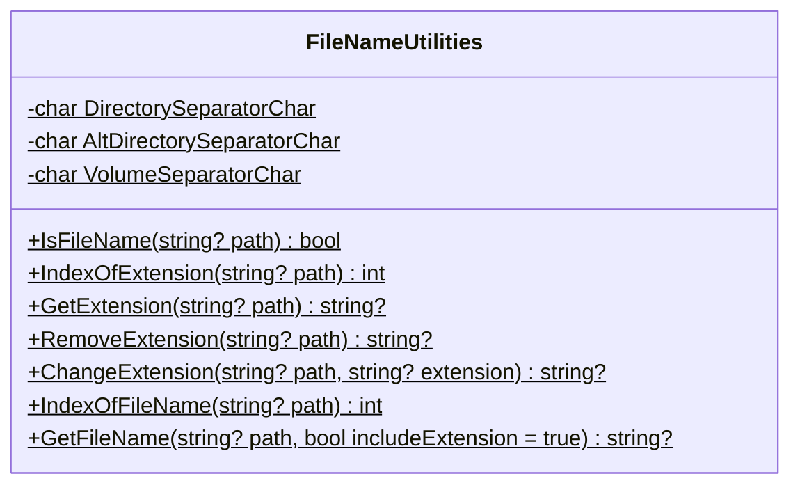

<div id="FileUtilities-class-diagram"></div>

##### `FileUtilities` class diagram

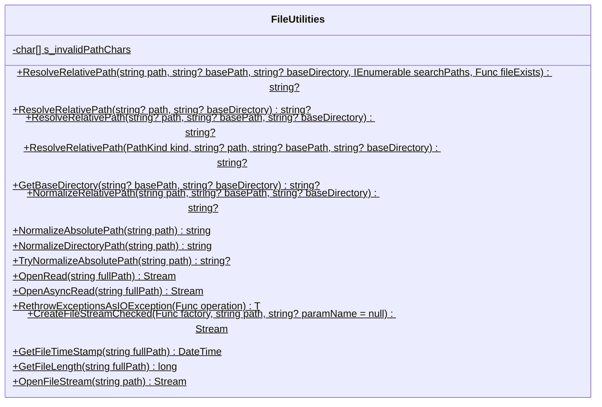

<div id="Hash-class-diagram"></div>

##### `Hash` class diagram

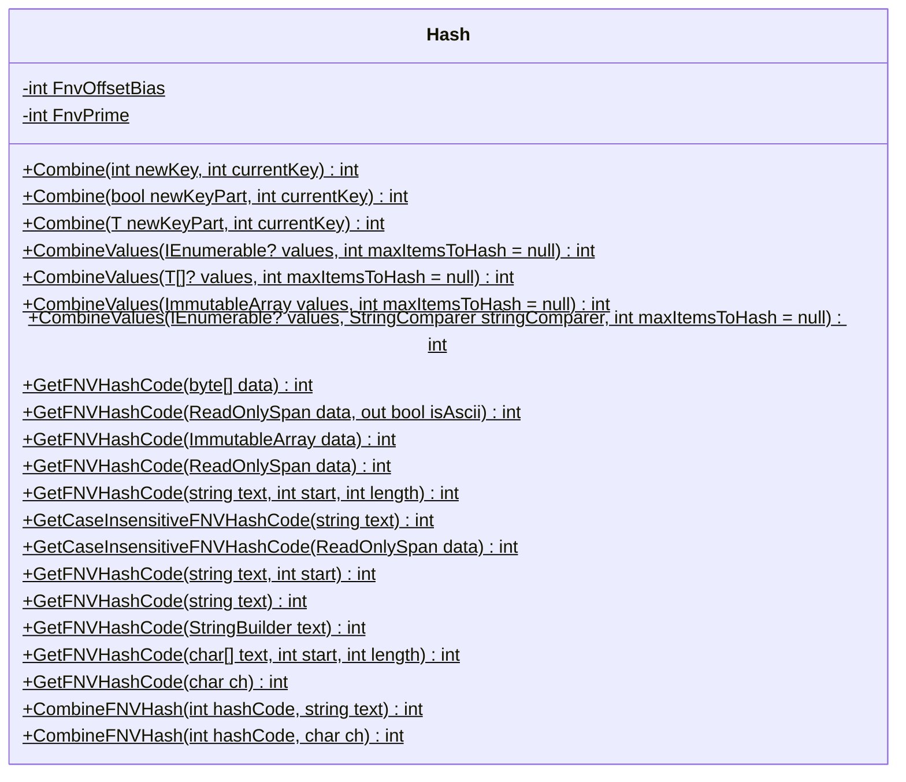

<div id="PathUtilities.PathComparer-class-diagram"></div>

##### `PathUtilities.PathComparer` class diagram

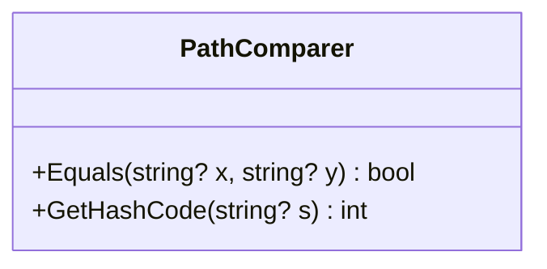

<div id="PathKind-class-diagram"></div>

##### `PathKind` class diagram

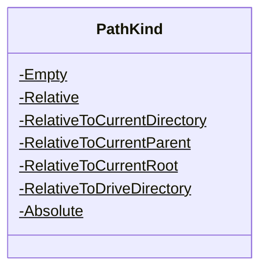

<div id="PathUtilities-class-diagram"></div>

##### `PathUtilities` class diagram

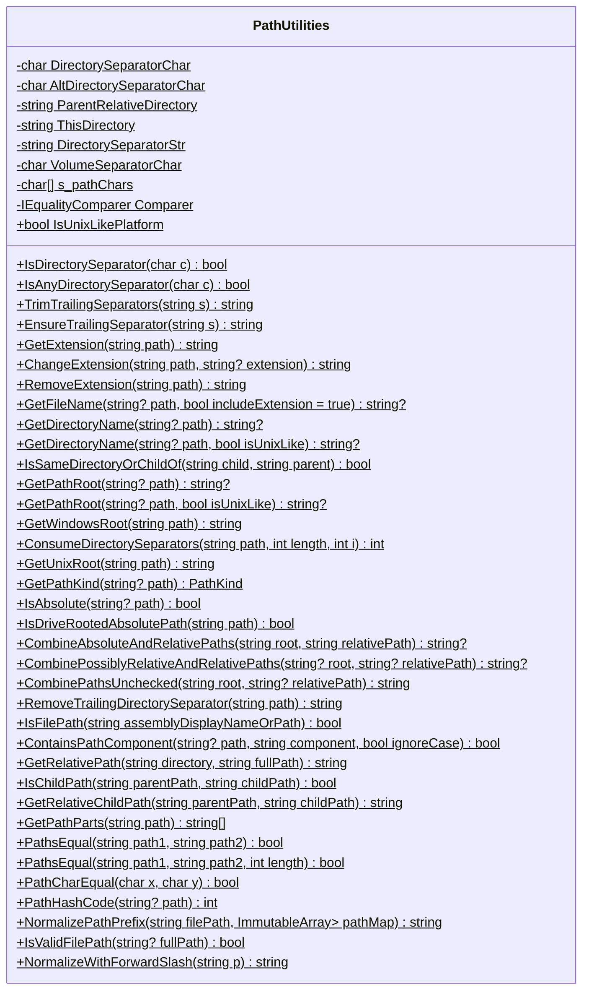

<div id="PlatformInformation-class-diagram"></div>

##### `PlatformInformation` class diagram

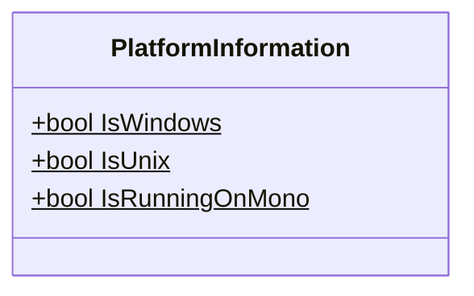

<div id="ProjectFileInfo-class-diagram"></div>

##### `ProjectFileInfo` class diagram


<div id="ProjectFileReference-class-diagram"></div>

##### `ProjectFileReference` class diagram

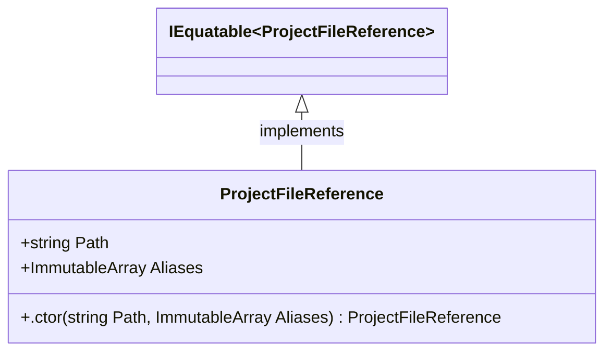

<div id="ProjectLoader-class-diagram"></div>

##### `ProjectLoader` class diagram

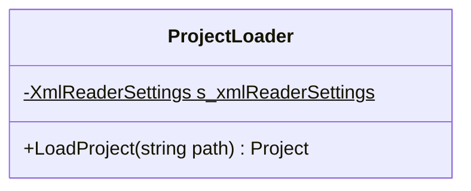

<div id="ProjectWorkspace-class-diagram"></div>

##### `ProjectWorkspace` class diagram

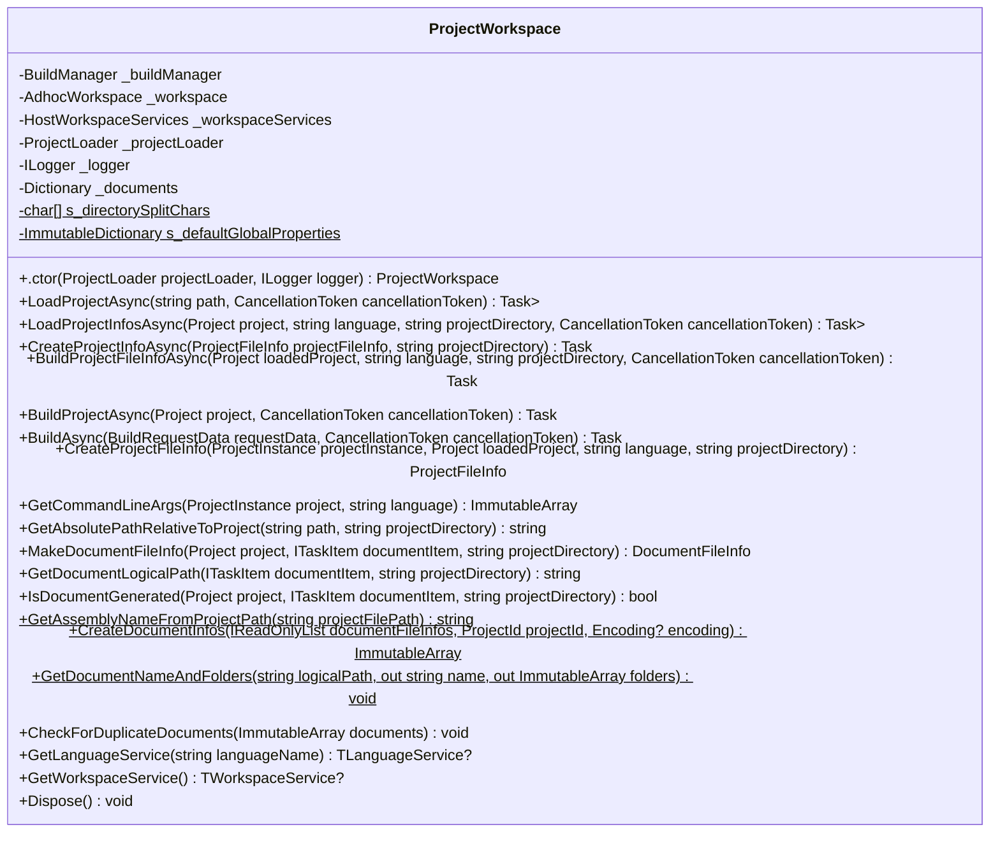

<div id="ServiceCollectionExtensions-class-diagram"></div>

##### `ServiceCollectionExtensions` class diagram


<div id="PathUtilities.TestAccessor-class-diagram"></div>

##### `PathUtilities.TestAccessor` class diagram

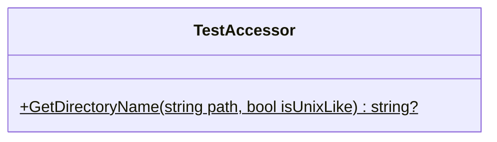

<div id="CSharpDefaults-class-diagram"></div>

##### `CSharpDefaults` class diagram

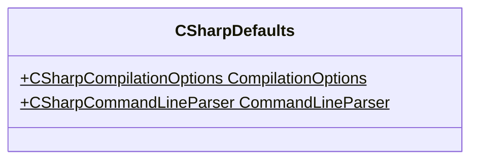

<div id="VisualBasicDefaults-class-diagram"></div>

##### `VisualBasicDefaults` class diagram

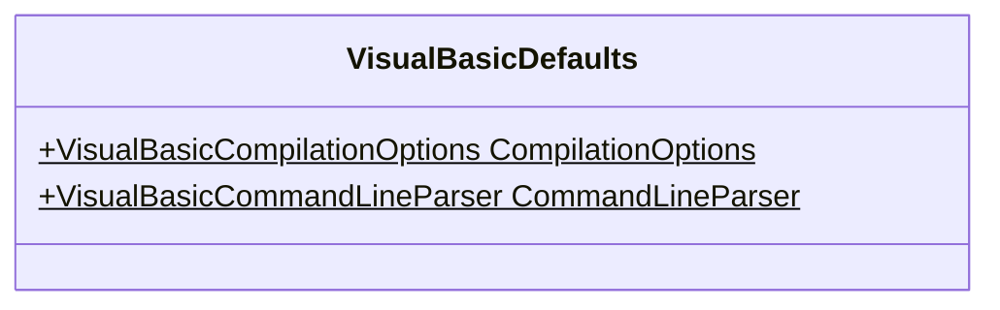

<div id="ProjectMetricDataAnalyzer-class-diagram"></div>

##### `ProjectMetricDataAnalyzer` class diagram

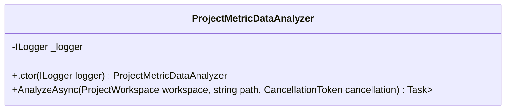

<div id="CodeAnalysisMetricDataExtensions-class-diagram"></div>

##### `CodeAnalysisMetricDataExtensions` class diagram

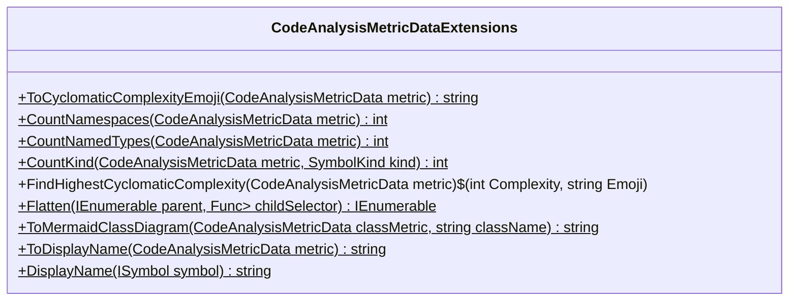

<div id="CodeMetricsReportExtensions-class-diagram"></div>

##### `CodeMetricsReportExtensions` class diagram

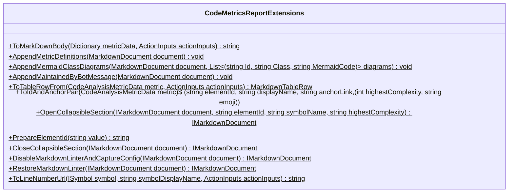

<div id="ServiceCollectionExtensions-class-diagram"></div>

##### `ServiceCollectionExtensions` class diagram


<div id="ActionInputs-class-diagram"></div>

##### `ActionInputs` class diagram

```mermaid
classDiagram
class ActionInputs{
    -string _repositoryName
    -string _branchName
    +string Owner
    +string Name
    +string Branch
    +string Directory
    +string WorkspaceDirectory
    +.ctor() ActionInputs
    +ParseAndAssign(string? value, Action<string> assign)$ void
}

```

*This file is maintained by a bot.*

<!-- markdownlint-restore -->
