<!-- markdownlint-capture -->
<!-- markdownlint-disable -->

# Code Metrics

This file is dynamically maintained by a bot, *please do not* edit this by hand. It represents various [code metrics](https://aka.ms/dotnet/code-metrics), such as cyclomatic complexity, maintainability index, and so on.

<div id='dotnet-codeanalysis'></div>

## DotNet.CodeAnalysis :exploding_head:

The *DotNet.CodeAnalysis.csproj* project file contains:

- 3 namespaces.
- 16 named types.
- 2,590 total lines of source code.
- Approximately 643 lines of executable code.
- The highest cyclomatic complexity is 17 :exploding_head:.

<details>
<summary>
  <strong id="dotnet-codeanalysis">
    DotNet.CodeAnalysis :exploding_head:
  </strong>
</summary>
<br>

The `DotNet.CodeAnalysis` namespace contains 14 named types.

- 14 named types.
- 2,568 total lines of source code.
- Approximately 639 lines of executable code.
- The highest cyclomatic complexity is 17 :exploding_head:.

<details>
<summary>
  <strong id="documentfileinfo">
    DocumentFileInfo :heavy_check_mark:
  </strong>
</summary>
<br>

- The `DocumentFileInfo` contains 6 members.
- 33 total lines of source code.
- Approximately 0 lines of executable code.
- The highest cyclomatic complexity is 1 :heavy_check_mark:.

| Member kind | Line number | Maintainability index | Cyclomatic complexity | Depth of inheritance | Class coupling | Lines of source / executable code |
| :-: | :-: | :-: | :-: | :-: | :-: | :-: |
| Method | <a href='https://github.com/dotnet/samples/blob/main/github-actions/DotNet.GitHubAction/DotNet.CodeAnalysis/DocumentFileInfo.cs#L8' title='DocumentFileInfo.DocumentFileInfo(string FilePath, string LogicalPath, bool IsLinked, bool IsGenerated, SourceCodeKind SourceCodeKind)'>8</a> | 100 | 1 :heavy_check_mark: | 0 | 1 | 33 / 0 |
| Property | <a href='https://github.com/dotnet/samples/blob/main/github-actions/DotNet.GitHubAction/DotNet.CodeAnalysis/DocumentFileInfo.cs#L12' title='string DocumentFileInfo.FilePath'>12</a> | 100 | 0 :heavy_check_mark: | 0 | 0 | 3 / 0 |
| Property | <a href='https://github.com/dotnet/samples/blob/main/github-actions/DotNet.GitHubAction/DotNet.CodeAnalysis/DocumentFileInfo.cs#L30' title='bool DocumentFileInfo.IsGenerated'>30</a> | 100 | 0 :heavy_check_mark: | 0 | 0 | 4 / 0 |
| Property | <a href='https://github.com/dotnet/samples/blob/main/github-actions/DotNet.GitHubAction/DotNet.CodeAnalysis/DocumentFileInfo.cs#L25' title='bool DocumentFileInfo.IsLinked'>25</a> | 100 | 0 :heavy_check_mark: | 0 | 0 | 5 / 0 |
| Property | <a href='https://github.com/dotnet/samples/blob/main/github-actions/DotNet.GitHubAction/DotNet.CodeAnalysis/DocumentFileInfo.cs#L19' title='string DocumentFileInfo.LogicalPath'>19</a> | 100 | 0 :heavy_check_mark: | 0 | 0 | 6 / 0 |
| Property | <a href='https://github.com/dotnet/samples/blob/main/github-actions/DotNet.GitHubAction/DotNet.CodeAnalysis/DocumentFileInfo.cs#L35' title='SourceCodeKind DocumentFileInfo.SourceCodeKind'>35</a> | 100 | 0 :heavy_check_mark: | 0 | 1 | 4 / 0 |

<a href="#DocumentFileInfo-class-diagram">:link: to `DocumentFileInfo` class diagram</a>

<a href="#dotnet-codeanalysis">:top: back to DotNet.CodeAnalysis</a>

</details>

<details>
<summary>
  <strong id="filenameutilities">
    FileNameUtilities :warning:
  </strong>
</summary>
<br>

- The `FileNameUtilities` contains 10 members.
- 183 total lines of source code.
- Approximately 51 lines of executable code.
- The highest cyclomatic complexity is 8 :warning:.

| Member kind | Line number | Maintainability index | Cyclomatic complexity | Depth of inheritance | Class coupling | Lines of source / executable code |
| :-: | :-: | :-: | :-: | :-: | :-: | :-: |
| Field | <a href='https://github.com/dotnet/samples/blob/main/github-actions/DotNet.GitHubAction/DotNet.CodeAnalysis/FileNameUtilities.cs#L15' title='char FileNameUtilities.AltDirectorySeparatorChar'>15</a> | 93 | 0 :heavy_check_mark: | 0 | 0 | 1 / 1 |
| Method | <a href='https://github.com/dotnet/samples/blob/main/github-actions/DotNet.GitHubAction/DotNet.CodeAnalysis/FileNameUtilities.cs#L130' title='string? FileNameUtilities.ChangeExtension(string? path, string? extension)'>130</a> | 63 | 6 :heavy_check_mark: | 0 | 3 | 31 / 9 |
| Field | <a href='https://github.com/dotnet/samples/blob/main/github-actions/DotNet.GitHubAction/DotNet.CodeAnalysis/FileNameUtilities.cs#L14' title='char FileNameUtilities.DirectorySeparatorChar'>14</a> | 93 | 0 :heavy_check_mark: | 0 | 0 | 1 / 1 |
| Method | <a href='https://github.com/dotnet/samples/blob/main/github-actions/DotNet.GitHubAction/DotNet.CodeAnalysis/FileNameUtilities.cs#L78' title='string? FileNameUtilities.GetExtension(string? path)'>78</a> | 72 | 3 :heavy_check_mark: | 0 | 3 | 18 / 5 |
| Method | <a href='https://github.com/dotnet/samples/blob/main/github-actions/DotNet.GitHubAction/DotNet.CodeAnalysis/FileNameUtilities.cs#L179' title='string? FileNameUtilities.GetFileName(string? path, bool includeExtension = true)'>179</a> | 70 | 3 :heavy_check_mark: | 0 | 3 | 11 / 5 |
| Method | <a href='https://github.com/dotnet/samples/blob/main/github-actions/DotNet.GitHubAction/DotNet.CodeAnalysis/FileNameUtilities.cs#L38' title='int FileNameUtilities.IndexOfExtension(string? path)'>38</a> | 58 | 8 :warning: | 0 | 2 | 38 / 13 |
| Method | <a href='https://github.com/dotnet/samples/blob/main/github-actions/DotNet.GitHubAction/DotNet.CodeAnalysis/FileNameUtilities.cs#L155' title='int FileNameUtilities.IndexOfFileName(string? path)'>155</a> | 65 | 6 :heavy_check_mark: | 0 | 2 | 22 / 7 |
| Method | <a href='https://github.com/dotnet/samples/blob/main/github-actions/DotNet.GitHubAction/DotNet.CodeAnalysis/FileNameUtilities.cs#L26' title='bool FileNameUtilities.IsFileName(string? path)'>26</a> | 92 | 1 :heavy_check_mark: | 0 | 2 | 12 / 1 |
| Method | <a href='https://github.com/dotnet/samples/blob/main/github-actions/DotNet.GitHubAction/DotNet.CodeAnalysis/FileNameUtilities.cs#L97' title='string? FileNameUtilities.RemoveExtension(string? path)'>97</a> | 63 | 5 :heavy_check_mark: | 0 | 3 | 29 / 9 |
| Field | <a href='https://github.com/dotnet/samples/blob/main/github-actions/DotNet.GitHubAction/DotNet.CodeAnalysis/FileNameUtilities.cs#L16' title='char FileNameUtilities.VolumeSeparatorChar'>16</a> | 93 | 0 :heavy_check_mark: | 0 | 0 | 1 / 1 |

<a href="#FileNameUtilities-class-diagram">:link: to `FileNameUtilities` class diagram</a>

<a href="#dotnet-codeanalysis">:top: back to DotNet.CodeAnalysis</a>

</details>

<details>
<summary>
  <strong id="fileutilities">
    FileUtilities :exploding_head:
  </strong>
</summary>
<br>

- The `FileUtilities` contains 17 members.
- 392 total lines of source code.
- Approximately 82 lines of executable code.
- The highest cyclomatic complexity is 17 :exploding_head:.

| Member kind | Line number | Maintainability index | Cyclomatic complexity | Depth of inheritance | Class coupling | Lines of source / executable code |
| :-: | :-: | :-: | :-: | :-: | :-: | :-: |
| Method | <a href='https://github.com/dotnet/samples/blob/main/github-actions/DotNet.GitHubAction/DotNet.CodeAnalysis/FileUtilities.cs#L298' title='Stream FileUtilities.CreateFileStreamChecked(Func<string, Stream> factory, string path, string? paramName = null)'>298</a> | 66 | 3 :heavy_check_mark: | 0 | 9 | 41 / 8 |
| Method | <a href='https://github.com/dotnet/samples/blob/main/github-actions/DotNet.GitHubAction/DotNet.CodeAnalysis/FileUtilities.cs#L168' title='string? FileUtilities.GetBaseDirectory(string? basePath, string? baseDirectory)'>168</a> | 72 | 2 :heavy_check_mark: | 0 | 2 | 19 / 6 |
| Method | <a href='https://github.com/dotnet/samples/blob/main/github-actions/DotNet.GitHubAction/DotNet.CodeAnalysis/FileUtilities.cs#L354' title='long FileUtilities.GetFileLength(string fullPath)'>354</a> | 79 | 1 :heavy_check_mark: | 0 | 5 | 17 / 4 |
| Method | <a href='https://github.com/dotnet/samples/blob/main/github-actions/DotNet.GitHubAction/DotNet.CodeAnalysis/FileUtilities.cs#L337' title='DateTime FileUtilities.GetFileTimeStamp(string fullPath)'>337</a> | 84 | 1 :heavy_check_mark: | 0 | 5 | 16 / 3 |
| Method | <a href='https://github.com/dotnet/samples/blob/main/github-actions/DotNet.GitHubAction/DotNet.CodeAnalysis/FileUtilities.cs#L219' title='string FileUtilities.NormalizeAbsolutePath(string path)'>219</a> | 75 | 1 :heavy_check_mark: | 0 | 6 | 26 / 5 |
| Method | <a href='https://github.com/dotnet/samples/blob/main/github-actions/DotNet.GitHubAction/DotNet.CodeAnalysis/FileUtilities.cs#L240' title='string FileUtilities.NormalizeDirectoryPath(string path)'>240</a> | 96 | 1 :heavy_check_mark: | 0 | 1 | 4 / 1 |
| Method | <a href='https://github.com/dotnet/samples/blob/main/github-actions/DotNet.GitHubAction/DotNet.CodeAnalysis/FileUtilities.cs#L190' title='string? FileUtilities.NormalizeRelativePath(string path, string? basePath, string? baseDirectory)'>190</a> | 64 | 5 :heavy_check_mark: | 0 | 2 | 22 / 9 |
| Method | <a href='https://github.com/dotnet/samples/blob/main/github-actions/DotNet.GitHubAction/DotNet.CodeAnalysis/FileUtilities.cs#L273' title='Stream FileUtilities.OpenAsyncRead(string fullPath)'>273</a> | 90 | 1 :heavy_check_mark: | 0 | 3 | 4 / 2 |
| Method | <a href='https://github.com/dotnet/samples/blob/main/github-actions/DotNet.GitHubAction/DotNet.CodeAnalysis/FileUtilities.cs#L371' title='Stream FileUtilities.OpenFileStream(string path)'>371</a> | 78 | 1 :heavy_check_mark: | 0 | 7 | 23 / 4 |
| Method | <a href='https://github.com/dotnet/samples/blob/main/github-actions/DotNet.GitHubAction/DotNet.CodeAnalysis/FileUtilities.cs#L257' title='Stream FileUtilities.OpenRead(string fullPath)'>257</a> | 84 | 1 :heavy_check_mark: | 0 | 6 | 15 / 3 |
| Method | <a href='https://github.com/dotnet/samples/blob/main/github-actions/DotNet.GitHubAction/DotNet.CodeAnalysis/FileUtilities.cs#L33' title='string? FileUtilities.ResolveRelativePath(string path, string? basePath, string? baseDirectory, IEnumerable<string> searchPaths, Func<string, bool> fileExists)'>33</a> | 56 | 8 :warning: | 0 | 6 | 72 / 17 |
| Method | <a href='https://github.com/dotnet/samples/blob/main/github-actions/DotNet.GitHubAction/DotNet.CodeAnalysis/FileUtilities.cs#L80' title='string? FileUtilities.ResolveRelativePath(string? path, string? baseDirectory)'>80</a> | 93 | 1 :heavy_check_mark: | 0 | 1 | 2 / 1 |
| Method | <a href='https://github.com/dotnet/samples/blob/main/github-actions/DotNet.GitHubAction/DotNet.CodeAnalysis/FileUtilities.cs#L83' title='string? FileUtilities.ResolveRelativePath(string? path, string? basePath, string? baseDirectory)'>83</a> | 91 | 1 :heavy_check_mark: | 0 | 3 | 4 / 1 |
| Method | <a href='https://github.com/dotnet/samples/blob/main/github-actions/DotNet.GitHubAction/DotNet.CodeAnalysis/FileUtilities.cs#L88' title='string? FileUtilities.ResolveRelativePath(PathKind kind, string? path, string? basePath, string? baseDirectory)'>88</a> | 57 | 17 :exploding_head: | 0 | 6 | 79 / 11 |
| Method | <a href='https://github.com/dotnet/samples/blob/main/github-actions/DotNet.GitHubAction/DotNet.CodeAnalysis/FileUtilities.cs#L278' title='T FileUtilities.RethrowExceptionsAsIOException<T>(Func<T> operation)'>278</a> | 84 | 1 :heavy_check_mark: | 0 | 5 | 15 / 3 |
| Field | <a href='https://github.com/dotnet/samples/blob/main/github-actions/DotNet.GitHubAction/DotNet.CodeAnalysis/FileUtilities.cs#L188' title='char[] FileUtilities.s_invalidPathChars'>188</a> | 93 | 0 :heavy_check_mark: | 0 | 1 | 1 / 1 |
| Method | <a href='https://github.com/dotnet/samples/blob/main/github-actions/DotNet.GitHubAction/DotNet.CodeAnalysis/FileUtilities.cs#L245' title='string? FileUtilities.TryNormalizeAbsolutePath(string path)'>245</a> | 85 | 1 :heavy_check_mark: | 0 | 2 | 11 / 3 |

<a href="#FileUtilities-class-diagram">:link: to `FileUtilities` class diagram</a>

<a href="#dotnet-codeanalysis">:top: back to DotNet.CodeAnalysis</a>

</details>

<details>
<summary>
  <strong id="hash">
    Hash :heavy_check_mark:
  </strong>
</summary>
<br>

- The `Hash` contains 23 members.
- 368 total lines of source code.
- Approximately 94 lines of executable code.
- The highest cyclomatic complexity is 5 :heavy_check_mark:.

| Member kind | Line number | Maintainability index | Cyclomatic complexity | Depth of inheritance | Class coupling | Lines of source / executable code |
| :-: | :-: | :-: | :-: | :-: | :-: | :-: |
| Method | <a href='https://github.com/dotnet/samples/blob/main/github-actions/DotNet.GitHubAction/DotNet.CodeAnalysis/Hash.cs#L10' title='int Hash.Combine(int newKey, int currentKey)'>10</a> | 91 | 1 :heavy_check_mark: | 0 | 1 | 7 / 1 |
| Method | <a href='https://github.com/dotnet/samples/blob/main/github-actions/DotNet.GitHubAction/DotNet.CodeAnalysis/Hash.cs#L15' title='int Hash.Combine(bool newKeyPart, int currentKey)'>15</a> | 91 | 2 :heavy_check_mark: | 0 | 0 | 4 / 1 |
| Method | <a href='https://github.com/dotnet/samples/blob/main/github-actions/DotNet.GitHubAction/DotNet.CodeAnalysis/Hash.cs#L26' title='int Hash.Combine<T>(T newKeyPart, int currentKey)'>26</a> | 75 | 2 :heavy_check_mark: | 0 | 1 | 17 / 4 |
| Method | <a href='https://github.com/dotnet/samples/blob/main/github-actions/DotNet.GitHubAction/DotNet.CodeAnalysis/Hash.cs#L349' title='int Hash.CombineFNVHash(int hashCode, string text)'>349</a> | 79 | 2 :heavy_check_mark: | 0 | 1 | 16 / 3 |
| Method | <a href='https://github.com/dotnet/samples/blob/main/github-actions/DotNet.GitHubAction/DotNet.CodeAnalysis/Hash.cs#L366' title='int Hash.CombineFNVHash(int hashCode, char ch)'>366</a> | 91 | 1 :heavy_check_mark: | 0 | 1 | 11 / 1 |
| Method | <a href='https://github.com/dotnet/samples/blob/main/github-actions/DotNet.GitHubAction/DotNet.CodeAnalysis/Hash.cs#L38' title='int Hash.CombineValues<T>(IEnumerable<T>? values, int maxItemsToHash = null)'>38</a> | 62 | 5 :heavy_check_mark: | 0 | 4 | 25 / 11 |
| Method | <a href='https://github.com/dotnet/samples/blob/main/github-actions/DotNet.GitHubAction/DotNet.CodeAnalysis/Hash.cs#L64' title='int Hash.CombineValues<T>(T[]? values, int maxItemsToHash = null)'>64</a> | 62 | 4 :heavy_check_mark: | 0 | 1 | 23 / 10 |
| Method | <a href='https://github.com/dotnet/samples/blob/main/github-actions/DotNet.GitHubAction/DotNet.CodeAnalysis/Hash.cs#L88' title='int Hash.CombineValues<T>(ImmutableArray<T> values, int maxItemsToHash = null)'>88</a> | 63 | 5 :heavy_check_mark: | 0 | 3 | 25 / 11 |
| Method | <a href='https://github.com/dotnet/samples/blob/main/github-actions/DotNet.GitHubAction/DotNet.CodeAnalysis/Hash.cs#L114' title='int Hash.CombineValues(IEnumerable<string?>? values, StringComparer stringComparer, int maxItemsToHash = null)'>114</a> | 62 | 5 :heavy_check_mark: | 0 | 5 | 24 / 11 |
| Field | <a href='https://github.com/dotnet/samples/blob/main/github-actions/DotNet.GitHubAction/DotNet.CodeAnalysis/Hash.cs#L143' title='int Hash.FnvOffsetBias'>143</a> | 93 | 0 :heavy_check_mark: | 0 | 0 | 1 / 1 |
| Field | <a href='https://github.com/dotnet/samples/blob/main/github-actions/DotNet.GitHubAction/DotNet.CodeAnalysis/Hash.cs#L149' title='int Hash.FnvPrime'>149</a> | 93 | 0 :heavy_check_mark: | 0 | 0 | 1 / 1 |
| Method | <a href='https://github.com/dotnet/samples/blob/main/github-actions/DotNet.GitHubAction/DotNet.CodeAnalysis/Hash.cs#L248' title='int Hash.GetCaseInsensitiveFNVHashCode(string text)'>248</a> | 96 | 1 :heavy_check_mark: | 0 | 1 | 4 / 1 |
| Method | <a href='https://github.com/dotnet/samples/blob/main/github-actions/DotNet.GitHubAction/DotNet.CodeAnalysis/Hash.cs#L253' title='int Hash.GetCaseInsensitiveFNVHashCode(ReadOnlySpan<char> data)'>253</a> | 73 | 2 :heavy_check_mark: | 0 | 2 | 11 / 4 |
| Method | <a href='https://github.com/dotnet/samples/blob/main/github-actions/DotNet.GitHubAction/DotNet.CodeAnalysis/Hash.cs#L157' title='int Hash.GetFNVHashCode(byte[] data)'>157</a> | 73 | 2 :heavy_check_mark: | 0 | 1 | 17 / 4 |
| Method | <a href='https://github.com/dotnet/samples/blob/main/github-actions/DotNet.GitHubAction/DotNet.CodeAnalysis/Hash.cs#L178' title='int Hash.GetFNVHashCode(ReadOnlySpan<byte> data, out bool isAscii)'>178</a> | 64 | 2 :heavy_check_mark: | 0 | 2 | 25 / 8 |
| Method | <a href='https://github.com/dotnet/samples/blob/main/github-actions/DotNet.GitHubAction/DotNet.CodeAnalysis/Hash.cs#L201' title='int Hash.GetFNVHashCode(ImmutableArray<byte> data)'>201</a> | 73 | 2 :heavy_check_mark: | 0 | 2 | 17 / 4 |
| Method | <a href='https://github.com/dotnet/samples/blob/main/github-actions/DotNet.GitHubAction/DotNet.CodeAnalysis/Hash.cs#L221' title='int Hash.GetFNVHashCode(ReadOnlySpan<char> data)'>221</a> | 73 | 2 :heavy_check_mark: | 0 | 2 | 19 / 4 |
| Method | <a href='https://github.com/dotnet/samples/blob/main/github-actions/DotNet.GitHubAction/DotNet.CodeAnalysis/Hash.cs#L245' title='int Hash.GetFNVHashCode(string text, int start, int length)'>245</a> | 95 | 1 :heavy_check_mark: | 0 | 1 | 14 / 1 |
| Method | <a href='https://github.com/dotnet/samples/blob/main/github-actions/DotNet.GitHubAction/DotNet.CodeAnalysis/Hash.cs#L272' title='int Hash.GetFNVHashCode(string text, int start)'>272</a> | 93 | 1 :heavy_check_mark: | 0 | 1 | 11 / 1 |
| Method | <a href='https://github.com/dotnet/samples/blob/main/github-actions/DotNet.GitHubAction/DotNet.CodeAnalysis/Hash.cs#L283' title='int Hash.GetFNVHashCode(string text)'>283</a> | 93 | 1 :heavy_check_mark: | 0 | 0 | 10 / 1 |
| Method | <a href='https://github.com/dotnet/samples/blob/main/github-actions/DotNet.GitHubAction/DotNet.CodeAnalysis/Hash.cs#L294' title='int Hash.GetFNVHashCode(StringBuilder text)'>294</a> | 71 | 2 :heavy_check_mark: | 0 | 4 | 18 / 5 |
| Method | <a href='https://github.com/dotnet/samples/blob/main/github-actions/DotNet.GitHubAction/DotNet.CodeAnalysis/Hash.cs#L315' title='int Hash.GetFNVHashCode(char[] text, int start, int length)'>315</a> | 70 | 2 :heavy_check_mark: | 0 | 1 | 20 / 5 |
| Method | <a href='https://github.com/dotnet/samples/blob/main/github-actions/DotNet.GitHubAction/DotNet.CodeAnalysis/Hash.cs#L337' title='int Hash.GetFNVHashCode(char ch)'>337</a> | 93 | 1 :heavy_check_mark: | 0 | 0 | 13 / 1 |

<a href="#Hash-class-diagram">:link: to `Hash` class diagram</a>

<a href="#dotnet-codeanalysis">:top: back to DotNet.CodeAnalysis</a>

</details>

<details>
<summary>
  <strong id="pathutilities-pathcomparer">
    PathUtilities.PathComparer :heavy_check_mark:
  </strong>
</summary>
<br>

- The `PathUtilities.PathComparer` contains 2 members.
- 22 total lines of source code.
- Approximately 6 lines of executable code.
- The highest cyclomatic complexity is 5 :heavy_check_mark:.

| Member kind | Line number | Maintainability index | Cyclomatic complexity | Depth of inheritance | Class coupling | Lines of source / executable code |
| :-: | :-: | :-: | :-: | :-: | :-: | :-: |
| Method | <a href='https://github.com/dotnet/samples/blob/main/github-actions/DotNet.GitHubAction/DotNet.CodeAnalysis/PathUtilities.cs#L721' title='bool PathComparer.Equals(string? x, string? y)'>721</a> | 71 | 5 :heavy_check_mark: | 0 | 1 | 14 / 5 |
| Method | <a href='https://github.com/dotnet/samples/blob/main/github-actions/DotNet.GitHubAction/DotNet.CodeAnalysis/PathUtilities.cs#L736' title='int PathComparer.GetHashCode(string? s)'>736</a> | 96 | 1 :heavy_check_mark: | 0 | 1 | 4 / 1 |

<a href="#PathUtilities.PathComparer-class-diagram">:link: to `PathUtilities.PathComparer` class diagram</a>

<a href="#dotnet-codeanalysis">:top: back to DotNet.CodeAnalysis</a>

</details>

<details>
<summary>
  <strong id="pathkind">
    PathKind :heavy_check_mark:
  </strong>
</summary>
<br>

- The `PathKind` contains 7 members.
- 39 total lines of source code.
- Approximately 0 lines of executable code.
- The highest cyclomatic complexity is 0 :heavy_check_mark:.

| Member kind | Line number | Maintainability index | Cyclomatic complexity | Depth of inheritance | Class coupling | Lines of source / executable code |
| :-: | :-: | :-: | :-: | :-: | :-: | :-: |
| Field | <a href='https://github.com/dotnet/samples/blob/main/github-actions/DotNet.GitHubAction/DotNet.CodeAnalysis/PathKind.cs#L40' title='PathKind.Absolute'>40</a> | 100 | 0 :heavy_check_mark: | 0 | 0 | 4 / 0 |
| Field | <a href='https://github.com/dotnet/samples/blob/main/github-actions/DotNet.GitHubAction/DotNet.CodeAnalysis/PathKind.cs#L10' title='PathKind.Empty'>10</a> | 100 | 0 :heavy_check_mark: | 0 | 0 | 3 / 0 |
| Field | <a href='https://github.com/dotnet/samples/blob/main/github-actions/DotNet.GitHubAction/DotNet.CodeAnalysis/PathKind.cs#L15' title='PathKind.Relative'>15</a> | 100 | 0 :heavy_check_mark: | 0 | 0 | 4 / 0 |
| Field | <a href='https://github.com/dotnet/samples/blob/main/github-actions/DotNet.GitHubAction/DotNet.CodeAnalysis/PathKind.cs#L20' title='PathKind.RelativeToCurrentDirectory'>20</a> | 100 | 0 :heavy_check_mark: | 0 | 0 | 4 / 0 |
| Field | <a href='https://github.com/dotnet/samples/blob/main/github-actions/DotNet.GitHubAction/DotNet.CodeAnalysis/PathKind.cs#L25' title='PathKind.RelativeToCurrentParent'>25</a> | 100 | 0 :heavy_check_mark: | 0 | 0 | 4 / 0 |
| Field | <a href='https://github.com/dotnet/samples/blob/main/github-actions/DotNet.GitHubAction/DotNet.CodeAnalysis/PathKind.cs#L30' title='PathKind.RelativeToCurrentRoot'>30</a> | 100 | 0 :heavy_check_mark: | 0 | 0 | 4 / 0 |
| Field | <a href='https://github.com/dotnet/samples/blob/main/github-actions/DotNet.GitHubAction/DotNet.CodeAnalysis/PathKind.cs#L35' title='PathKind.RelativeToDriveDirectory'>35</a> | 100 | 0 :heavy_check_mark: | 0 | 0 | 4 / 0 |

<a href="#PathKind-class-diagram">:link: to `PathKind` class diagram</a>

<a href="#dotnet-codeanalysis">:top: back to DotNet.CodeAnalysis</a>

</details>

<details>
<summary>
  <strong id="pathutilities">
    PathUtilities :exploding_head:
  </strong>
</summary>
<br>

- The `PathUtilities` contains 45 members.
- 745 total lines of source code.
- Approximately 198 lines of executable code.
- The highest cyclomatic complexity is 17 :exploding_head:.

| Member kind | Line number | Maintainability index | Cyclomatic complexity | Depth of inheritance | Class coupling | Lines of source / executable code |
| :-: | :-: | :-: | :-: | :-: | :-: | :-: |
| Field | <a href='https://github.com/dotnet/samples/blob/main/github-actions/DotNet.GitHubAction/DotNet.CodeAnalysis/PathUtilities.cs#L13' title='char PathUtilities.AltDirectorySeparatorChar'>13</a> | 93 | 0 :heavy_check_mark: | 0 | 0 | 1 / 1 |
| Method | <a href='https://github.com/dotnet/samples/blob/main/github-actions/DotNet.GitHubAction/DotNet.CodeAnalysis/PathUtilities.cs#L86' title='string PathUtilities.ChangeExtension(string path, string? extension)'>86</a> | 97 | 1 :heavy_check_mark: | 0 | 1 | 4 / 1 |
| Method | <a href='https://github.com/dotnet/samples/blob/main/github-actions/DotNet.GitHubAction/DotNet.CodeAnalysis/PathUtilities.cs#L380' title='string? PathUtilities.CombineAbsoluteAndRelativePaths(string root, string relativePath)'>380</a> | 97 | 1 :heavy_check_mark: | 0 | 1 | 16 / 1 |
| Method | <a href='https://github.com/dotnet/samples/blob/main/github-actions/DotNet.GitHubAction/DotNet.CodeAnalysis/PathUtilities.cs#L407' title='string PathUtilities.CombinePathsUnchecked(string root, string? relativePath)'>407</a> | 72 | 3 :heavy_check_mark: | 0 | 2 | 10 / 4 |
| Method | <a href='https://github.com/dotnet/samples/blob/main/github-actions/DotNet.GitHubAction/DotNet.CodeAnalysis/PathUtilities.cs#L392' title='string? PathUtilities.CombinePossiblyRelativeAndRelativePaths(string? root, string? relativePath)'>392</a> | 78 | 2 :heavy_check_mark: | 0 | 3 | 21 / 3 |
| Field | <a href='https://github.com/dotnet/samples/blob/main/github-actions/DotNet.GitHubAction/DotNet.CodeAnalysis/PathUtilities.cs#L717' title='IEqualityComparer<string> PathUtilities.Comparer'>717</a> | 93 | 0 :heavy_check_mark: | 0 | 2 | 1 / 1 |
| Method | <a href='https://github.com/dotnet/samples/blob/main/github-actions/DotNet.GitHubAction/DotNet.CodeAnalysis/PathUtilities.cs#L254' title='int PathUtilities.ConsumeDirectorySeparators(string path, int length, int i)'>254</a> | 79 | 3 :heavy_check_mark: | 0 | 1 | 9 / 3 |
| Method | <a href='https://github.com/dotnet/samples/blob/main/github-actions/DotNet.GitHubAction/DotNet.CodeAnalysis/PathUtilities.cs#L454' title='bool PathUtilities.ContainsPathComponent(string? path, string component, bool ignoreCase)'>454</a> | 60 | 7 :heavy_check_mark: | 0 | 2 | 35 / 12 |
| Field | <a href='https://github.com/dotnet/samples/blob/main/github-actions/DotNet.GitHubAction/DotNet.CodeAnalysis/PathUtilities.cs#L12' title='char PathUtilities.DirectorySeparatorChar'>12</a> | 88 | 1 :heavy_check_mark: | 0 | 1 | 1 / 1 |
| Field | <a href='https://github.com/dotnet/samples/blob/main/github-actions/DotNet.GitHubAction/DotNet.CodeAnalysis/PathUtilities.cs#L16' title='string PathUtilities.DirectorySeparatorStr'>16</a> | 90 | 0 :heavy_check_mark: | 0 | 0 | 1 / 1 |
| Method | <a href='https://github.com/dotnet/samples/blob/main/github-actions/DotNet.GitHubAction/DotNet.CodeAnalysis/PathUtilities.cs#L56' title='string PathUtilities.EnsureTrailingSeparator(string s)'>56</a> | 62 | 7 :heavy_check_mark: | 0 | 1 | 27 / 9 |
| Method | <a href='https://github.com/dotnet/samples/blob/main/github-actions/DotNet.GitHubAction/DotNet.CodeAnalysis/PathUtilities.cs#L109' title='string? PathUtilities.GetDirectoryName(string? path)'>109</a> | 93 | 1 :heavy_check_mark: | 0 | 1 | 11 / 1 |
| Method | <a href='https://github.com/dotnet/samples/blob/main/github-actions/DotNet.GitHubAction/DotNet.CodeAnalysis/PathUtilities.cs#L114' title='string? PathUtilities.GetDirectoryName(string? path, bool isUnixLike)'>114</a> | 60 | 7 :heavy_check_mark: | 0 | 2 | 28 / 12 |
| Method | <a href='https://github.com/dotnet/samples/blob/main/github-actions/DotNet.GitHubAction/DotNet.CodeAnalysis/PathUtilities.cs#L81' title='string PathUtilities.GetExtension(string path)'>81</a> | 100 | 1 :heavy_check_mark: | 0 | 1 | 4 / 1 |
| Method | <a href='https://github.com/dotnet/samples/blob/main/github-actions/DotNet.GitHubAction/DotNet.CodeAnalysis/PathUtilities.cs#L97' title='string? PathUtilities.GetFileName(string? path, bool includeExtension = true)'>97</a> | 78 | 1 :heavy_check_mark: | 0 | 3 | 5 / 3 |
| Method | <a href='https://github.com/dotnet/samples/blob/main/github-actions/DotNet.GitHubAction/DotNet.CodeAnalysis/PathUtilities.cs#L275' title='PathKind PathUtilities.GetPathKind(string? path)'>275</a> | 54 | 17 :exploding_head: | 0 | 3 | 58 / 16 |
| Method | <a href='https://github.com/dotnet/samples/blob/main/github-actions/DotNet.GitHubAction/DotNet.CodeAnalysis/PathUtilities.cs#L563' title='string[] PathUtilities.GetPathParts(string path)'>563</a> | 73 | 2 :heavy_check_mark: | 0 | 1 | 12 / 5 |
| Method | <a href='https://github.com/dotnet/samples/blob/main/github-actions/DotNet.GitHubAction/DotNet.CodeAnalysis/PathUtilities.cs#L166' title='string? PathUtilities.GetPathRoot(string? path)'>166</a> | 85 | 1 :heavy_check_mark: | 0 | 2 | 8 / 2 |
| Method | <a href='https://github.com/dotnet/samples/blob/main/github-actions/DotNet.GitHubAction/DotNet.CodeAnalysis/PathUtilities.cs#L172' title='string? PathUtilities.GetPathRoot(string? path, bool isUnixLike)'>172</a> | 73 | 3 :heavy_check_mark: | 0 | 2 | 17 / 6 |
| Method | <a href='https://github.com/dotnet/samples/blob/main/github-actions/DotNet.GitHubAction/DotNet.CodeAnalysis/PathUtilities.cs#L547' title='string PathUtilities.GetRelativeChildPath(string parentPath, string childPath)'>547</a> | 73 | 2 :heavy_check_mark: | 0 | 1 | 13 / 5 |
| Method | <a href='https://github.com/dotnet/samples/blob/main/github-actions/DotNet.GitHubAction/DotNet.CodeAnalysis/PathUtilities.cs#L482' title='string PathUtilities.GetRelativePath(string directory, string fullPath)'>482</a> | 52 | 10 :radioactive: | 0 | 1 | 56 / 20 |
| Method | <a href='https://github.com/dotnet/samples/blob/main/github-actions/DotNet.GitHubAction/DotNet.CodeAnalysis/PathUtilities.cs#L264' title='string PathUtilities.GetUnixRoot(string path)'>264</a> | 89 | 3 :heavy_check_mark: | 0 | 1 | 7 / 1 |
| Method | <a href='https://github.com/dotnet/samples/blob/main/github-actions/DotNet.GitHubAction/DotNet.CodeAnalysis/PathUtilities.cs#L189' title='string PathUtilities.GetWindowsRoot(string path)'>189</a> | 51 | 13 :x: | 0 | 1 | 64 / 21 |
| Method | <a href='https://github.com/dotnet/samples/blob/main/github-actions/DotNet.GitHubAction/DotNet.CodeAnalysis/PathUtilities.cs#L334' title='bool PathUtilities.IsAbsolute(string? path)'>334</a> | 67 | 6 :heavy_check_mark: | 0 | 3 | 28 / 7 |
| Method | <a href='https://github.com/dotnet/samples/blob/main/github-actions/DotNet.GitHubAction/DotNet.CodeAnalysis/PathUtilities.cs#L28' title='bool PathUtilities.IsAnyDirectorySeparator(char c)'>28</a> | 91 | 2 :heavy_check_mark: | 0 | 0 | 4 / 1 |
| Method | <a href='https://github.com/dotnet/samples/blob/main/github-actions/DotNet.GitHubAction/DotNet.CodeAnalysis/PathUtilities.cs#L539' title='bool PathUtilities.IsChildPath(string parentPath, string childPath)'>539</a> | 86 | 5 :heavy_check_mark: | 0 | 1 | 10 / 1 |
| Method | <a href='https://github.com/dotnet/samples/blob/main/github-actions/DotNet.GitHubAction/DotNet.CodeAnalysis/PathUtilities.cs#L23' title='bool PathUtilities.IsDirectorySeparator(char c)'>23</a> | 90 | 2 :heavy_check_mark: | 0 | 0 | 4 / 1 |
| Method | <a href='https://github.com/dotnet/samples/blob/main/github-actions/DotNet.GitHubAction/DotNet.CodeAnalysis/PathUtilities.cs#L363' title='bool PathUtilities.IsDriveRootedAbsolutePath(string path)'>363</a> | 88 | 3 :heavy_check_mark: | 0 | 1 | 7 / 1 |
| Method | <a href='https://github.com/dotnet/samples/blob/main/github-actions/DotNet.GitHubAction/DotNet.CodeAnalysis/PathUtilities.cs#L434' title='bool PathUtilities.IsFilePath(string assemblyDisplayNameOrPath)'>434</a> | 80 | 4 :heavy_check_mark: | 0 | 2 | 12 / 2 |
| Method | <a href='https://github.com/dotnet/samples/blob/main/github-actions/DotNet.GitHubAction/DotNet.CodeAnalysis/PathUtilities.cs#L143' title='bool PathUtilities.IsSameDirectoryOrChildOf(string child, string parent)'>143</a> | 67 | 3 :heavy_check_mark: | 0 | 2 | 18 / 8 |
| Property | <a href='https://github.com/dotnet/samples/blob/main/github-actions/DotNet.GitHubAction/DotNet.CodeAnalysis/PathUtilities.cs#L18' title='bool PathUtilities.IsUnixLikePlatform'>18</a> | 100 | 2 :heavy_check_mark: | 0 | 1 | 1 / 2 |
| Method | <a href='https://github.com/dotnet/samples/blob/main/github-actions/DotNet.GitHubAction/DotNet.CodeAnalysis/PathUtilities.cs#L682' title='bool PathUtilities.IsValidFilePath(string? fullPath)'>682</a> | 71 | 4 :heavy_check_mark: | 0 | 5 | 34 / 6 |
| Method | <a href='https://github.com/dotnet/samples/blob/main/github-actions/DotNet.GitHubAction/DotNet.CodeAnalysis/PathUtilities.cs#L635' title='string PathUtilities.NormalizePathPrefix(string filePath, ImmutableArray<KeyValuePair<string, string>> pathMap)'>635</a> | 58 | 10 :radioactive: | 0 | 4 | 35 / 13 |
| Method | <a href='https://github.com/dotnet/samples/blob/main/github-actions/DotNet.GitHubAction/DotNet.CodeAnalysis/PathUtilities.cs#L714' title='string PathUtilities.NormalizeWithForwardSlash(string p)'>714</a> | 91 | 2 :heavy_check_mark: | 0 | 1 | 10 / 1 |
| Field | <a href='https://github.com/dotnet/samples/blob/main/github-actions/DotNet.GitHubAction/DotNet.CodeAnalysis/PathUtilities.cs#L14' title='string PathUtilities.ParentRelativeDirectory'>14</a> | 93 | 0 :heavy_check_mark: | 0 | 0 | 1 / 1 |
| Method | <a href='https://github.com/dotnet/samples/blob/main/github-actions/DotNet.GitHubAction/DotNet.CodeAnalysis/PathUtilities.cs#L605' title='bool PathUtilities.PathCharEqual(char x, char y)'>605</a> | 77 | 4 :heavy_check_mark: | 0 | 1 | 11 / 3 |
| Method | <a href='https://github.com/dotnet/samples/blob/main/github-actions/DotNet.GitHubAction/DotNet.CodeAnalysis/PathUtilities.cs#L617' title='int PathUtilities.PathHashCode(string? path)'>617</a> | 71 | 4 :heavy_check_mark: | 0 | 4 | 17 / 6 |
| Method | <a href='https://github.com/dotnet/samples/blob/main/github-actions/DotNet.GitHubAction/DotNet.CodeAnalysis/PathUtilities.cs#L579' title='bool PathUtilities.PathsEqual(string path1, string path2)'>579</a> | 95 | 1 :heavy_check_mark: | 0 | 1 | 7 / 1 |
| Method | <a href='https://github.com/dotnet/samples/blob/main/github-actions/DotNet.GitHubAction/DotNet.CodeAnalysis/PathUtilities.cs#L587' title='bool PathUtilities.PathsEqual(string path1, string path2, int length)'>587</a> | 69 | 5 :heavy_check_mark: | 0 | 1 | 20 / 6 |
| Method | <a href='https://github.com/dotnet/samples/blob/main/github-actions/DotNet.GitHubAction/DotNet.CodeAnalysis/PathUtilities.cs#L91' title='string PathUtilities.RemoveExtension(string path)'>91</a> | 97 | 1 :heavy_check_mark: | 0 | 1 | 4 / 1 |
| Method | <a href='https://github.com/dotnet/samples/blob/main/github-actions/DotNet.GitHubAction/DotNet.CodeAnalysis/PathUtilities.cs#L418' title='string PathUtilities.RemoveTrailingDirectorySeparator(string path)'>418</a> | 77 | 3 :heavy_check_mark: | 0 | 1 | 11 / 3 |
| Field | <a href='https://github.com/dotnet/samples/blob/main/github-actions/DotNet.GitHubAction/DotNet.CodeAnalysis/PathUtilities.cs#L561' title='char[] PathUtilities.s_pathChars'>561</a> | 86 | 0 :heavy_check_mark: | 0 | 0 | 1 / 1 |
| Field | <a href='https://github.com/dotnet/samples/blob/main/github-actions/DotNet.GitHubAction/DotNet.CodeAnalysis/PathUtilities.cs#L15' title='string PathUtilities.ThisDirectory'>15</a> | 93 | 0 :heavy_check_mark: | 0 | 0 | 1 / 1 |
| Method | <a href='https://github.com/dotnet/samples/blob/main/github-actions/DotNet.GitHubAction/DotNet.CodeAnalysis/PathUtilities.cs#L37' title='string PathUtilities.TrimTrailingSeparators(string s)'>37</a> | 69 | 4 :heavy_check_mark: | 0 | 1 | 22 / 6 |
| Field | <a href='https://github.com/dotnet/samples/blob/main/github-actions/DotNet.GitHubAction/DotNet.CodeAnalysis/PathUtilities.cs#L17' title='char PathUtilities.VolumeSeparatorChar'>17</a> | 93 | 0 :heavy_check_mark: | 0 | 0 | 1 / 1 |

<a href="#PathUtilities-class-diagram">:link: to `PathUtilities` class diagram</a>

<a href="#dotnet-codeanalysis">:top: back to DotNet.CodeAnalysis</a>

</details>

<details>
<summary>
  <strong id="platforminformation">
    PlatformInformation :heavy_check_mark:
  </strong>
</summary>
<br>

- The `PlatformInformation` contains 3 members.
- 27 total lines of source code.
- Approximately 7 lines of executable code.
- The highest cyclomatic complexity is 2 :heavy_check_mark:.

| Member kind | Line number | Maintainability index | Cyclomatic complexity | Depth of inheritance | Class coupling | Lines of source / executable code |
| :-: | :-: | :-: | :-: | :-: | :-: | :-: |
| Property | <a href='https://github.com/dotnet/samples/blob/main/github-actions/DotNet.GitHubAction/DotNet.CodeAnalysis/PlatformInformation.cs#L14' title='bool PlatformInformation.IsRunningOnMono'>14</a> | 82 | 1 :heavy_check_mark: | 0 | 1 | 15 / 3 |
| Property | <a href='https://github.com/dotnet/samples/blob/main/github-actions/DotNet.GitHubAction/DotNet.CodeAnalysis/PlatformInformation.cs#L13' title='bool PlatformInformation.IsUnix'>13</a> | 98 | 2 :heavy_check_mark: | 0 | 1 | 1 / 2 |
| Property | <a href='https://github.com/dotnet/samples/blob/main/github-actions/DotNet.GitHubAction/DotNet.CodeAnalysis/PlatformInformation.cs#L12' title='bool PlatformInformation.IsWindows'>12</a> | 98 | 2 :heavy_check_mark: | 0 | 1 | 1 / 2 |

<a href="#PlatformInformation-class-diagram">:link: to `PlatformInformation` class diagram</a>

<a href="#dotnet-codeanalysis">:top: back to DotNet.CodeAnalysis</a>

</details>

<details>
<summary>
  <strong id="projectfileinfo">
    ProjectFileInfo :heavy_check_mark:
  </strong>
</summary>
<br>

- The `ProjectFileInfo` contains 16 members.
- 149 total lines of source code.
- Approximately 15 lines of executable code.
- The highest cyclomatic complexity is 2 :heavy_check_mark:.

| Member kind | Line number | Maintainability index | Cyclomatic complexity | Depth of inheritance | Class coupling | Lines of source / executable code |
| :-: | :-: | :-: | :-: | :-: | :-: | :-: |
| Method | <a href='https://github.com/dotnet/samples/blob/main/github-actions/DotNet.GitHubAction/DotNet.CodeAnalysis/ProjectFileInfo.cs#L83' title='ProjectFileInfo.ProjectFileInfo(bool isEmpty, string language, string filePath, string outputFilePath, string outputRefFilePath, string defaultNamespace, string targetFramework, ImmutableArray<string> commandLineArgs, ImmutableArray<DocumentFileInfo> documents, ImmutableArray<DocumentFileInfo> additionalDocuments, ImmutableArray<DocumentFileInfo> analyzerConfigDocuments, ImmutableArray<ProjectFileReference> projectReferences)'>83</a> | 60 | 1 :heavy_check_mark: | 0 | 3 | 27 / 12 |
| Property | <a href='https://github.com/dotnet/samples/blob/main/github-actions/DotNet.GitHubAction/DotNet.CodeAnalysis/ProjectFileInfo.cs#L66' title='ImmutableArray<DocumentFileInfo> ProjectFileInfo.AdditionalDocuments'>66</a> | 100 | 1 :heavy_check_mark: | 0 | 2 | 4 / 0 |
| Property | <a href='https://github.com/dotnet/samples/blob/main/github-actions/DotNet.GitHubAction/DotNet.CodeAnalysis/ProjectFileInfo.cs#L71' title='ImmutableArray<DocumentFileInfo> ProjectFileInfo.AnalyzerConfigDocuments'>71</a> | 100 | 1 :heavy_check_mark: | 0 | 2 | 4 / 0 |
| Property | <a href='https://github.com/dotnet/samples/blob/main/github-actions/DotNet.GitHubAction/DotNet.CodeAnalysis/ProjectFileInfo.cs#L56' title='ImmutableArray<string> ProjectFileInfo.CommandLineArgs'>56</a> | 100 | 1 :heavy_check_mark: | 0 | 1 | 4 / 0 |
| Method | <a href='https://github.com/dotnet/samples/blob/main/github-actions/DotNet.GitHubAction/DotNet.CodeAnalysis/ProjectFileInfo.cs#L111' title='ProjectFileInfo ProjectFileInfo.Create(string language, string filePath, string outputFilePath, string outputRefFilePath, string defaultNamespace, string targetFramework, ImmutableArray<string> commandLineArgs, ImmutableArray<DocumentFileInfo> documents, ImmutableArray<DocumentFileInfo> additionalDocuments, ImmutableArray<DocumentFileInfo> analyzerConfigDocuments, ImmutableArray<ProjectFileReference> projectReferences)'>111</a> | 88 | 1 :heavy_check_mark: | 0 | 3 | 25 / 1 |
| Method | <a href='https://github.com/dotnet/samples/blob/main/github-actions/DotNet.GitHubAction/DotNet.CodeAnalysis/ProjectFileInfo.cs#L137' title='ProjectFileInfo ProjectFileInfo.CreateEmpty(string language, string filePath)'>137</a> | 92 | 1 :heavy_check_mark: | 0 | 1 | 14 / 1 |
| Property | <a href='https://github.com/dotnet/samples/blob/main/github-actions/DotNet.GitHubAction/DotNet.CodeAnalysis/ProjectFileInfo.cs#L45' title='string ProjectFileInfo.DefaultNamespace'>45</a> | 100 | 1 :heavy_check_mark: | 0 | 0 | 12 / 0 |
| Property | <a href='https://github.com/dotnet/samples/blob/main/github-actions/DotNet.GitHubAction/DotNet.CodeAnalysis/ProjectFileInfo.cs#L61' title='ImmutableArray<DocumentFileInfo> ProjectFileInfo.Documents'>61</a> | 100 | 1 :heavy_check_mark: | 0 | 2 | 4 / 0 |
| Property | <a href='https://github.com/dotnet/samples/blob/main/github-actions/DotNet.GitHubAction/DotNet.CodeAnalysis/ProjectFileInfo.cs#L22' title='string ProjectFileInfo.FilePath'>22</a> | 100 | 1 :heavy_check_mark: | 0 | 0 | 4 / 0 |
| Property | <a href='https://github.com/dotnet/samples/blob/main/github-actions/DotNet.GitHubAction/DotNet.CodeAnalysis/ProjectFileInfo.cs#L12' title='bool ProjectFileInfo.IsEmpty'>12</a> | 100 | 1 :heavy_check_mark: | 0 | 0 | 1 / 0 |
| Property | <a href='https://github.com/dotnet/samples/blob/main/github-actions/DotNet.GitHubAction/DotNet.CodeAnalysis/ProjectFileInfo.cs#L17' title='string ProjectFileInfo.Language'>17</a> | 100 | 1 :heavy_check_mark: | 0 | 0 | 4 / 0 |
| Property | <a href='https://github.com/dotnet/samples/blob/main/github-actions/DotNet.GitHubAction/DotNet.CodeAnalysis/ProjectFileInfo.cs#L27' title='string ProjectFileInfo.OutputFilePath'>27</a> | 100 | 1 :heavy_check_mark: | 0 | 0 | 4 / 0 |
| Property | <a href='https://github.com/dotnet/samples/blob/main/github-actions/DotNet.GitHubAction/DotNet.CodeAnalysis/ProjectFileInfo.cs#L32' title='string ProjectFileInfo.OutputRefFilePath'>32</a> | 100 | 1 :heavy_check_mark: | 0 | 0 | 4 / 0 |
| Property | <a href='https://github.com/dotnet/samples/blob/main/github-actions/DotNet.GitHubAction/DotNet.CodeAnalysis/ProjectFileInfo.cs#L76' title='ImmutableArray<ProjectFileReference> ProjectFileInfo.ProjectReferences'>76</a> | 100 | 1 :heavy_check_mark: | 0 | 2 | 4 / 0 |
| Property | <a href='https://github.com/dotnet/samples/blob/main/github-actions/DotNet.GitHubAction/DotNet.CodeAnalysis/ProjectFileInfo.cs#L51' title='string ProjectFileInfo.TargetFramework'>51</a> | 100 | 1 :heavy_check_mark: | 0 | 0 | 5 / 0 |
| Method | <a href='https://github.com/dotnet/samples/blob/main/github-actions/DotNet.GitHubAction/DotNet.CodeAnalysis/ProjectFileInfo.cs#L78' title='string ProjectFileInfo.ToString()'>78</a> | 93 | 2 :heavy_check_mark: | 0 | 1 | 4 / 1 |

<a href="#ProjectFileInfo-class-diagram">:link: to `ProjectFileInfo` class diagram</a>

<a href="#dotnet-codeanalysis">:top: back to DotNet.CodeAnalysis</a>

</details>

<details>
<summary>
  <strong id="projectfilereference">
    ProjectFileReference :heavy_check_mark:
  </strong>
</summary>
<br>

- The `ProjectFileReference` contains 3 members.
- 13 total lines of source code.
- Approximately 0 lines of executable code.
- The highest cyclomatic complexity is 1 :heavy_check_mark:.

| Member kind | Line number | Maintainability index | Cyclomatic complexity | Depth of inheritance | Class coupling | Lines of source / executable code |
| :-: | :-: | :-: | :-: | :-: | :-: | :-: |
| Method | <a href='https://github.com/dotnet/samples/blob/main/github-actions/DotNet.GitHubAction/DotNet.CodeAnalysis/ProjectFileReference.cs#L5' title='ProjectFileReference.ProjectFileReference(string Path, ImmutableArray<string> Aliases)'>5</a> | 100 | 1 :heavy_check_mark: | 0 | 1 | 13 / 0 |
| Property | <a href='https://github.com/dotnet/samples/blob/main/github-actions/DotNet.GitHubAction/DotNet.CodeAnalysis/ProjectFileReference.cs#L15' title='ImmutableArray<string> ProjectFileReference.Aliases'>15</a> | 100 | 0 :heavy_check_mark: | 0 | 1 | 4 / 0 |
| Property | <a href='https://github.com/dotnet/samples/blob/main/github-actions/DotNet.GitHubAction/DotNet.CodeAnalysis/ProjectFileReference.cs#L10' title='string ProjectFileReference.Path'>10</a> | 100 | 0 :heavy_check_mark: | 0 | 0 | 4 / 0 |

<a href="#ProjectFileReference-class-diagram">:link: to `ProjectFileReference` class diagram</a>

<a href="#dotnet-codeanalysis">:top: back to DotNet.CodeAnalysis</a>

</details>

<details>
<summary>
  <strong id="projectloader">
    ProjectLoader :heavy_check_mark:
  </strong>
</summary>
<br>

- The `ProjectLoader` contains 2 members.
- 24 total lines of source code.
- Approximately 7 lines of executable code.
- The highest cyclomatic complexity is 1 :heavy_check_mark:.

| Member kind | Line number | Maintainability index | Cyclomatic complexity | Depth of inheritance | Class coupling | Lines of source / executable code |
| :-: | :-: | :-: | :-: | :-: | :-: | :-: |
| Method | <a href='https://github.com/dotnet/samples/blob/main/github-actions/DotNet.GitHubAction/DotNet.CodeAnalysis/ProjectLoader.cs#L16' title='Project ProjectLoader.LoadProject(string path)'>16</a> | 71 | 1 :heavy_check_mark: | 0 | 5 | 13 / 6 |
| Field | <a href='https://github.com/dotnet/samples/blob/main/github-actions/DotNet.GitHubAction/DotNet.CodeAnalysis/ProjectLoader.cs#L10' title='XmlReaderSettings ProjectLoader.s_xmlReaderSettings'>10</a> | 93 | 0 :heavy_check_mark: | 0 | 2 | 4 / 1 |

<a href="#ProjectLoader-class-diagram">:link: to `ProjectLoader` class diagram</a>

<a href="#dotnet-codeanalysis">:top: back to DotNet.CodeAnalysis</a>

</details>

<details>
<summary>
  <strong id="projectworkspace">
    ProjectWorkspace :warning:
  </strong>
</summary>
<br>

- The `ProjectWorkspace` contains 28 members.
- 551 total lines of source code.
- Approximately 176 lines of executable code.
- The highest cyclomatic complexity is 8 :warning:.

| Member kind | Line number | Maintainability index | Cyclomatic complexity | Depth of inheritance | Class coupling | Lines of source / executable code |
| :-: | :-: | :-: | :-: | :-: | :-: | :-: |
| Field | <a href='https://github.com/dotnet/samples/blob/main/github-actions/DotNet.GitHubAction/DotNet.CodeAnalysis/ProjectWorkspace.cs#L11' title='BuildManager ProjectWorkspace._buildManager'>11</a> | 93 | 0 :heavy_check_mark: | 0 | 2 | 1 / 1 |
| Field | <a href='https://github.com/dotnet/samples/blob/main/github-actions/DotNet.GitHubAction/DotNet.CodeAnalysis/ProjectWorkspace.cs#L17' title='Dictionary<string, ProjectItem> ProjectWorkspace._documents'>17</a> | 93 | 0 :heavy_check_mark: | 0 | 3 | 1 / 1 |
| Field | <a href='https://github.com/dotnet/samples/blob/main/github-actions/DotNet.GitHubAction/DotNet.CodeAnalysis/ProjectWorkspace.cs#L16' title='ILogger<ProjectWorkspace> ProjectWorkspace._logger'>16</a> | 100 | 0 :heavy_check_mark: | 0 | 1 | 1 / 0 |
| Field | <a href='https://github.com/dotnet/samples/blob/main/github-actions/DotNet.GitHubAction/DotNet.CodeAnalysis/ProjectWorkspace.cs#L15' title='ProjectLoader ProjectWorkspace._projectLoader'>15</a> | 100 | 0 :heavy_check_mark: | 0 | 1 | 1 / 0 |
| Field | <a href='https://github.com/dotnet/samples/blob/main/github-actions/DotNet.GitHubAction/DotNet.CodeAnalysis/ProjectWorkspace.cs#L13' title='AdhocWorkspace ProjectWorkspace._workspace'>13</a> | 93 | 0 :heavy_check_mark: | 0 | 1 | 1 / 1 |
| Field | <a href='https://github.com/dotnet/samples/blob/main/github-actions/DotNet.GitHubAction/DotNet.CodeAnalysis/ProjectWorkspace.cs#L14' title='HostWorkspaceServices ProjectWorkspace._workspaceServices'>14</a> | 93 | 0 :heavy_check_mark: | 0 | 1 | 1 / 1 |
| Method | <a href='https://github.com/dotnet/samples/blob/main/github-actions/DotNet.GitHubAction/DotNet.CodeAnalysis/ProjectWorkspace.cs#L35' title='ProjectWorkspace.ProjectWorkspace(ProjectLoader projectLoader, ILogger<ProjectWorkspace> logger)'>35</a> | 89 | 1 :heavy_check_mark: | 0 | 6 | 3 / 1 |
| Method | <a href='https://github.com/dotnet/samples/blob/main/github-actions/DotNet.GitHubAction/DotNet.CodeAnalysis/ProjectWorkspace.cs#L286' title='Task<BuildResult> ProjectWorkspace.BuildAsync(BuildRequestData requestData, CancellationToken cancellationToken)'>286</a> | 60 | 2 :heavy_check_mark: | 0 | 9 | 38 / 16 |
| Method | <a href='https://github.com/dotnet/samples/blob/main/github-actions/DotNet.GitHubAction/DotNet.CodeAnalysis/ProjectWorkspace.cs#L258' title='Task<ProjectInstance> ProjectWorkspace.BuildProjectAsync(Project project, CancellationToken cancellationToken)'>258</a> | 61 | 5 :heavy_check_mark: | 0 | 8 | 27 / 11 |
| Method | <a href='https://github.com/dotnet/samples/blob/main/github-actions/DotNet.GitHubAction/DotNet.CodeAnalysis/ProjectWorkspace.cs#L247' title='Task<ProjectFileInfo> ProjectWorkspace.BuildProjectFileInfoAsync(Project loadedProject, string language, string projectDirectory, CancellationToken cancellationToken)'>247</a> | 81 | 2 :heavy_check_mark: | 0 | 6 | 10 / 2 |
| Method | <a href='https://github.com/dotnet/samples/blob/main/github-actions/DotNet.GitHubAction/DotNet.CodeAnalysis/ProjectWorkspace.cs#L524' title='void ProjectWorkspace.CheckForDuplicateDocuments(ImmutableArray<DocumentInfo> documents)'>524</a> | 70 | 4 :heavy_check_mark: | 0 | 8 | 18 / 7 |
| Method | <a href='https://github.com/dotnet/samples/blob/main/github-actions/DotNet.GitHubAction/DotNet.CodeAnalysis/ProjectWorkspace.cs#L476' title='ImmutableArray<DocumentInfo> ProjectWorkspace.CreateDocumentInfos(IReadOnlyList<DocumentFileInfo> documentFileInfos, ProjectId projectId, Encoding? encoding)'>476</a> | 70 | 2 :heavy_check_mark: | 0 | 10 | 23 / 6 |
| Method | <a href='https://github.com/dotnet/samples/blob/main/github-actions/DotNet.GitHubAction/DotNet.CodeAnalysis/ProjectWorkspace.cs#L325' title='ProjectFileInfo ProjectWorkspace.CreateProjectFileInfo(ProjectInstance projectInstance, Project loadedProject, string language, string projectDirectory)'>325</a> | 50 | 8 :warning: | 0 | 7 | 68 / 23 |
| Method | <a href='https://github.com/dotnet/samples/blob/main/github-actions/DotNet.GitHubAction/DotNet.CodeAnalysis/ProjectWorkspace.cs#L139' title='Task<ProjectInfo> ProjectWorkspace.CreateProjectInfoAsync(ProjectFileInfo projectFileInfo, string projectDirectory)'>139</a> | 46 | 7 :heavy_check_mark: | 0 | 14 | 107 / 30 |
| Method | <a href='https://github.com/dotnet/samples/blob/main/github-actions/DotNet.GitHubAction/DotNet.CodeAnalysis/ProjectWorkspace.cs#L552' title='void ProjectWorkspace.Dispose()'>552</a> | 87 | 2 :heavy_check_mark: | 0 | 2 | 5 / 2 |
| Method | <a href='https://github.com/dotnet/samples/blob/main/github-actions/DotNet.GitHubAction/DotNet.CodeAnalysis/ProjectWorkspace.cs#L405' title='string ProjectWorkspace.GetAbsolutePathRelativeToProject(string path, string projectDirectory)'>405</a> | 85 | 3 :heavy_check_mark: | 0 | 2 | 5 / 2 |
| Method | <a href='https://github.com/dotnet/samples/blob/main/github-actions/DotNet.GitHubAction/DotNet.CodeAnalysis/ProjectWorkspace.cs#L470' title='string ProjectWorkspace.GetAssemblyNameFromProjectPath(string projectFilePath)'>470</a> | 86 | 2 :heavy_check_mark: | 0 | 1 | 5 / 2 |
| Method | <a href='https://github.com/dotnet/samples/blob/main/github-actions/DotNet.GitHubAction/DotNet.CodeAnalysis/ProjectWorkspace.cs#L394' title='ImmutableArray<string> ProjectWorkspace.GetCommandLineArgs(ProjectInstance project, string language)'>394</a> | 75 | 2 :heavy_check_mark: | 0 | 3 | 10 / 4 |
| Method | <a href='https://github.com/dotnet/samples/blob/main/github-actions/DotNet.GitHubAction/DotNet.CodeAnalysis/ProjectWorkspace.cs#L422' title='string ProjectWorkspace.GetDocumentLogicalPath(ITaskItem documentItem, string projectDirectory)'>422</a> | 62 | 5 :heavy_check_mark: | 0 | 4 | 36 / 12 |
| Method | <a href='https://github.com/dotnet/samples/blob/main/github-actions/DotNet.GitHubAction/DotNet.CodeAnalysis/ProjectWorkspace.cs#L500' title='void ProjectWorkspace.GetDocumentNameAndFolders(string logicalPath, out string name, out ImmutableArray<string> folders)'>500</a> | 66 | 3 :heavy_check_mark: | 0 | 2 | 23 / 8 |
| Method | <a href='https://github.com/dotnet/samples/blob/main/github-actions/DotNet.GitHubAction/DotNet.CodeAnalysis/ProjectWorkspace.cs#L543' title='TLanguageService? ProjectWorkspace.GetLanguageService<TLanguageService>(string languageName)'>543</a> | 97 | 1 :heavy_check_mark: | 0 | 2 | 4 / 1 |
| Method | <a href='https://github.com/dotnet/samples/blob/main/github-actions/DotNet.GitHubAction/DotNet.CodeAnalysis/ProjectWorkspace.cs#L548' title='TWorkspaceService? ProjectWorkspace.GetWorkspaceService<TWorkspaceService>()'>548</a> | 100 | 1 :heavy_check_mark: | 0 | 2 | 3 / 1 |
| Method | <a href='https://github.com/dotnet/samples/blob/main/github-actions/DotNet.GitHubAction/DotNet.CodeAnalysis/ProjectWorkspace.cs#L459' title='bool ProjectWorkspace.IsDocumentGenerated(Project project, ITaskItem documentItem, string projectDirectory)'>459</a> | 78 | 2 :heavy_check_mark: | 0 | 6 | 10 / 3 |
| Method | <a href='https://github.com/dotnet/samples/blob/main/github-actions/DotNet.GitHubAction/DotNet.CodeAnalysis/ProjectWorkspace.cs#L39' title='Task<ImmutableArray<Project>> ProjectWorkspace.LoadProjectAsync(string path, CancellationToken cancellationToken)'>39</a> | 56 | 3 :heavy_check_mark: | 0 | 18 | 45 / 17 |
| Method | <a href='https://github.com/dotnet/samples/blob/main/github-actions/DotNet.GitHubAction/DotNet.CodeAnalysis/ProjectWorkspace.cs#L85' title='Task<ImmutableArray<ProjectInfo>> ProjectWorkspace.LoadProjectInfosAsync(Project project, string language, string projectDirectory, CancellationToken cancellationToken)'>85</a> | 53 | 6 :heavy_check_mark: | 0 | 8 | 53 / 21 |
| Method | <a href='https://github.com/dotnet/samples/blob/main/github-actions/DotNet.GitHubAction/DotNet.CodeAnalysis/ProjectWorkspace.cs#L411' title='DocumentFileInfo ProjectWorkspace.MakeDocumentFileInfo(Project project, ITaskItem documentItem, string projectDirectory)'>411</a> | 71 | 1 :heavy_check_mark: | 0 | 4 | 10 / 5 |
| Field | <a href='https://github.com/dotnet/samples/blob/main/github-actions/DotNet.GitHubAction/DotNet.CodeAnalysis/ProjectWorkspace.cs#L22' title='ImmutableDictionary<string, string> ProjectWorkspace.s_defaultGlobalProperties'>22</a> | 81 | 0 :heavy_check_mark: | 0 | 3 | 11 / 1 |
| Field | <a href='https://github.com/dotnet/samples/blob/main/github-actions/DotNet.GitHubAction/DotNet.CodeAnalysis/ProjectWorkspace.cs#L19' title='char[] ProjectWorkspace.s_directorySplitChars'>19</a> | 93 | 0 :heavy_check_mark: | 0 | 1 | 1 / 1 |

<a href="#ProjectWorkspace-class-diagram">:link: to `ProjectWorkspace` class diagram</a>

<a href="#dotnet-codeanalysis">:top: back to DotNet.CodeAnalysis</a>

</details>

<details>
<summary>
  <strong id="servicecollectionextensions">
    ServiceCollectionExtensions :heavy_check_mark:
  </strong>
</summary>
<br>

- The `ServiceCollectionExtensions` contains 1 members.
- 11 total lines of source code.
- Approximately 2 lines of executable code.
- The highest cyclomatic complexity is 1 :heavy_check_mark:.

| Member kind | Line number | Maintainability index | Cyclomatic complexity | Depth of inheritance | Class coupling | Lines of source / executable code |
| :-: | :-: | :-: | :-: | :-: | :-: | :-: |
| Method | <a href='https://github.com/dotnet/samples/blob/main/github-actions/DotNet.GitHubAction/DotNet.CodeAnalysis/ServiceCollectionExtensions.cs#L5' title='IServiceCollection ServiceCollectionExtensions.AddDotNetCodeAnalysisServices(IServiceCollection services)'>5</a> | 93 | 1 :heavy_check_mark: | 0 | 2 | 8 / 2 |

<a href="#ServiceCollectionExtensions-class-diagram">:link: to `ServiceCollectionExtensions` class diagram</a>

<a href="#dotnet-codeanalysis">:top: back to DotNet.CodeAnalysis</a>

</details>

<details>
<summary>
  <strong id="pathutilities-testaccessor">
    PathUtilities.TestAccessor :heavy_check_mark:
  </strong>
</summary>
<br>

- The `PathUtilities.TestAccessor` contains 1 members.
- 5 total lines of source code.
- Approximately 1 lines of executable code.
- The highest cyclomatic complexity is 1 :heavy_check_mark:.

| Member kind | Line number | Maintainability index | Cyclomatic complexity | Depth of inheritance | Class coupling | Lines of source / executable code |
| :-: | :-: | :-: | :-: | :-: | :-: | :-: |
| Method | <a href='https://github.com/dotnet/samples/blob/main/github-actions/DotNet.GitHubAction/DotNet.CodeAnalysis/PathUtilities.cs#L744' title='string? TestAccessor.GetDirectoryName(string path, bool isUnixLike)'>744</a> | 98 | 1 :heavy_check_mark: | 0 | 1 | 2 / 1 |

<a href="#PathUtilities.TestAccessor-class-diagram">:link: to `PathUtilities.TestAccessor` class diagram</a>

<a href="#dotnet-codeanalysis">:top: back to DotNet.CodeAnalysis</a>

</details>

</details>

<details>
<summary>
  <strong id="dotnet-codeanalysis-csharp">
    DotNet.CodeAnalysis.CSharp :heavy_check_mark:
  </strong>
</summary>
<br>

The `DotNet.CodeAnalysis.CSharp` namespace contains 1 named types.

- 1 named types.
- 11 total lines of source code.
- Approximately 2 lines of executable code.
- The highest cyclomatic complexity is 1 :heavy_check_mark:.

<details>
<summary>
  <strong id="csharpdefaults">
    CSharpDefaults :heavy_check_mark:
  </strong>
</summary>
<br>

- The `CSharpDefaults` contains 2 members.
- 8 total lines of source code.
- Approximately 2 lines of executable code.
- The highest cyclomatic complexity is 1 :heavy_check_mark:.

| Member kind | Line number | Maintainability index | Cyclomatic complexity | Depth of inheritance | Class coupling | Lines of source / executable code |
| :-: | :-: | :-: | :-: | :-: | :-: | :-: |
| Property | <a href='https://github.com/dotnet/samples/blob/main/github-actions/DotNet.GitHubAction/DotNet.CodeAnalysis/CSharp/CSharpDefaults.cs#L10' title='CSharpCommandLineParser CSharpDefaults.CommandLineParser'>10</a> | 100 | 1 :heavy_check_mark: | 0 | 2 | 2 / 1 |
| Property | <a href='https://github.com/dotnet/samples/blob/main/github-actions/DotNet.GitHubAction/DotNet.CodeAnalysis/CSharp/CSharpDefaults.cs#L7' title='CSharpCompilationOptions CSharpDefaults.CompilationOptions'>7</a> | 100 | 1 :heavy_check_mark: | 0 | 2 | 2 / 1 |

<a href="#CSharpDefaults-class-diagram">:link: to `CSharpDefaults` class diagram</a>

<a href="#dotnet-codeanalysis-csharp">:top: back to DotNet.CodeAnalysis.CSharp</a>

</details>

</details>

<details>
<summary>
  <strong id="dotnet-codeanalysis-visualbasic">
    DotNet.CodeAnalysis.VisualBasic :heavy_check_mark:
  </strong>
</summary>
<br>

The `DotNet.CodeAnalysis.VisualBasic` namespace contains 1 named types.

- 1 named types.
- 11 total lines of source code.
- Approximately 2 lines of executable code.
- The highest cyclomatic complexity is 1 :heavy_check_mark:.

<details>
<summary>
  <strong id="visualbasicdefaults">
    VisualBasicDefaults :heavy_check_mark:
  </strong>
</summary>
<br>

- The `VisualBasicDefaults` contains 2 members.
- 8 total lines of source code.
- Approximately 2 lines of executable code.
- The highest cyclomatic complexity is 1 :heavy_check_mark:.

| Member kind | Line number | Maintainability index | Cyclomatic complexity | Depth of inheritance | Class coupling | Lines of source / executable code |
| :-: | :-: | :-: | :-: | :-: | :-: | :-: |
| Property | <a href='https://github.com/dotnet/samples/blob/main/github-actions/DotNet.GitHubAction/DotNet.CodeAnalysis/VisualBasic/VisualBasicDefaults.cs#L10' title='VisualBasicCommandLineParser VisualBasicDefaults.CommandLineParser'>10</a> | 100 | 1 :heavy_check_mark: | 0 | 2 | 2 / 1 |
| Property | <a href='https://github.com/dotnet/samples/blob/main/github-actions/DotNet.GitHubAction/DotNet.CodeAnalysis/VisualBasic/VisualBasicDefaults.cs#L7' title='VisualBasicCompilationOptions VisualBasicDefaults.CompilationOptions'>7</a> | 100 | 1 :heavy_check_mark: | 0 | 2 | 2 / 1 |

<a href="#VisualBasicDefaults-class-diagram">:link: to `VisualBasicDefaults` class diagram</a>

<a href="#dotnet-codeanalysis-visualbasic">:top: back to DotNet.CodeAnalysis.VisualBasic</a>

</details>

</details>

<a href="#dotnet-codeanalysis">:top: back to DotNet.CodeAnalysis</a>

<div id='dotnet-githubaction'></div>

## DotNet.GitHubAction :x:

The *DotNet.GitHubAction.csproj* project file contains:

- 4 namespaces.
- 6 named types.
- 669 total lines of source code.
- Approximately 288 lines of executable code.
- The highest cyclomatic complexity is 13 :x:.

<details>
<summary>
  <strong id="global+namespace">
    &lt;global namespace&gt; :heavy_check_mark:
  </strong>
</summary>
<br>

The `<global namespace>` namespace contains 1 named types.

- 1 named types.
- 94 total lines of source code.
- Approximately 94 lines of executable code.
- The highest cyclomatic complexity is 7 :heavy_check_mark:.

<details>
<summary>
  <strong id="program$">
    &lt;Program&gt;$ :heavy_check_mark:
  </strong>
</summary>
<br>

- The `<Program>$` contains 1 members.
- 94 total lines of source code.
- Approximately 94 lines of executable code.
- The highest cyclomatic complexity is 7 :heavy_check_mark:.

| Member kind | Line number | Maintainability index | Cyclomatic complexity | Depth of inheritance | Class coupling | Lines of source / executable code |
| :-: | :-: | :-: | :-: | :-: | :-: | :-: |
| Method | <a href='https://github.com/dotnet/samples/blob/main/github-actions/DotNet.GitHubAction/DotNet.GitHubAction/Program.cs#L1' title='<top-level-statements-entry-point>'>1</a> | 42 | 7 :heavy_check_mark: | 0 | 15 | 94 / 47 |

<a href="#global+namespace">:top: back to &lt;global namespace&gt;</a>

</details>

</details>

<details>
<summary>
  <strong id="dotnet-githubaction-analyzers">
    DotNet.GitHubAction.Analyzers :heavy_check_mark:
  </strong>
</summary>
<br>

The `DotNet.GitHubAction.Analyzers` namespace contains 1 named types.

- 1 named types.
- 47 total lines of source code.
- Approximately 13 lines of executable code.
- The highest cyclomatic complexity is 3 :heavy_check_mark:.

<details>
<summary>
  <strong id="projectmetricdataanalyzer">
    ProjectMetricDataAnalyzer :heavy_check_mark:
  </strong>
</summary>
<br>

- The `ProjectMetricDataAnalyzer` contains 3 members.
- 44 total lines of source code.
- Approximately 13 lines of executable code.
- The highest cyclomatic complexity is 3 :heavy_check_mark:.

| Member kind | Line number | Maintainability index | Cyclomatic complexity | Depth of inheritance | Class coupling | Lines of source / executable code |
| :-: | :-: | :-: | :-: | :-: | :-: | :-: |
| Field | <a href='https://github.com/dotnet/samples/blob/main/github-actions/DotNet.GitHubAction/DotNet.GitHubAction/Analyzers/ProjectMetricDataAnalyzer.cs#L7' title='ILogger<ProjectMetricDataAnalyzer> ProjectMetricDataAnalyzer._logger'>7</a> | 100 | 0 :heavy_check_mark: | 0 | 1 | 1 / 0 |
| Method | <a href='https://github.com/dotnet/samples/blob/main/github-actions/DotNet.GitHubAction/DotNet.GitHubAction/Analyzers/ProjectMetricDataAnalyzer.cs#L9' title='ProjectMetricDataAnalyzer.ProjectMetricDataAnalyzer(ILogger<ProjectMetricDataAnalyzer> logger)'>9</a> | 96 | 1 :heavy_check_mark: | 0 | 1 | 1 / 1 |
| Method | <a href='https://github.com/dotnet/samples/blob/main/github-actions/DotNet.GitHubAction/DotNet.GitHubAction/Analyzers/ProjectMetricDataAnalyzer.cs#L11' title='Task<ImmutableArray<(string, CodeAnalysisMetricData)>> ProjectMetricDataAnalyzer.AnalyzeAsync(ProjectWorkspace workspace, string path, CancellationToken cancellation)'>11</a> | 61 | 3 :heavy_check_mark: | 0 | 10 | 37 / 12 |

<a href="#ProjectMetricDataAnalyzer-class-diagram">:link: to `ProjectMetricDataAnalyzer` class diagram</a>

<a href="#dotnet-githubaction-analyzers">:top: back to DotNet.GitHubAction.Analyzers</a>

</details>

</details>

<details>
<summary>
  <strong id="dotnet-githubaction-extensions">
    DotNet.GitHubAction.Extensions :x:
  </strong>
</summary>
<br>

The `DotNet.GitHubAction.Extensions` namespace contains 3 named types.

- 3 named types.
- 471 total lines of source code.
- Approximately 156 lines of executable code.
- The highest cyclomatic complexity is 13 :x:.

<details>
<summary>
  <strong id="codeanalysismetricdataextensions">
    CodeAnalysisMetricDataExtensions :x:
  </strong>
</summary>
<br>

- The `CodeAnalysisMetricDataExtensions` contains 9 members.
- 208 total lines of source code.
- Approximately 67 lines of executable code.
- The highest cyclomatic complexity is 13 :x:.

| Member kind | Line number | Maintainability index | Cyclomatic complexity | Depth of inheritance | Class coupling | Lines of source / executable code |
| :-: | :-: | :-: | :-: | :-: | :-: | :-: |
| Method | <a href='https://github.com/dotnet/samples/blob/main/github-actions/DotNet.GitHubAction/DotNet.GitHubAction/Extensions/CodeAnalysisMetricDataExtensions.cs#L24' title='int CodeAnalysisMetricDataExtensions.CountKind(CodeAnalysisMetricData metric, SymbolKind kind)'>24</a> | 82 | 1 :heavy_check_mark: | 0 | 4 | 4 / 3 |
| Method | <a href='https://github.com/dotnet/samples/blob/main/github-actions/DotNet.GitHubAction/DotNet.GitHubAction/Extensions/CodeAnalysisMetricDataExtensions.cs#L21' title='int CodeAnalysisMetricDataExtensions.CountNamedTypes(CodeAnalysisMetricData metric)'>21</a> | 100 | 1 :heavy_check_mark: | 0 | 2 | 2 / 1 |
| Method | <a href='https://github.com/dotnet/samples/blob/main/github-actions/DotNet.GitHubAction/DotNet.GitHubAction/Extensions/CodeAnalysisMetricDataExtensions.cs#L18' title='int CodeAnalysisMetricDataExtensions.CountNamespaces(CodeAnalysisMetricData metric)'>18</a> | 100 | 1 :heavy_check_mark: | 0 | 2 | 2 / 1 |
| Method | <a href='https://github.com/dotnet/samples/blob/main/github-actions/DotNet.GitHubAction/DotNet.GitHubAction/Extensions/CodeAnalysisMetricDataExtensions.cs#L196' title='string CodeAnalysisMetricDataExtensions.DisplayName(ISymbol symbol)'>196</a> | 69 | 2 :heavy_check_mark: | 0 | 3 | 17 / 7 |
| Method | <a href='https://github.com/dotnet/samples/blob/main/github-actions/DotNet.GitHubAction/DotNet.GitHubAction/Extensions/CodeAnalysisMetricDataExtensions.cs#L29' title='(int Complexity, string Emoji) CodeAnalysisMetricDataExtensions.FindHighestCyclomaticComplexity(CodeAnalysisMetricData metric)'>29</a> | 73 | 1 :heavy_check_mark: | 0 | 4 | 12 / 6 |
| Method | <a href='https://github.com/dotnet/samples/blob/main/github-actions/DotNet.GitHubAction/DotNet.GitHubAction/Extensions/CodeAnalysisMetricDataExtensions.cs#L42' title='IEnumerable<TSource> CodeAnalysisMetricDataExtensions.Flatten<TSource>(IEnumerable<TSource> parent, Func<TSource, IEnumerable<TSource>> childSelector)'>42</a> | 87 | 1 :heavy_check_mark: | 0 | 3 | 5 / 2 |
| Method | <a href='https://github.com/dotnet/samples/blob/main/github-actions/DotNet.GitHubAction/DotNet.GitHubAction/Extensions/CodeAnalysisMetricDataExtensions.cs#L8' title='string CodeAnalysisMetricDataExtensions.ToCyclomaticComplexityEmoji(CodeAnalysisMetricData metric)'>8</a> | 88 | 1 :heavy_check_mark: | 0 | 2 | 9 / 1 |
| Method | <a href='https://github.com/dotnet/samples/blob/main/github-actions/DotNet.GitHubAction/DotNet.GitHubAction/Extensions/CodeAnalysisMetricDataExtensions.cs#L181' title='string CodeAnalysisMetricDataExtensions.ToDisplayName(CodeAnalysisMetricData metric)'>181</a> | 100 | 1 :heavy_check_mark: | 0 | 2 | 14 / 1 |
| Method | <a href='https://github.com/dotnet/samples/blob/main/github-actions/DotNet.GitHubAction/DotNet.GitHubAction/Extensions/CodeAnalysisMetricDataExtensions.cs#L48' title='string CodeAnalysisMetricDataExtensions.ToMermaidClassDiagram(CodeAnalysisMetricData classMetric, string className)'>48</a> | 41 | 13 :x: | 0 | 9 | 132 / 45 |

<a href="#CodeAnalysisMetricDataExtensions-class-diagram">:link: to `CodeAnalysisMetricDataExtensions` class diagram</a>

<a href="#dotnet-githubaction-extensions">:top: back to DotNet.GitHubAction.Extensions</a>

</details>

<details>
<summary>
  <strong id="codemetricsreportextensions">
    CodeMetricsReportExtensions :heavy_check_mark:
  </strong>
</summary>
<br>

- The `CodeMetricsReportExtensions` contains 12 members.
- 248 total lines of source code.
- Approximately 88 lines of executable code.
- The highest cyclomatic complexity is 6 :heavy_check_mark:.

| Member kind | Line number | Maintainability index | Cyclomatic complexity | Depth of inheritance | Class coupling | Lines of source / executable code |
| :-: | :-: | :-: | :-: | :-: | :-: | :-: |
| Method | <a href='https://github.com/dotnet/samples/blob/main/github-actions/DotNet.GitHubAction/DotNet.GitHubAction/Extensions/CodeMetricsReportExtensions.cs#L157' title='void CodeMetricsReportExtensions.AppendMaintainedByBotMessage(MarkdownDocument document)'>157</a> | 98 | 1 :heavy_check_mark: | 0 | 3 | 3 / 1 |
| Method | <a href='https://github.com/dotnet/samples/blob/main/github-actions/DotNet.GitHubAction/DotNet.GitHubAction/Extensions/CodeMetricsReportExtensions.cs#L144' title='void CodeMetricsReportExtensions.AppendMermaidClassDiagrams(MarkdownDocument document, List<(string Id, string Class, string MermaidCode)> diagrams)'>144</a> | 72 | 2 :heavy_check_mark: | 0 | 5 | 12 / 5 |
| Method | <a href='https://github.com/dotnet/samples/blob/main/github-actions/DotNet.GitHubAction/DotNet.GitHubAction/Extensions/CodeMetricsReportExtensions.cs#L119' title='void CodeMetricsReportExtensions.AppendMetricDefinitions(MarkdownDocument document)'>119</a> | 66 | 2 :heavy_check_mark: | 0 | 5 | 24 / 7 |
| Method | <a href='https://github.com/dotnet/samples/blob/main/github-actions/DotNet.GitHubAction/DotNet.GitHubAction/Extensions/CodeMetricsReportExtensions.cs#L214' title='IMarkdownDocument CodeMetricsReportExtensions.CloseCollapsibleSection(IMarkdownDocument document)'>214</a> | 98 | 1 :heavy_check_mark: | 0 | 2 | 2 / 1 |
| Method | <a href='https://github.com/dotnet/samples/blob/main/github-actions/DotNet.GitHubAction/DotNet.GitHubAction/Extensions/CodeMetricsReportExtensions.cs#L217' title='IMarkdownDocument CodeMetricsReportExtensions.DisableMarkdownLinterAndCaptureConfig(IMarkdownDocument document)'>217</a> | 98 | 1 :heavy_check_mark: | 0 | 2 | 4 / 1 |
| Method | <a href='https://github.com/dotnet/samples/blob/main/github-actions/DotNet.GitHubAction/DotNet.GitHubAction/Extensions/CodeMetricsReportExtensions.cs#L195' title='IMarkdownDocument CodeMetricsReportExtensions.OpenCollapsibleSection(IMarkdownDocument document, string elementId, string symbolName, string highestComplexity)'>195</a> | 91 | 1 :heavy_check_mark: | 0 | 2 | 9 / 1 |
| Method | <a href='https://github.com/dotnet/samples/blob/main/github-actions/DotNet.GitHubAction/DotNet.GitHubAction/Extensions/CodeMetricsReportExtensions.cs#L205' title='string CodeMetricsReportExtensions.PrepareElementId(string value)'>205</a> | 88 | 1 :heavy_check_mark: | 0 | 1 | 8 / 1 |
| Method | <a href='https://github.com/dotnet/samples/blob/main/github-actions/DotNet.GitHubAction/DotNet.GitHubAction/Extensions/CodeMetricsReportExtensions.cs#L222' title='IMarkdownDocument CodeMetricsReportExtensions.RestoreMarkdownLinter(IMarkdownDocument document)'>222</a> | 98 | 1 :heavy_check_mark: | 0 | 2 | 3 / 1 |
| Method | <a href='https://github.com/dotnet/samples/blob/main/github-actions/DotNet.GitHubAction/DotNet.GitHubAction/Extensions/CodeMetricsReportExtensions.cs#L184' title='(string elementId, string displayName, string anchorLink, (int highestComplexity, string emoji)) CodeMetricsReportExtensions.ToIdAndAnchorPair(CodeAnalysisMetricData metric)'>184</a> | 71 | 2 :heavy_check_mark: | 0 | 5 | 10 / 5 |
| Method | <a href='https://github.com/dotnet/samples/blob/main/github-actions/DotNet.GitHubAction/DotNet.GitHubAction/Extensions/CodeMetricsReportExtensions.cs#L226' title='string CodeMetricsReportExtensions.ToLineNumberUrl(ISymbol symbol, string symbolDisplayName, ActionInputs actionInputs)'>226</a> | 61 | 4 :heavy_check_mark: | 0 | 3 | 26 / 10 |
| Method | <a href='https://github.com/dotnet/samples/blob/main/github-actions/DotNet.GitHubAction/DotNet.GitHubAction/Extensions/CodeMetricsReportExtensions.cs#L7' title='string CodeMetricsReportExtensions.ToMarkDownBody(Dictionary<string, CodeAnalysisMetricData> metricData, ActionInputs actionInputs)'>7</a> | 42 | 6 :heavy_check_mark: | 0 | 15 | 111 / 47 |
| Method | <a href='https://github.com/dotnet/samples/blob/main/github-actions/DotNet.GitHubAction/DotNet.GitHubAction/Extensions/CodeMetricsReportExtensions.cs#L161' title='MarkdownTableRow CodeMetricsReportExtensions.ToTableRowFrom(CodeAnalysisMetricData metric, ActionInputs actionInputs)'>161</a> | 65 | 1 :heavy_check_mark: | 0 | 5 | 22 / 8 |

<a href="#CodeMetricsReportExtensions-class-diagram">:link: to `CodeMetricsReportExtensions` class diagram</a>

<a href="#dotnet-githubaction-extensions">:top: back to DotNet.GitHubAction.Extensions</a>

</details>

<details>
<summary>
  <strong id="servicecollectionextensions">
    ServiceCollectionExtensions :heavy_check_mark:
  </strong>
</summary>
<br>

- The `ServiceCollectionExtensions` contains 1 members.
- 7 total lines of source code.
- Approximately 1 lines of executable code.
- The highest cyclomatic complexity is 1 :heavy_check_mark:.

| Member kind | Line number | Maintainability index | Cyclomatic complexity | Depth of inheritance | Class coupling | Lines of source / executable code |
| :-: | :-: | :-: | :-: | :-: | :-: | :-: |
| Method | <a href='https://github.com/dotnet/samples/blob/main/github-actions/DotNet.GitHubAction/DotNet.GitHubAction/Extensions/ServiceCollectionExtensions.cs#L5' title='IServiceCollection ServiceCollectionExtensions.AddGitHubActionServices(IServiceCollection services)'>5</a> | 100 | 1 :heavy_check_mark: | 0 | 2 | 4 / 1 |

<a href="#ServiceCollectionExtensions-class-diagram">:link: to `ServiceCollectionExtensions` class diagram</a>

<a href="#dotnet-githubaction-extensions">:top: back to DotNet.GitHubAction.Extensions</a>

</details>

</details>

<details>
<summary>
  <strong id="dotnet-githubaction">
    DotNet.GitHubAction :heavy_check_mark:
  </strong>
</summary>
<br>

The `DotNet.GitHubAction` namespace contains 1 named types.

- 1 named types.
- 57 total lines of source code.
- Approximately 25 lines of executable code.
- The highest cyclomatic complexity is 3 :heavy_check_mark:.

<details>
<summary>
  <strong id="actioninputs">
    ActionInputs :heavy_check_mark:
  </strong>
</summary>
<br>

- The `ActionInputs` contains 9 members.
- 55 total lines of source code.
- Approximately 25 lines of executable code.
- The highest cyclomatic complexity is 3 :heavy_check_mark:.

| Member kind | Line number | Maintainability index | Cyclomatic complexity | Depth of inheritance | Class coupling | Lines of source / executable code |
| :-: | :-: | :-: | :-: | :-: | :-: | :-: |
| Field | <a href='https://github.com/dotnet/samples/blob/main/github-actions/DotNet.GitHubAction/DotNet.GitHubAction/ActionInputs.cs#L6' title='string ActionInputs._branchName'>6</a> | 93 | 0 :heavy_check_mark: | 0 | 0 | 1 / 1 |
| Field | <a href='https://github.com/dotnet/samples/blob/main/github-actions/DotNet.GitHubAction/DotNet.GitHubAction/ActionInputs.cs#L5' title='string ActionInputs._repositoryName'>5</a> | 93 | 0 :heavy_check_mark: | 0 | 0 | 1 / 1 |
| Method | <a href='https://github.com/dotnet/samples/blob/main/github-actions/DotNet.GitHubAction/DotNet.GitHubAction/ActionInputs.cs#L8' title='ActionInputs.ActionInputs()'>8</a> | 88 | 2 :heavy_check_mark: | 0 | 1 | 8 / 2 |
| Property | <a href='https://github.com/dotnet/samples/blob/main/github-actions/DotNet.GitHubAction/DotNet.GitHubAction/ActionInputs.cs#L34' title='string ActionInputs.Branch'>34</a> | 93 | 2 :heavy_check_mark: | 0 | 2 | 8 / 5 |
| Property | <a href='https://github.com/dotnet/samples/blob/main/github-actions/DotNet.GitHubAction/DotNet.GitHubAction/ActionInputs.cs#L43' title='string ActionInputs.Directory'>43</a> | 100 | 2 :heavy_check_mark: | 0 | 2 | 4 / 3 |
| Property | <a href='https://github.com/dotnet/samples/blob/main/github-actions/DotNet.GitHubAction/DotNet.GitHubAction/ActionInputs.cs#L25' title='string ActionInputs.Name'>25</a> | 93 | 2 :heavy_check_mark: | 0 | 2 | 8 / 5 |
| Property | <a href='https://github.com/dotnet/samples/blob/main/github-actions/DotNet.GitHubAction/DotNet.GitHubAction/ActionInputs.cs#L20' title='string ActionInputs.Owner'>20</a> | 100 | 2 :heavy_check_mark: | 0 | 2 | 4 / 3 |
| Method | <a href='https://github.com/dotnet/samples/blob/main/github-actions/DotNet.GitHubAction/DotNet.GitHubAction/ActionInputs.cs#L50' title='void ActionInputs.ParseAndAssign(string? value, Action<string> assign)'>50</a> | 82 | 3 :heavy_check_mark: | 0 | 4 | 7 / 2 |
| Property | <a href='https://github.com/dotnet/samples/blob/main/github-actions/DotNet.GitHubAction/DotNet.GitHubAction/ActionInputs.cs#L48' title='string ActionInputs.WorkspaceDirectory'>48</a> | 100 | 2 :heavy_check_mark: | 0 | 2 | 4 / 3 |

<a href="#ActionInputs-class-diagram">:link: to `ActionInputs` class diagram</a>

<a href="#dotnet-githubaction">:top: back to DotNet.GitHubAction</a>

</details>

</details>

<a href="#dotnet-githubaction">:top: back to DotNet.GitHubAction</a>

## Metric definitions

  - **Maintainability index**: Measures ease of code maintenance. Higher values are better.
  - **Cyclomatic complexity**: Measures the number of branches. Lower values are better.
  - **Depth of inheritance**: Measures length of object inheritance hierarchy. Lower values are better.
  - **Class coupling**: Measures the number of classes that are referenced. Lower values are better.
  - **Lines of source code**: Exact number of lines of source code. Lower values are better.
  - **Lines of executable code**: Approximates the lines of executable code. Lower values are better.

## Mermaid class diagrams

<div id="DocumentFileInfo-class-diagram"></div>

##### `DocumentFileInfo` class diagram

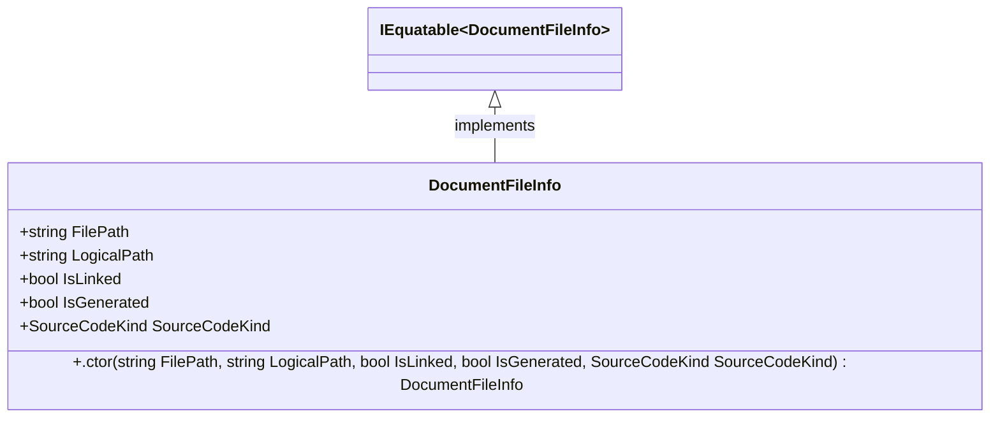

<div id="FileNameUtilities-class-diagram"></div>

##### `FileNameUtilities` class diagram

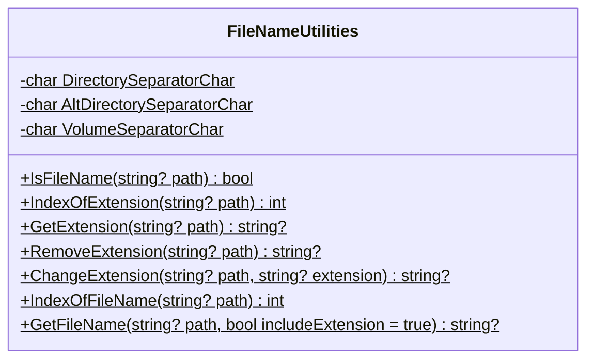

<div id="FileUtilities-class-diagram"></div>

##### `FileUtilities` class diagram

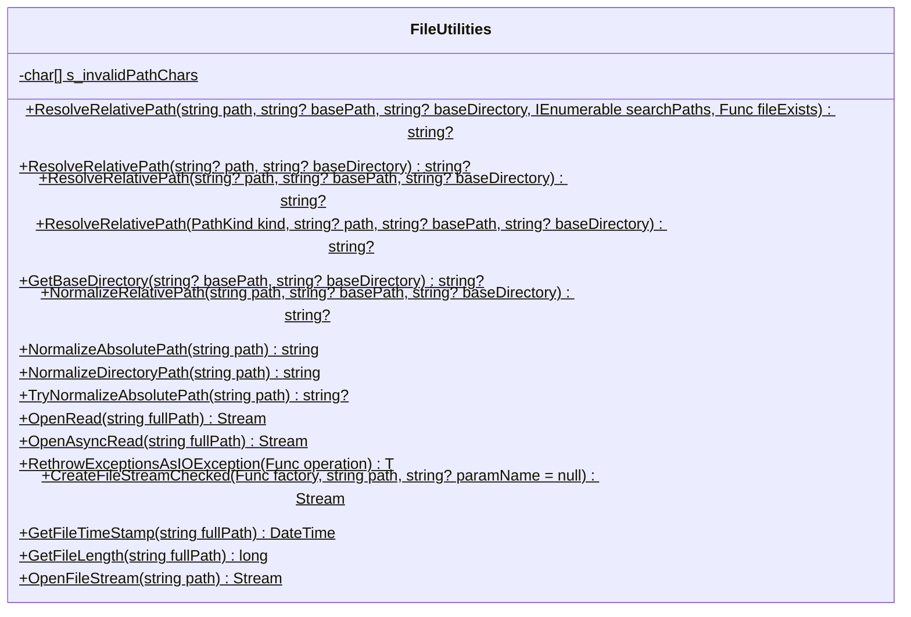

<div id="Hash-class-diagram"></div>

##### `Hash` class diagram

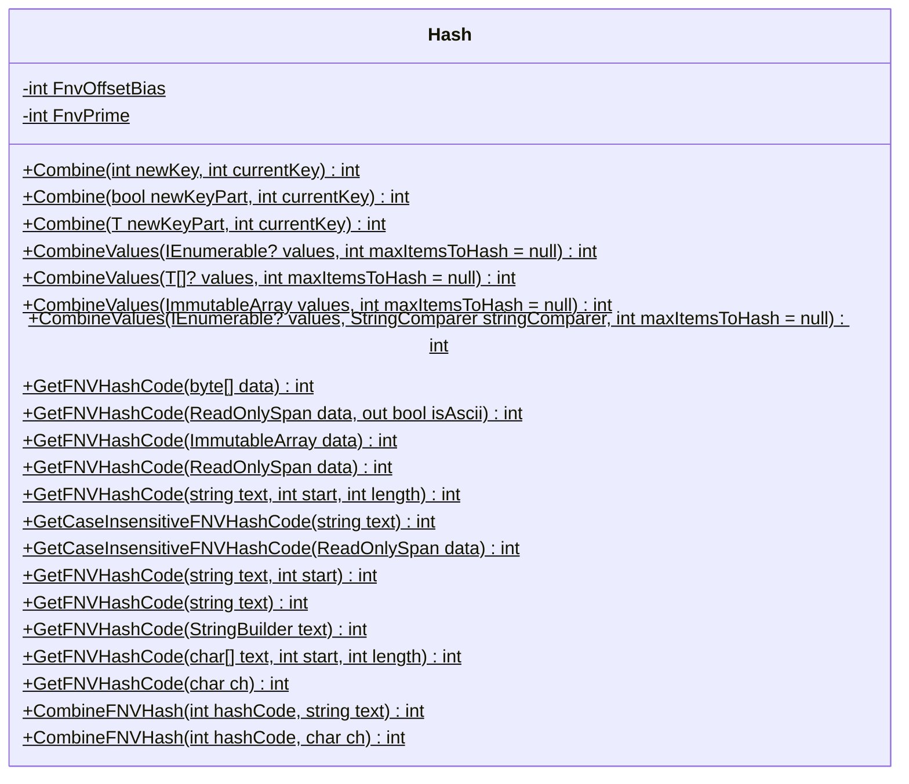

<div id="PathUtilities.PathComparer-class-diagram"></div>

##### `PathUtilities.PathComparer` class diagram

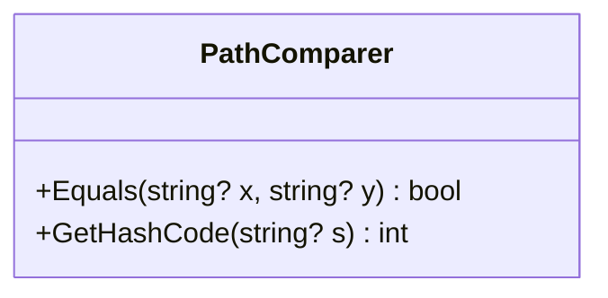

<div id="PathKind-class-diagram"></div>

##### `PathKind` class diagram

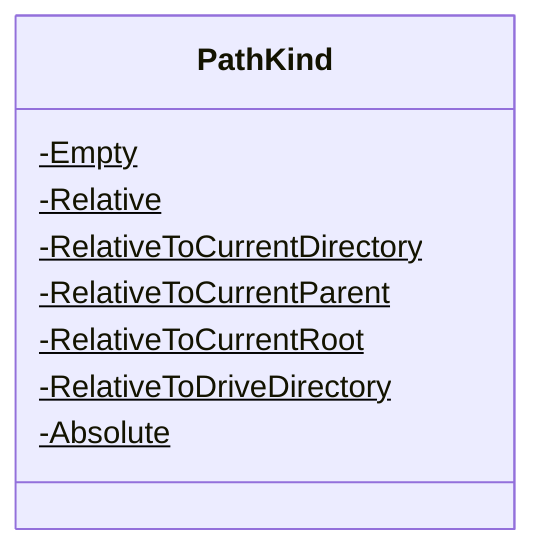

<div id="PathUtilities-class-diagram"></div>

##### `PathUtilities` class diagram

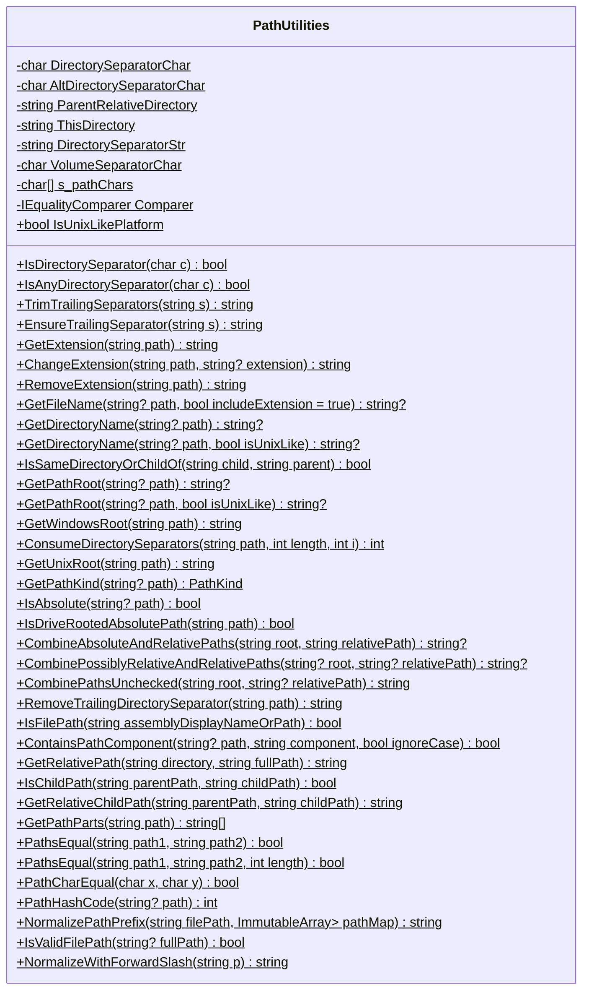

<div id="PlatformInformation-class-diagram"></div>

##### `PlatformInformation` class diagram

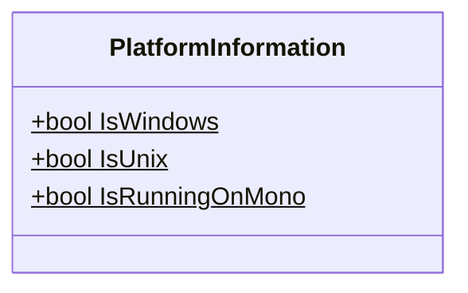

<div id="ProjectFileInfo-class-diagram"></div>

##### `ProjectFileInfo` class diagram

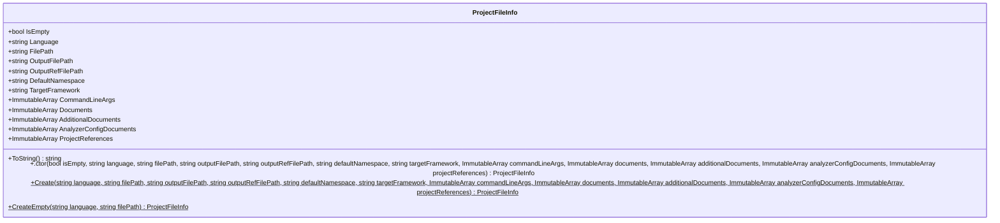

<div id="ProjectFileReference-class-diagram"></div>

##### `ProjectFileReference` class diagram

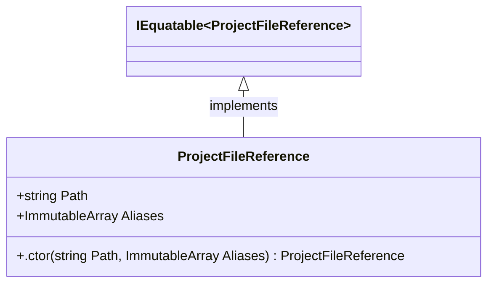

<div id="ProjectLoader-class-diagram"></div>

##### `ProjectLoader` class diagram

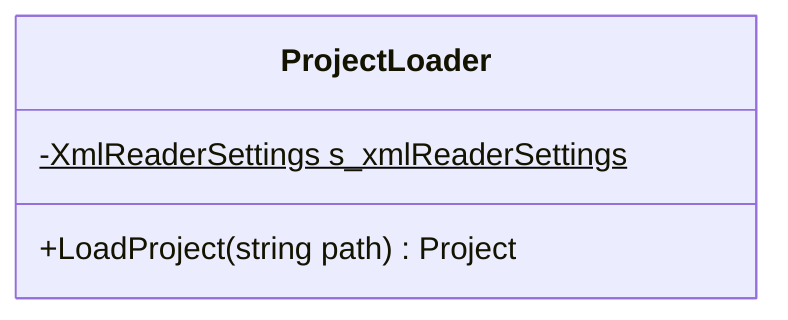

<div id="ProjectWorkspace-class-diagram"></div>

##### `ProjectWorkspace` class diagram

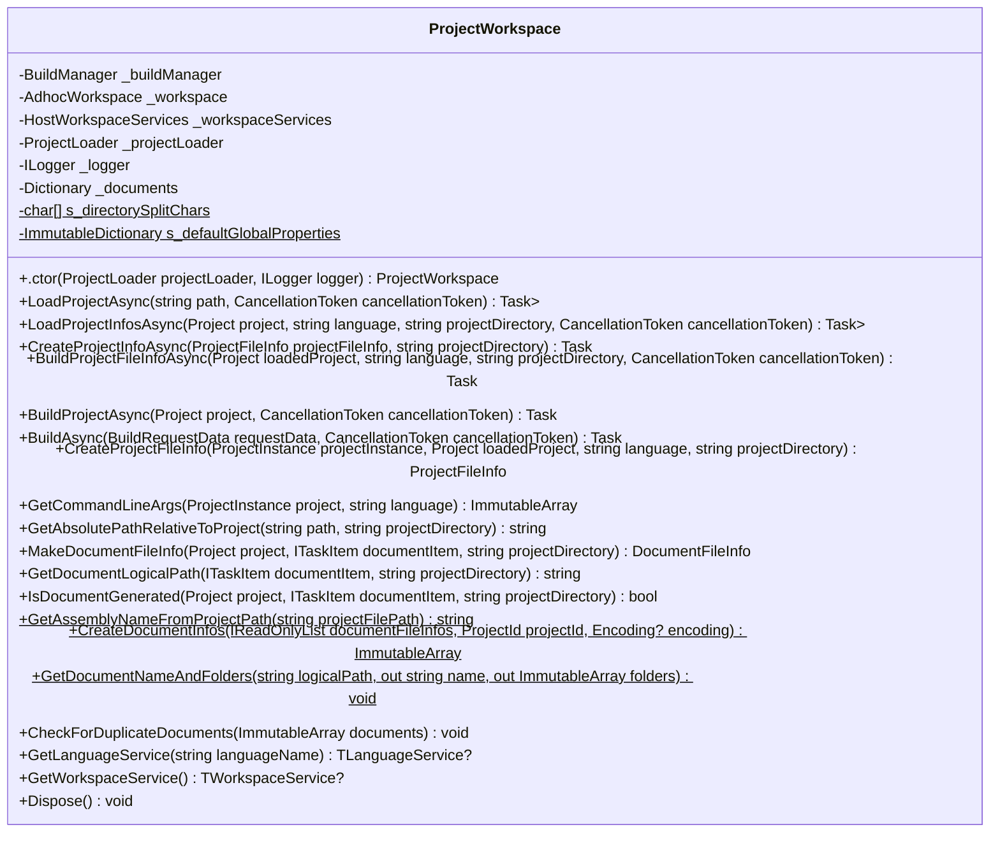

<div id="ServiceCollectionExtensions-class-diagram"></div>

##### `ServiceCollectionExtensions` class diagram

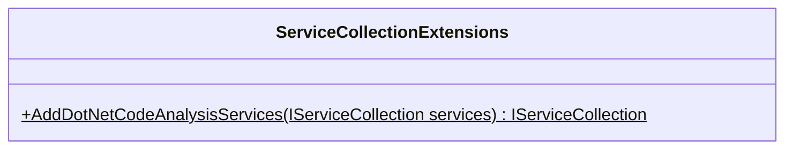

<div id="PathUtilities.TestAccessor-class-diagram"></div>

##### `PathUtilities.TestAccessor` class diagram

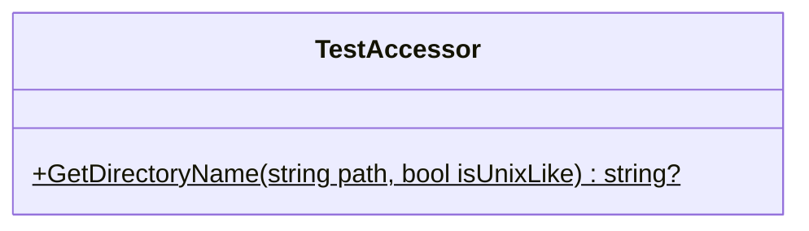

<div id="CSharpDefaults-class-diagram"></div>

##### `CSharpDefaults` class diagram

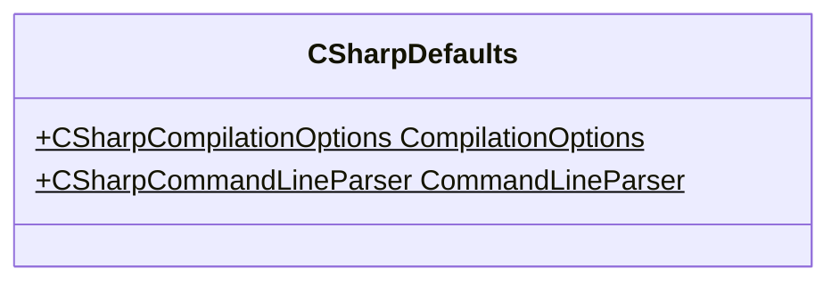

<div id="VisualBasicDefaults-class-diagram"></div>

##### `VisualBasicDefaults` class diagram

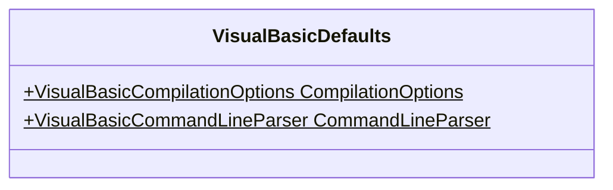

<div id="ProjectMetricDataAnalyzer-class-diagram"></div>

##### `ProjectMetricDataAnalyzer` class diagram

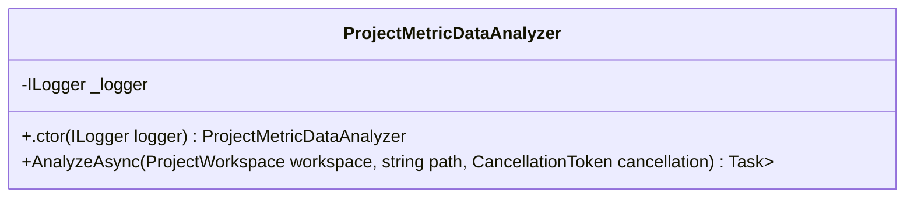

<div id="CodeAnalysisMetricDataExtensions-class-diagram"></div>

##### `CodeAnalysisMetricDataExtensions` class diagram

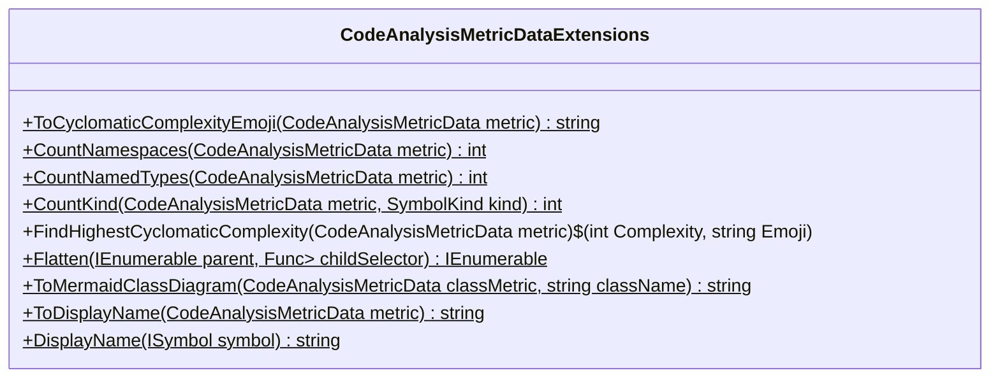

<div id="CodeMetricsReportExtensions-class-diagram"></div>

##### `CodeMetricsReportExtensions` class diagram

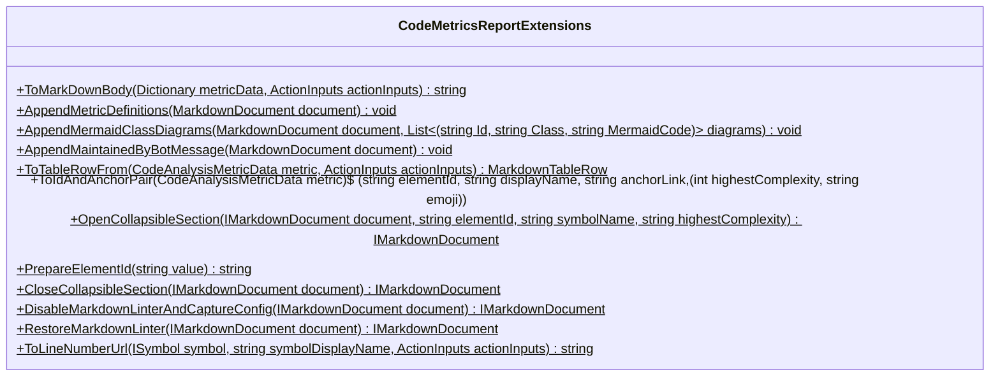

<div id="ServiceCollectionExtensions-class-diagram"></div>

##### `ServiceCollectionExtensions` class diagram

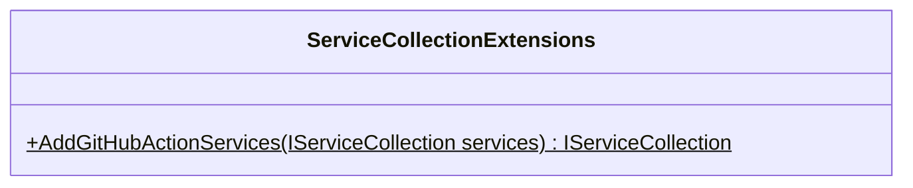

<div id="ActionInputs-class-diagram"></div>

##### `ActionInputs` class diagram

```mermaid
classDiagram
class ActionInputs{
    -string _repositoryName
    -string _branchName
    +string Owner
    +string Name
    +string Branch
    +string Directory
    +string WorkspaceDirectory
    +.ctor() ActionInputs
    +ParseAndAssign(string? value, Action<string> assign)$ void
}

```

*This file is maintained by a bot.*

<!-- markdownlint-restore -->
