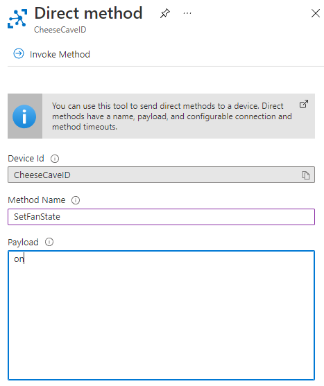

---
languages:
- csharp
products:
- dotnet
- azure-iot-hub
page_type: sample
name: "End-to-end .NET IoT and Azure IoT Hub example"
urlFragment: "dotnet-iot-end-to-end"
description: "A sample console application that shows combines learnings from two Microsoft Learn modules."
---

# End-to-end .NET IoT and Azure IoT Hub example

This sample console application provides an example that combines learnings from the following two Microsoft Learn modules:

- [Construct Internet of Things devices using the .NET IoT Libraries](https://aka.ms/learn-dotnet-iot)
- [Remotely monitor and control devices with Azure IoT Hub](https://aka.ms/learn-azure-iot-hub)

> [!IMPORTANT]
> It is **strongly** recommended that you complete the two list Microsoft Learn modules before using this sample.

## Running the sample

1. Provision an Azure IoT Hub resource and device as described in [Exercise - Create an Azure IoT Hub, and a device ID, using the Microsoft Azure portal](https://docs.microsoft.com/learn/modules/remotely-monitor-devices-with-azure-iot-hub/2-create-iot-hub-device-id).
1. In *Program.cs*, replace `YOUR DEVICE CONNECTION STRING HERE` with your device connection string from the previous step.
1. Construct a device as described in [Exercise: Construct IoT hardware](https://docs.microsoft.com/learn/modules/create-iot-device-dotnet/2-construct-iot-hardware).
1. Deploy the app to your device as described in [Exercise: Deploy app to Raspberry Pi](https://docs.microsoft.com/learn/modules/create-iot-device-dotnet/5-deploy-app-raspberry-pi).
1. Run the app as described in [Exercise: Test the app](https://docs.microsoft.com/learn/modules/create-iot-device-dotnet/6-test-raspberry-pi)

You will be able to interact with the device in the Azure portal using **direct methods** and **device twins**. The *cheesecaveoperator* back-end app is optional.

