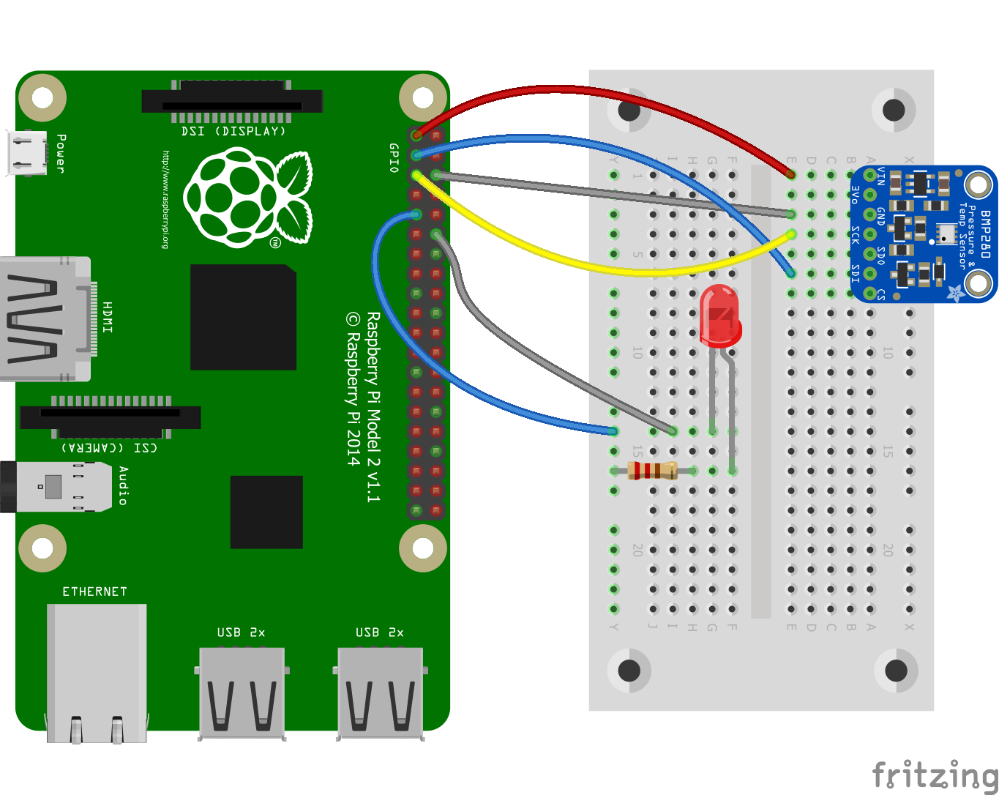
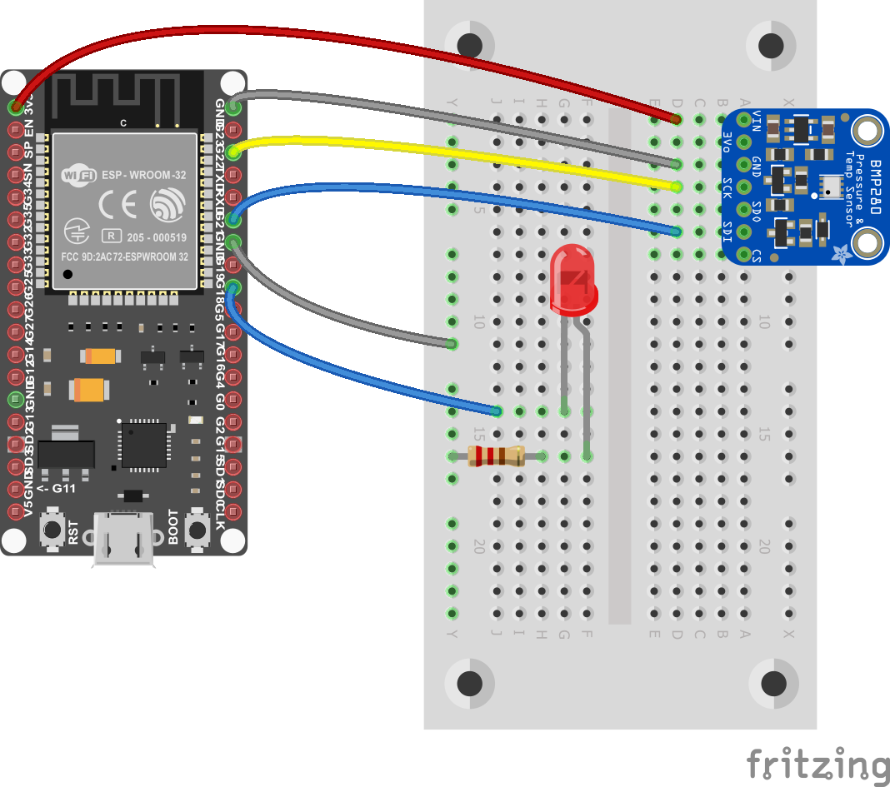
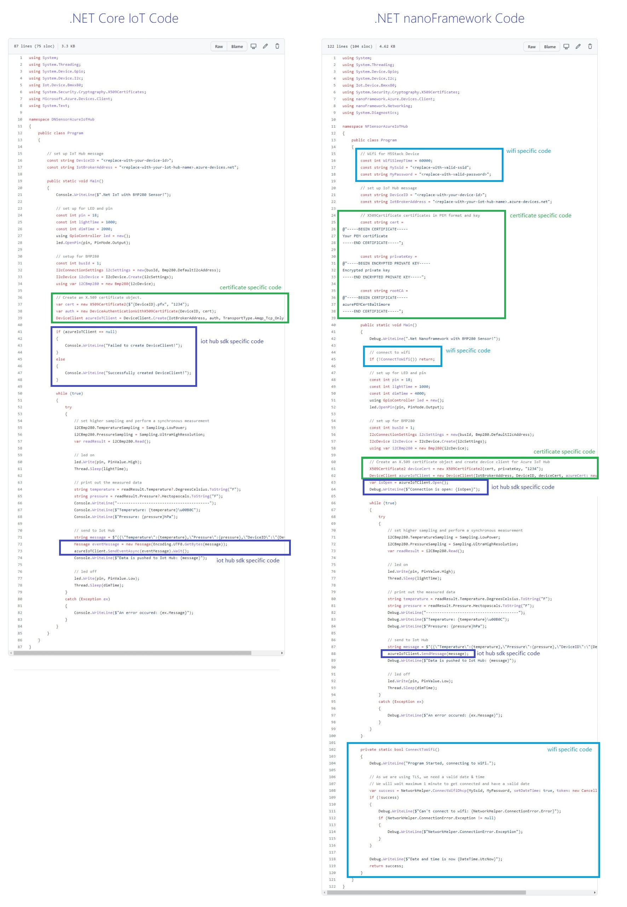

---
languages:
- csharp
products:
- dotnet
- azure-iot-hub
page_type: sample
name: "Compare .NET nanoFramework with .NET IoT"
urlFragment: "compare-nanoframework-with-dotnet-core-iot"
description: "A sample solution and documentation for comparing .NET nanoFramework and .NET IoT platforms. For this documentation same sample application with an identical scenario is created on both platforms, M5Stack with .NET nanoFramework and Raspberry Pi 2 (or above) with .Net IoT"
---

# Compare .NET nanoFramework with .NET IoT

## What's .NET nanoFramework

[.NET nanoFramework](https://www.nanoframework.net/) is a free and Open Source platform that enables the writing of managed code applications for constrained embedded devices such as Micro Controller Unit (MCU) like ESP32, STM32, NXP or TI. It is suitable for many types of projects including IoT sensors, wearables, academic proof of concept, robotics, hobbyist/makers creations or even complex industrial equipment.

It makes the development for such platforms easier, faster and less costly by giving embedded developers access to modern technologies and tools used by desktop application developers. Developers can harness the powerful and familiar Microsoft Visual Studio IDE and their .NET C# knowledge to quickly write code without having to worry about the low-level hardware intricacies of a microcontroller. Desktop .NET developers will feel "at home" and are able to use their skills in embedded systems development, enlarging the pool of qualified embedded developers.

There are great examples of .NET nanoFramework in production such as highligted `"Show dotnet"`: [Running my .NET nanoFramework for 8 years on a battery](https://devblogs.microsoft.com/dotnet/show-dotnet-running-my-net-nanoframework-for-8-years-on-a-battery/). This gives an example of production products running .NET nanoFramework and connected to Azure IoT.

This solution includes .NET IoT and .NET nanoFramework samples to compare two platforms and see maximum reusability. Any .NET developer can easily jump start to nanoFramework with their existing skills. There are some platform specific nuances, you'll learn those below.

## Solution Overview

Sample solution and documentation for comparing .NET nanoFramework and .NET IoT platforms. For this solution same sample application with an identical scenario is created on both platforms, M5Stack with .NET nanoFramework and Raspberry Pi 2 (or above) with .Net IoT.

The sample application includes a scenario on both platforms: Every 3 seconds application reads temperature value from BMP280 sensor and turns on LED after reading the value. Then this temperature value is pushed to IoT Hub with device name and after every successful push LED will blink and turn off. Data will be handled by IoT Hub message routing and will be pushed to blob storage to store.

| .NET IoT                | .NET nanoFramework |
| :----------------------------------------------------------: | :----------------------------------------------------------: |
|  |  |
| [Raspberry Pi with .Net IoT sample project](dotnet-iot) | [M5Stack with .NET nanoFramework sample project](nanoFramework) |

## Certificate

Device certificates are used in these samples. Certificates provide handshake between your device and Azure IoT Hub, and samples explain how to use certificates on both .NET IoT and .NET nanoFramework platforms.

If you don't have any certificate, you can learn how to create certificates following [Create test certificate using OpenSSL and Azure IoT Hub](create-certificate.md) documentation.

## Quick Tips & Differences

| .NET IoT                                                | .NET nanoFramework                                           |
| ------------------------------------------------------------ | ------------------------------------------------------------ |
| Works on powerful boards with memory and CPU                 | Works on low-level microcontroller devices with low memory   |
| Due to device specs it can benefit from all .NET libraries | Uses specific .NET libraries for nanoFramework due to performance on low-level devices |
| You can add your packages via NuGet manager                  | You can add your packages via NuGet manager                  |
| You only need to add `Iot.Device.Bindings` and `System.Device.Gpio` packages for new sensors | You need to add nanoFramework specific packages separately for each sensor |
| You need to setup your deployment and remote debugging manually | Built-in deployment and rich remote debugging experience as Default |
| Deploy the code via SSH connection                           | Deploy the code directly via wired connection                |
| It can use WiFi of Raspberry Pi OS                           | You need to connect your device to WiFi through your code                   |
| You can use `pfx` certificates in your code                  | You can use `PEM`, `crt` and `der` certificates in your code |

## Code Comparison

With this comparison we use exactly the same scenario for .NET IoT and .NET nanoFramework platforms. We're controlling BMP280 temperature & pressure sensor and LED via GPIO pins, connecting to wifi and accessing Azure IoT Hub via client specific Azure SDKs. We're using certificates to identify devices on Azure IoT Hub and grant access based on certificates.

On these platforms most code is the same because of API and SDK API between both platforms are aligned. You can find [nanoFramework.IoT.Device](https://github.com/nanoframework/nanoFramework.IoT.Device) bindings as well with aligned API.
Despite the fact that .NET nanoFramework does not support (yet) generics, away and async, and is a subset of the full framework, the most important API are present and everything is aligned to make it as easy as possible to reuse a maximum of code.

Code may change due to access some platform specific resources and SDKs, but majority of the code lines are identically same in these samples. Let's compare what are the differences on these platforms.

## Conclusion

Both `.NET IoT` and `.NET nanoFramework` are very powerful platforms enable the writing of managed code applications using C# on different boards. Both platforms provide maximum code reusability, there are only small nuances which are due to platform/board specific differences.

Both of them provide access to GPIO pins, pin numbers may change based on device manufacturer.
