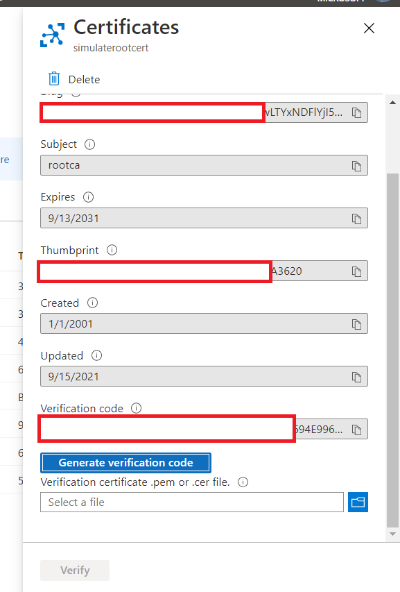
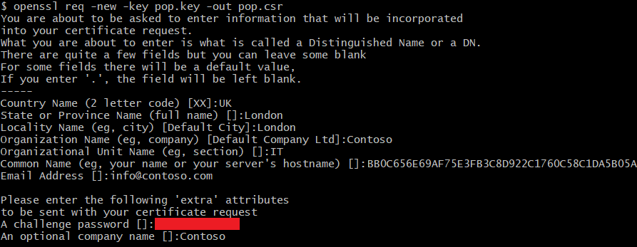
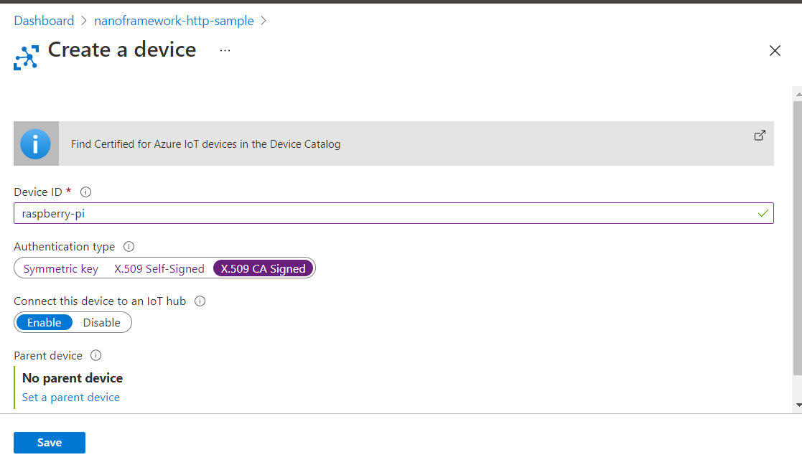
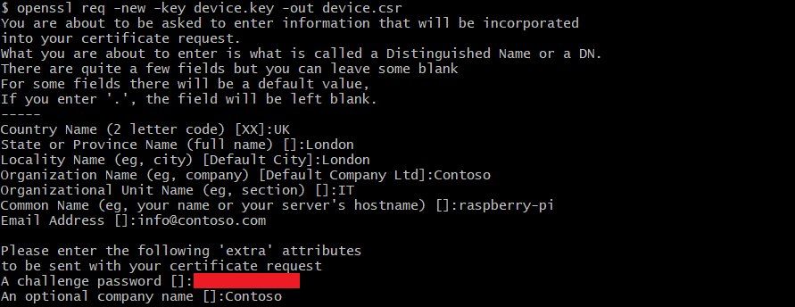

# Create test certificate using OpenSSL and Azure IoT Hub

This documentation is created following [Tutorial: Using OpenSSL to create test certificates](https://docs.microsoft.com/en-us/azure/iot-hub/tutorial-x509-openssl) document.

> NOTE: This example was created using [Cygwin64 for Windows](https://cygwin.com/install.html). Cygwin is an open source tool collection that allows Unix or Linux applications to be run on Windows from within a Linux-like interface. CygWin64 is bundled with OpenSSL. If you are using Linux, you probably already have OpenSSL installed.

Although you can purchase X.509 certificates from a trusted certification authority, creating your own test certificate hierarchy or using self-signed certificates is adequate for testing IoT hub device authentication. The following example uses [OpenSSL](https://www.openssl.org/) and the [OpenSSL Cookbook](https://www.feistyduck.com/library/openssl-cookbook/online/ch-openssl.html) to create a certification authority (CA) and a device certificate. The example then signs the CA and the device certificate into a certificate hierarchy. This is presented for example purposes only.

## Step 1 - Create the root CA directory structure

In Cygwin specify the folder you'll be creating your certificates, for accessing easily to certificates you can select Documents folder with following command:

```bash
cd /cygdrive/c/Users/{your-username}/Documents
```

Create a directory structure for the certification authority.

* The **certs** directory stores new certificates.
* The **db** directory is used for the certificate database.
* The **private** directory stores the CA private key.

```bash
mkdir rootca
cd rootca
mkdir certs db private
touch db/index
openssl rand -hex 16 > db/serial
echo 1001 > db/crlnumber
```

## Step 2 - Create a root CA configuration file

Before creating a CA, create a configuration file and save it as `rootca.conf` in the rootca directory.

```xml
[default]
name                     = rootca
domain_suffix            = example.com
aia_url                  = http://$name.$domain_suffix/$name.crt
crl_url                  = http://$name.$domain_suffix/$name.crl
default_ca               = ca_default
name_opt                 = utf8,esc_ctrl,multiline,lname,align

[ca_dn]
commonName               = "Test Root CA"

[ca_default]
home                     = ../rootca
database                 = $home/db/index
serial                   = $home/db/serial
crlnumber                = $home/db/crlnumber
certificate              = $home/$name.crt
private_key              = $home/private/$name.key
RANDFILE                 = $home/private/random
new_certs_dir            = $home/certs
unique_subject           = no
copy_extensions          = none
default_days             = 3650
default_crl_days         = 365
default_md               = sha256
policy                   = policy_c_o_match

[policy_c_o_match]
countryName              = optional
stateOrProvinceName      = optional
organizationName         = optional
organizationalUnitName   = optional
commonName               = supplied
emailAddress             = optional

[req]
default_bits             = 2048
encrypt_key              = yes
default_md               = sha256
utf8                     = yes
string_mask              = utf8only
prompt                   = no
distinguished_name       = ca_dn
req_extensions           = ca_ext

[ca_ext]
basicConstraints         = critical,CA:true
keyUsage                 = critical,keyCertSign,cRLSign
subjectKeyIdentifier     = hash

[sub_ca_ext]
authorityKeyIdentifier   = keyid:always
basicConstraints         = critical,CA:true,pathlen:0
extendedKeyUsage         = clientAuth,serverAuth
keyUsage                 = critical,keyCertSign,cRLSign
subjectKeyIdentifier     = hash

[client_ext]
authorityKeyIdentifier   = keyid:always
basicConstraints         = critical,CA:false
extendedKeyUsage         = clientAuth
keyUsage                 = critical,digitalSignature
subjectKeyIdentifier     = hash

```

## Step 3 - Create a root CA

First, generate the key and the certificate signing request (CSR) in the rootca directory. This step will ask you PEM pass phrase, enter the value twice

```bash
openssl req -new -config rootca.conf -out rootca.csr -keyout private/rootca.key
```

Next, create a self-signed CA certificate. Self-signing is suitable for testing purposes. Specify the ca_ext configuration file extensions on the command line. These indicate that the certificate is for a root CA and can be used to sign certificates and certificate revocation lists (CRLs). Sign the certificate, and commit it to the database.

```bash
openssl ca -selfsign -config rootca.conf -in rootca.csr -out rootca.crt -extensions ca_ext
```

## Step 4 - Demonstrate proof of possession

You now have a root CA certificate. You can use it to sign device certificates. This certifate must be uploaded to your IoT Hub. To upload and register your CA certificate to your IoT Hub:

1. In the Azure portal, navigate to your IoTHub and select **Settings > Certificates**.

2. Select **Add** to add your new CA certificate.

3. Enter a display name in the **Certificate Name** field, and select the PEM  certificate file you created previously.

    > NOTE: The .crt certificates created above are the same as .pem certificates. You can simply change the extension when uploading a certificate to prove possession, or you can use the following OpenSSL command:

    ```bash
    openssl x509 -in rootca.crt -out rootca.pem -outform PEM
    ```

4. Select **Save**. Your certificate is shown in the certificate list with a status of **Unverified**. The verification process will prove that you own the certificate.

5. Select the certificate to view the **Certificate Details** dialog.

6. Select **Generate Verification Code**. For more information, see [Prove Possession of a CA certificate](https://docs.microsoft.com/en-us/azure/iot-hub/tutorial-x509-prove-possession).

    

7. Copy the verification code to the clipboard. You must set the verification code as the certificate subject. For example, if the verification code is BB0C656E69AF75E3FB3C8D922C1760C58C1DA5B05AAA9D0A, add that as the subject of your certificate as shown in step 9.

8. Generate a private key.

    ```bash
    openssl genpkey -out pop.key -algorithm RSA -pkeyopt rsa_keygen_bits:2048
    ```

9. Generate a certificate signing request (CSR) from the private key. Add the verification code as the subject of your certificate.

    ```bash
    openssl req -new -key pop.key -out pop.csr

      -----
      Country Name (2 letter code) [XX]:.
      State or Province Name (full name) []:.
      Locality Name (eg, city) [Default City]:.
      Organization Name (eg, company) [Default Company Ltd]:.
      Organizational Unit Name (eg, section) []:.
      Common Name (eg, your name or your server hostname) []:BB0C656E69AF75E3FB3C8D922C1760C58C1DA5B05AAA9D0A
      Email Address []:
      Please enter the following 'extra' attributes
      to be sent with your certificate request
      A challenge password []:
      An optional company name []:

    ```

    

10. Create a certificate using the root CA configuration file and the CSR for the proof of possession certificate.

    ```bash
    openssl ca -config rootca.conf -in pop.csr -out pop.crt -extensions client_ext
    ```

11. Select the new certificate in the **Certificate Details** view. To find the PEM file, navigate to the certs folder.

12. After the certificate uploads, select **Verify**. The CA certificate status should change to **Verified**.

## Step 8 - Create a device in your IoT Hub

Navigate to your IoT Hub in the Azure portal and create a new IoT device identity with the following values:

1. Provide the **Device ID** that matches the subject name of your device certificates. In the following sample we'll use **"raspberry-pi"** as device id.

1. Select the **X.509 CA Signed** authentication type.

1. Select **Save**.

    

## Step 9 - Create a client device certificate

To generate a client certificate, you must first generate a private key. The following command shows how to use OpenSSL to create a private key. Create the key in the subca directory.

```bash
openssl genpkey -out device.key -algorithm RSA -pkeyopt rsa_keygen_bits:2048
```

Create a certificate signing request (CSR) for the key. You do not need to enter a challenge password or an optional company name. You must, however, enter the device ID in the common name field. In our case we picked **"raspberry-pi"** as device ID, we'll use this id in the common name field.

```bash
openssl req -new -key device.key -out device.csr

-----
Country Name (2 letter code) [XX]:.
State or Province Name (full name) []:.
Locality Name (eg, city) [Default City]:.
Organization Name (eg, company) [Default Company Ltd]:.
Organizational Unit Name (eg, section) []:
Common Name (eg, your name or your server hostname) []: raspberry-pi
Email Address []:

Please enter the following 'extra' attributes
to be sent with your certificate request
A challenge password []:
An optional company name []:

```



Check that the CSR is what you expect.

```bash
openssl req -text -in device.csr -noout
```

Send the CSR to the CA for signing. Specify `client_ext` in the `-extensions` switch. Notice that the `Basic Constraints` in the issued certificate indicate that this certificate is not for a CA. If you are signing multiple certificates, be sure to update the serial number before generating each certificate by using the openssl `rand -hex 16 > db/serial` command.

```bash
openssl ca -config rootca.conf -in device.csr -out device.crt -extensions client_ext
```

## Step 10 - Create `pfx` certificate for device

After creating certificates and keys using `openssl`, now it is time to create PFX certificate files for devices using PEM and Key files. When you run these commands, you're prompted to create a password. Make a note of the password, you need it in the next step.

Use key and the latest pem file in certs folder.

```bash
openssl pkcs12 -export -out raspberry-pi.pfx -inkey device.key -in certs/***.pem
```

## Step 11 - Test `pfx` device certificate

Go to [Testing Certificate Authentication](https://docs.microsoft.com/en-us/azure/iot-hub/tutorial-x509-test-certificate) to determine if your certificate can authenticate your device to your IoT Hub.
