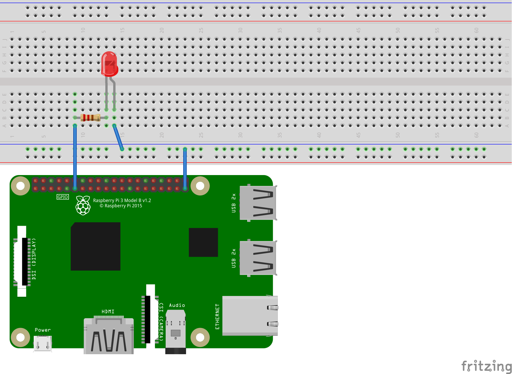

# Blink an LED with .NET Core on a Raspberry Pi

This [sample](Program.cs) demonstrates blinking an LED at a given interval. It repeatedly toggles a GPIO pin on and off, which powers the LED. This sample also demonstrates the most basic usage of the [.NET Core GPIO library](https://dotnet.myget.org/feed/dotnet-corefxlab/package/nuget/System.Devices.Gpio).

### Code

The following code provides write access to a GPIO pin (GPIO 17 in this case):

```csharp
GpioController controller = new GpioController(PinNumberingScheme.Gpio);
GpioPin ledPin = controller.OpenPin(17, PinMode.Output);
```

Given a `GpioPin`, the following code blinks the LED on a schedule for an indefinite duration (forever):

```csharp
while (true)
{
    Console.WriteLine($"Light for {lightTime}ms");
    ledPin.Write(PinValue.High);
    Thread.Sleep(lightTime);
    Console.WriteLine($"Dim for {dimTime}ms");
    ledPin.Write(PinValue.Low);
    Thread.Sleep(dimTime);
}
```

### Breadboard layout

The following [fritzing diagram](rpi-led.fzz) demonstrates how you should wire your device in order to run the [program](Program.cs). It uses the GND and GPIO 17 pins on the Raspberry Pi.



## Hardware elements

The following elements are used in this sample:

* [Diffused LEDs](https://www.adafruit.com/product/297)

## Resources

* [Using .NET Core for IoT Scenarios](../README.md)
* [All about LEDs](https://learn.adafruit.com/all-about-leds)