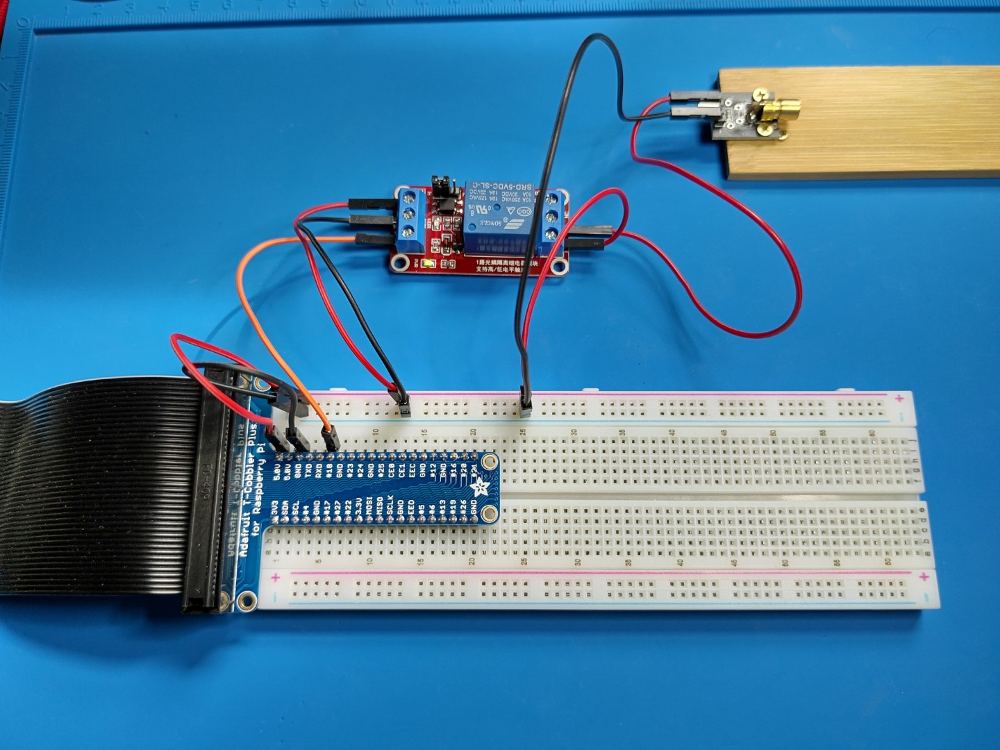

---
languages:
- csharp
products:
- dotnet
page_type: sample
name: "Morse Code in .NET with GPIO"
urlFragment: "morse-dotnet"
description: "Send and receive Morse code with single board computers (like Raspberry Pi), lasers, and .NET."
---

# Morse Code in .NET with GPIO

This sample consists of two apps:

- **MorseSend**: A .NET console app that uses GPIO to send Morse code to a receiver.
- **MorseReceive**: A .NET console app that uses GPIO to receive Morse code from a sender.

## But why? 🤔

This sample is a fun way to learn about GPIO and .NET. It's also a good way to learn about the [Morse code](https://en.wikipedia.org/wiki/Morse_code) alphabet.

## Video demonstration

[You can see Morse.NET in action in this video](https://learn.microsoft.com/shows/dotnet-iot-for-beginners/general-purpose-inputoutput-read-input-with-gpio-and-dotnet-dotnet-iot-for-beginners#time=6m4s).

## Limitations

The sender app is fully functional. The receiver app works well with the sender app, but it probably wouldn't work very well with a human telegraph operator. The receiver app expects precise timing between the on and off states of the laser. A human operator would probably be more likely to vary the timing between on and off states, which would make the receiver app less reliable.

## Building the sender hardware

The sending device uses a a single GPIO pin to send Morse code. The pin is connected to a relay, which toggles a laser on and off. The laser is pointed at the laser receiver.

The relay and the laser are both powered by the 5V pin (red) on the device. The relay is controlled by GPIO pin 18 (orange). The relay completes the circuit between the 5V pin and the laser.

The code to toggle the relay on and off is based on the [Blink an LED](https://learn.microsoft.com/dotnet/iot/tutorials/blink-led) tutorial.

## Building the receiver hardware

The receiver is connected in the same manner as in the [Use GPIO for binary input](https://learn.microsoft.com/dotnet/iot/tutorials/gpio-input#laser-tripwire) tutorial.

The laser receiver module is powered by 5V power. The output pin (yellow) on the receiver module is passed through a [voltage divider](https://www.seeedstudio.com/blog/2019/10/09/voltage-dividers-everything-you-need-to-know/) to reduce the 5V output voltage below 3.3V, which is the maximum allowed by Raspberry Pi for input. The output of the voltage divider (green) is connected to GPIO pin 21.

## Running the sample

Deploy the apps to your devices as described in [Deploy .NET apps to Raspberry Pi](https://learn.microsoft.com/dotnet/iot/deployment). The apps use separate pins for sending and receiving, so you can run both apps on the same device if needed, but we think it's more fun to run them on separate devices.

The MorseSend app prompts for text input, which is displayed as it is received and parsed by the MorseReceive app.
