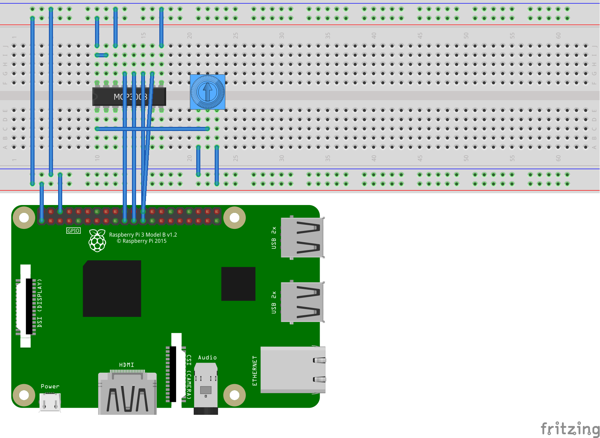

# Reading Analog Input from a Potentiometer

You can use .NET Core to read analog values from a [potentiometer](https://en.wikipedia.org/wiki/Trimmer_(electronics)), like a [volume control](https://www.adafruit.com/product/356).

The Rasperry Pi cannot read analog values directly so relies on an analog to digital converter, like the [MCP3008 ADC](https://www.adafruit.com/product/856). The MCP3008 supports the SPI interface. The 10-bit chip can be accessed as an SPI device or manually via raw GPIO pins. Both options are demonstrated.

## Accessing the MCP3008 via SPI

The Raspberry Pi has support for SPI. You need to [enable the SPI interface on the Raspberry Pi](https://www.raspberrypi-spy.co.uk/2014/08/enabling-the-spi-interface-on-the-raspberry-pi/) since it is not enabled by default.

You can use the following code to [access the MCP3008 via SPI](Program.cs#L17-L22):

```csharp
var connection = new SpiConnectionSettings(0,0);
connection.ClockFrequency = 1000000;
connection.Mode = SpiMode.Mode0;
var spi = new UnixSpiDevice(connection);
var mcp = new Mcp3008(spi);
```

The following pin layout can be used (also shown in a [fritzing diagram](rpi-trimpot-spi.fzz)):

* MCP3008 VDD to RPi 3.3V
* MCP3008 VREF to RPi 3.3V
* MCP3008 AGND to RPi GND
* MCP3008 DGND to RPi GND
* MCP3008 CLK to RPi SCLK
* MCP3008 DOUT to RPi MISO
* MCP3008 DIN to RPi MOSI
* MCP3008 CS/SHDN to RPi CE0




## Accessing the MCP3008 via GPIO

You can also access the MCP3008 via GPIO pins, implementing SPI manually. This method is referred to as [bit-banging](https://en.wikipedia.org/wiki/Serial_Peripheral_Interface#Example_of_bit-banging_the_master_protocol).

You can use the following code to [access the MCP3008 via GPIO](Program.cs#L29-L30):

```csharp
GpioController controller = new GpioController(PinNumberingScheme.Gpio);
var mcp = new Mcp3008(controller, 18, 23, 24, 25);
```

The following pin layout can be used (also shown in a [fritzing diagram](rpi-trimpot-gpio.fzz)):

* MCP3008 VDD to RPi 3.3V
* MCP3008 VREF to RPi 3.3V
* MCP3008 AGND to RPi GND
* MCP3008 DGND to RPi GND
* MCP3008 CLK to RPi pin 18
* MCP3008 DOUT to RPi pin 23
* MCP3008 DIN to RPi pin 24
* MCP3008 CS/SHDN to RPi pin 25


## Processing the data

Independent of the way in which you access the MCP3008 chip, the code to process its results is the same, which follows.

```csharp
while (true)
{
    double value = mcp.Read(0);
    value = value / 10.24;
    value = Math.Round(value);
    Console.WriteLine(value);
    Thread.Sleep(500);
}
```

The chip is 10-bit, which means that it will generate values from 0-1023 (recall that 2^10 is 1024). We can transform the value to a more familiar 0-100 scale by dividing the 10-bit value by 10.24.

## Hardware elements

The following elements are used in this sample:

* [Potentiometer](https://www.adafruit.com/product/356)
* [MCP3008](https://www.adafruit.com/product/856)

## References

The sample is based on following resources:

* [Analog Inputs for Raspberry Pi Using the MCP3008](https://learn.adafruit.com/reading-a-analog-in-and-controlling-audio-volume-with-the-raspberry-pi) 
* [Raspberry Pi Analog to Digital Converters](https://learn.adafruit.com/raspberry-pi-analog-to-digital-converters).
* [Raspbery Pi Analog Input with MCP3008](https://gist.github.com/ladyada/3151375)
* [MCP3008.py](https://github.com/adafruit/Adafruit_Python_MCP3008/blob/master/Adafruit_MCP3008/MCP3008.py)

Major thanks to [Adafruit](https://adafruit.com) for providing python implementations, which were ported to C# for this sample.

See [Using .NET Core for IoT Scenarios](../README.md) for more samples.
