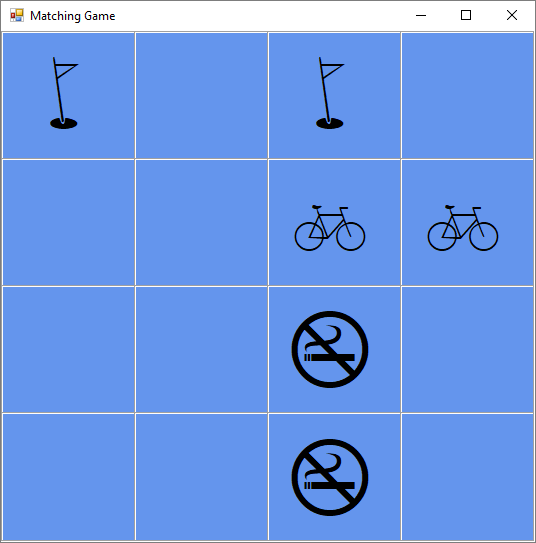

# Matching Game Sample

These samples are used in the upgrade documentation for [Windows Forms](https://learn.microsoft.com/dotnet/desktop/winforms/migration/how-to-upgrade-winforms) and [WPF](https://learn.microsoft.com/dotnet/desktop/wpf/migration/how-to-upgrade-wpf). It demonstrates a match-2 memory game where you try to match tiles in the fewest moves possible.

