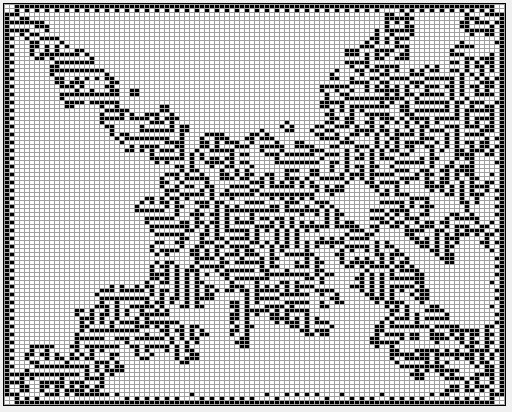

---
languages:
- vb
products:
- dotnet
- windows-forms
page_type: sample
name: ".NET Core Windows Forms Conway's Game Of Life (Visual Basic)"
urlFragment: "Conway's-Game-of-Life-vb"
description: "The Game of Life, also known simply as Life, is a cellular automaton devised by the British mathematician John Horton Conway in 1970."
---
# Conway's Game of Life

## Requires

- Visual Studio 2019 or later to edit the GUI in the solution designer
- .NET Core 3.1

## License

- MIT

## Technologies

- Windows Forms
- .NET Core

## Topics

- OOP
- Extended Controls

## Updated

- 02/08/2020

## Description

This Windows Forms sample was ported to .NET Core from a [previous .NET Framework 4.5 sample](https://github.com/microsoftarchive/msdn-code-gallery-community-a-c/tree/master/Conway's%20Game%20of%20Life/%5BVB%5D-Conway's%20Game%20of%20Life/VB).  This illustrates how to use Visual Basic in Windows Forms in .NET Core 3.1. Visual Basic support for Windows Forms is not fully supported in .NET Core 3.1, but the features used in this sample work fine.

The Game of Life, also known simply as Life, is a cellular automaton devised by the British mathematician John Horton Conway in 1970.

The "game" is a zero-player game, meaning that its evolution is determined by its initial state, requiring no further input. One interacts with the Game of Life by creating an initial configuration and observing how it evolves, or, for advanced "players", by creating patterns with particular properties. This is a simplified version allowing 3 distinct seeds, a diamond shape, a square, and a cross shape.

The universe of the Game of Life is an infinite two-dimensional orthogonal grid of square cells, each of which is in one of two possible states, alive or dead, or "populated" or "unpopulated". Every cell interacts with its eight neighbors, which are the cells that are horizontally, vertically, or diagonally adjacent. At each step in time, the following transitions occur:

1. Any live cell with fewer than two live neighbors dies, as if caused by underpopulation.
2. Any live cell with two or three live neighbors lives on to the next generation.
3. Any live cell with more than three live neighbors dies, as if by overpopulation.
4. Any dead cell with exactly three live neighbors becomes a live cell, as if by reproduction.

The initial pattern constitutes the seed of the system. The first generation is created by applying the previous rules simultaneously to every cell in the seed. Births and deaths occur simultaneously, and the discrete moment at which this happens is sometimes called a tick (in other words, each generation is a pure function of the preceding one). The rules continue to be applied repeatedly to create further generations.

