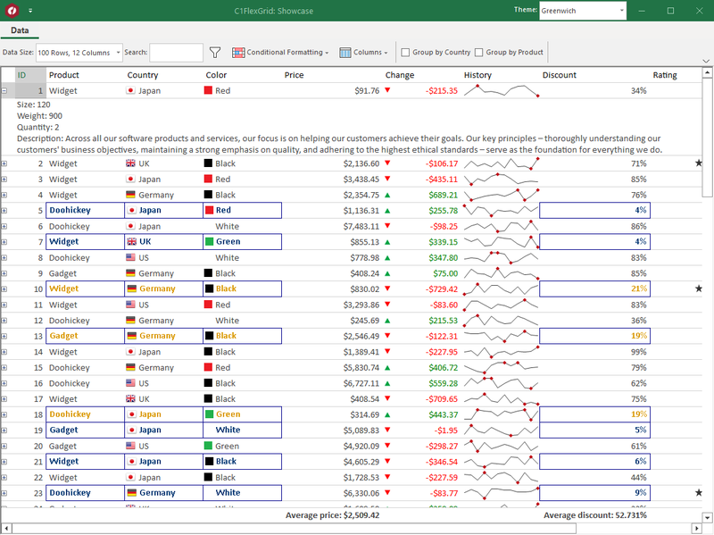
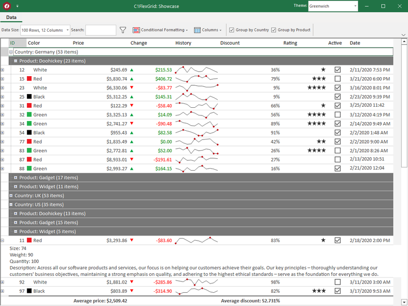

---
languages:
- csharp
products:
- windows-forms
page_type: sample
name: "Windows Forms Datagrid Sample: FlexGrid Showcase (C#)"
urlFragment: "winforms-flexgridshowcase-cs"
description: ".NET 6.0 Windows Forms application that demonstrates how to use GrapeCity FlexGrid"
---

# FlexGrid Showcase Demo

This sample is a .NET 6.0 Windows Forms application that demonstrates how to use GrapeCity [`FlexGrid`](https://www.grapecity.com/componentone/winforms-ui-controls/flexgrid-winforms-data-grid), a Windows Forms Datagrid control.

The sample shows different operations with `FlexGrid`:

* Search
* Formatting
* Data grouping

There are several GrapeCity packages used in the sample:

* [`FlexGrid`](https://www.nuget.org/packages/C1.Win.FlexGrid)
* [`Ribbon`](https://www.nuget.org/packages/C1.Win.Ribbon)
* [`RulesManager`](https://www.nuget.org/packages/C1.Win.RulesManager)
* [`SuperTooltip`](https://www.nuget.org/packages/C1.Win.SuperTooltip)
* [`Themes`](https://www.nuget.org/packages/C1.Win.Themes)

For more code examples and tutorials see the [documentation](https://www.grapecity.com/componentone/docs/win/online-flexgrid/overview.html).

Mentioned controls and packages require a valid license for runtime testing and distribution.

Also there is 30-day trial for evaluation purposes.

For more licensing information visit [www.grapecity.com/componentone/licensing](https://www.grapecity.com/componentone/licensing).

## Sample prerequisites

This sample is written in C# and targets .NET 6.0 running on Windows. It requires the [.NET 6.0 SDK](https://dotnet.microsoft.com/download/dotnet/6.0).

## Building the sample

To download and run the sample, follow these steps:

01. Download and unzip the sample.
01. In Visual Studio 2022 or later:
    01. On the menu bar, choose **File** > **Open** > **Project/Solution**.
    01. Navigate to the folder that holds the unzipped sample code, and open the project (*.csproj*) file.
    01. Choose the <kbd>F5</kbd> key, or <kbd>Ctrl</kbd>+<kbd>F5</kbd> keys, to run the project.
01. From the command line:
    01. Navigate to the folder that holds the unzipped sample code.
    01. At the command line, type `dotnet run`.
