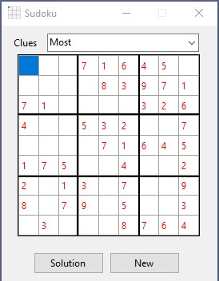

---
languages:
- vb
products:
- dotnet
- windows-forms
page_type: sample
name: ".NET Core Windows Forms Sudoku (Visual Basic)"
urlFragment: "sudoku-vb"
description: "Sudoku is a number puzzle game, played on a nine by nine cell grid"
---
# Sudoku

## Requires

- Visual Studio 2019 or later to edit the GUI in the solution designer.
- .NET Core 3.1

## License

- MIT

## Technologies

- Windows Forms
- .NET Core

## Topics

- Puzzle Game

## Updated

- 12/12/2019

## Description

This Windows Forms sample was ported to .NET Core 3.1 from a [previous .NET Framework 4.5 sample](https://github.com/microsoftarchive/msdn-code-gallery-community-s-z/tree/master/Sudoku).

Sudoku is a number puzzle game, played on a nine by nine cell grid. Within that grid, there are nine sub-regions consisting of three cells by three cells. In this version, there are three levels of difficulty, which are Most clues, Medium clues, and Least clues.

- Most clues gives you five random numbers from each nine cell horizontal row.
- Medium clues gives you four random numbers from each nine cell horizontal row.
- Least clues gives you three random numbers from each nine cell horizontal row.

The object of the game is to fill the remaining cells with the numbers from one to nine. But each horizontal row can only contain one instance of each number, and each vertical row can only contain one instance of each number.

There is also the further added constraint that each sub-region can also only contain one instance of each number.

In a new game, the given numbers (clues) are rendered in red text. The numbers that you enter are rendered in black text.

There is a Solution button, which when clicked, reveals the correct answer to the puzzle. Any numbers that you have added that are correctly placed, remain rendered with black text. Any cells that were empty or had an incorrect number will display the correct number rendered in blue text.
Any cells that were empty or had an incorrect integer will display the correct integer rendered in blue text.

You win the game if after clicking the Solution button, all of the numbers are rendered in either black or red text.
