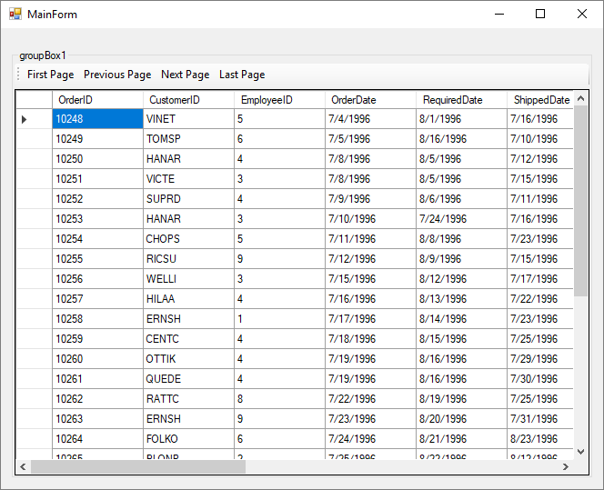
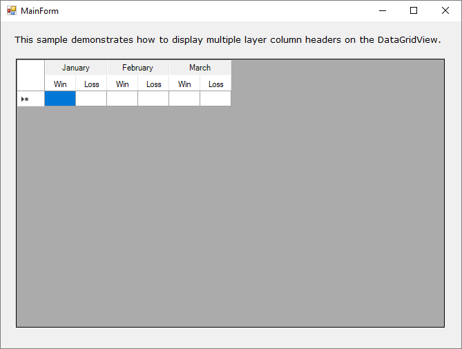

# DataGridView Samples

This Windows Forms sample was ported to .NET Core from
[a previous .NET Framework 4.5 sample](https://github.com/microsoftarchive/msdn-code-gallery-microsoft/tree/master/OneCodeTeam/Windows%20Forms%20DataGridView%20demo%20(CSWinFormDataGridView)).

This sample demonstrates DataGridView usage in a .NET Core 3 Windows Forms app.
It contains five separate sample DataGridView scenarios. Uncomment the one
you wish to run in `Program.cs`:

* CustomDataGridViewColumn
* DataGridViewPaging
* EditingControlHosting
* JustInTimeDataLoading
* MultipleLayeredColumnHeader

Note that the DataGridViewPaging and JustInTimeDataLoading samples use the
NorthWind sample database (in order to have a large amount of data to display
in the grid view). Before running these scenarios, follow the
[these instructions](https://docs.microsoft.com/dotnet/framework/data/adonet/sql/linq/downloading-sample-databases)
to set up the NorthView sample database and make sure that the connection
strings in those scenarios are updated to match where the sample database
is deployed (possibly replacing `localhost` with `(LocalDb)\MSSQLLocalDB`,
for example).

