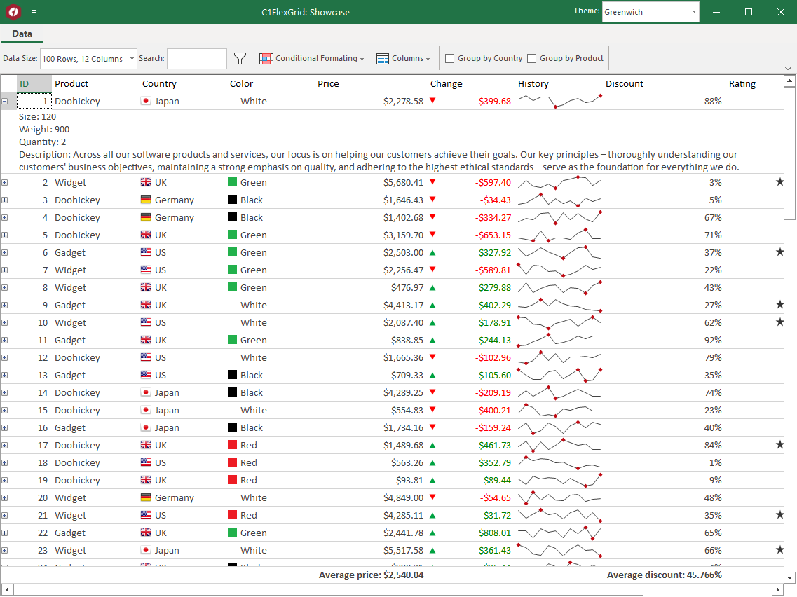
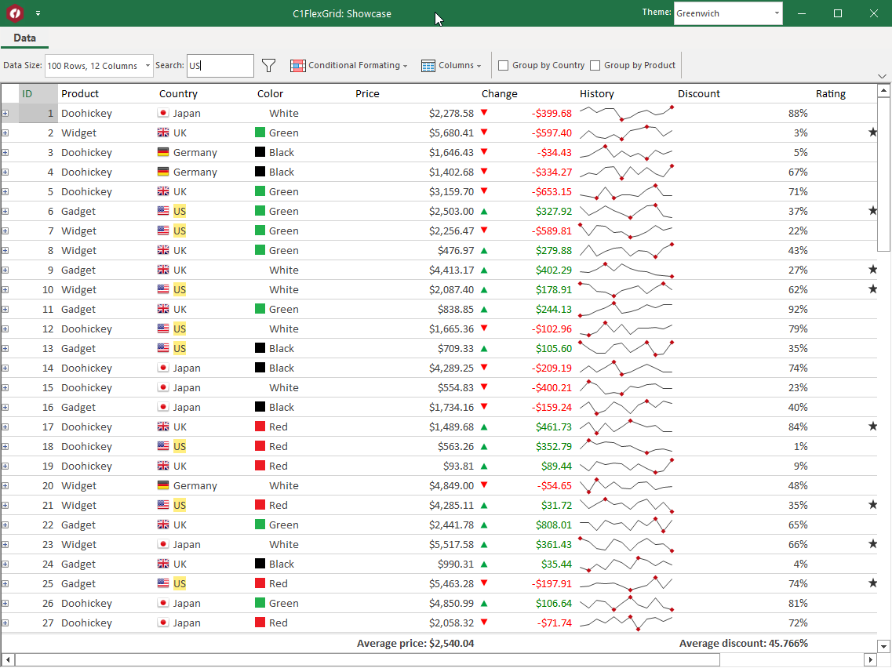
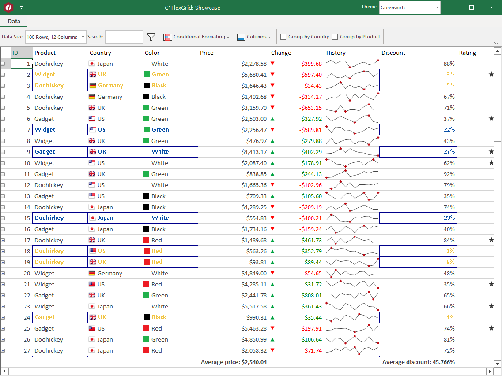
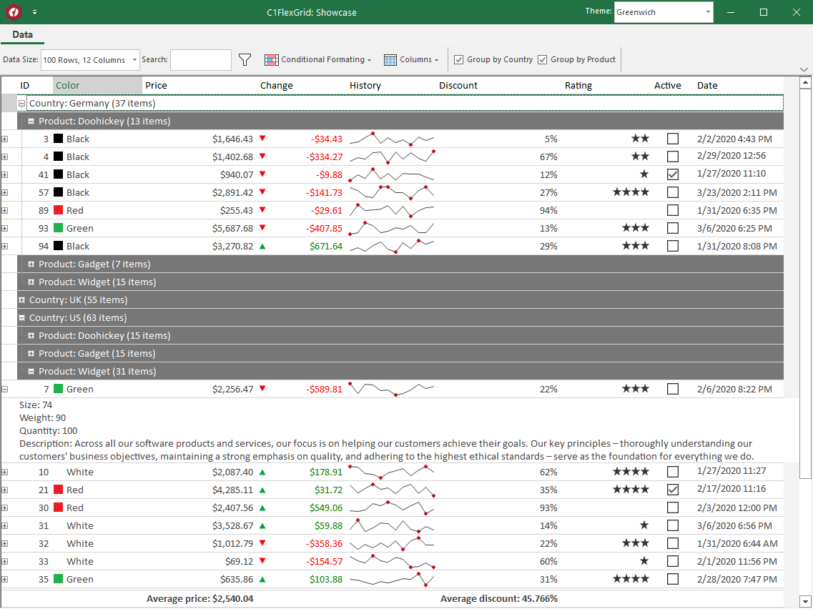

# FlexGrid Sample

This Windows Forms sample demonstrates GrapeCity C1FlexGrid and C1Ribbon usage in a .NET 5 WinForms app.

The sample shows different operations with mentioned controls:

* Search
* Formatting
* Data grouping

