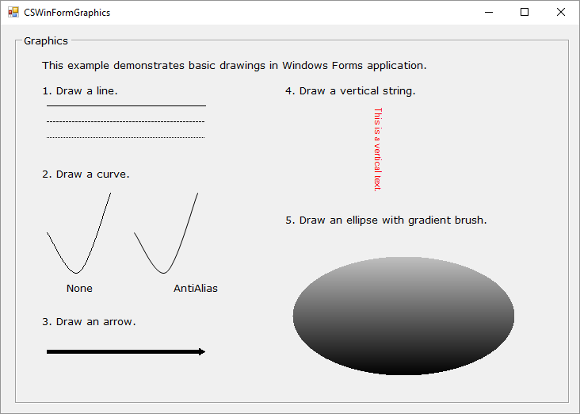

# Windows Forms Graphics Demo

This Windows Forms sample was ported to .NET Core from a previous .NET Framework 4.5 sample.

This sample demonstrates the fundamentals of GDI+ programming with Windows Forms Graphics APIs. GDI+ allows you to create graphics, draw text, and manipulate graphical images as objects. GDI+ is designed to offer performance as well as ease of use. You can use GDI+ to render graphical images on Windows Forms and controls.

In this sample, there are 5 examples:

1. **Draw a Line** Demonstrates how to draw a solid/dash/dot line.
1. **Draw a Curve** Demonstrates how to draw a curve, and the difference between antialiasing rendering mode and no antialiasing rendering mode.
1. **Draw an Arrow** Demonstrates how to draw an arrow.
1. **Draw a Vertical String** Demonstrates how to draw a vertical string.
1. **Draw a Ellipse With Gradient Brush** Demonstrates how to draw a shape with gradient effect.



## Using the Code

### Example 1: Draw a Line

Use Graphics.DrawLine method with a normal pen to draw a normal line

```CSharp
// Draw a solid line starts at point(40,90) and ends at point(240,90).
e.Graphics.DrawLine(p, 40, 90, 240, 90);
```

Use Graphics.DrawLine method with a dash pen to draw a dashed line

```CSharp
// Draw a dash line starts at point(40,110) and ends at point(240,110).
p.DashStyle = System.Drawing.Drawing2D.DashStyle.Dash;
e.Graphics.DrawLine(p, 40, 110, 240, 110);
```

Use Graphics.DrawLine method with a dot pen to draw a dotted line

```CSharp
// Draw a dot line starts at point(40,130) and ends at point(240,130).
p.DashStyle = System.Drawing.Drawing2D.DashStyle.Dot;
e.Graphics.DrawLine(p, 40, 130, 240, 130);
```

### Example 2: Draw a Curve

Create a collection of points for the curve;

```CSharp
// Specify a collection of points for the curve.
Point[] ps = new Point[]{
   new Point(40,250),
   new Point(80,300),
   new Point(120,200)};

// Specify a collection of points for the curve.
Point[] ps2 = new Point[]{
   new Point(150,250),
   new Point(190,300),
   new Point(230,200)};
```

Draw a curve without antialiasing rendering mode.

```CSharp
e.Graphics.DrawCurve(p, ps);
```

Draw a curve with antialiasing rendering mode.

```CSharp
// Draw a curve with antialiasing rendering mode.
e.Graphics.SmoothingMode = System.Drawing.Drawing2D.SmoothingMode.AntiAlias;
e.Graphics.DrawCurve(p, ps2);
```

### Example 3: Draw an Arrow

Create a pen with EndCap property set to ArrowAnchor;

Use the pen created at step #1 to draw the line;

```CSharp
// To draw an arrow, set the EndCap property to LineCap.ArrowAnchor for the pen.
p.EndCap = System.Drawing.Drawing2D.LineCap.ArrowAnchor;
p.Width = 5;
e.Graphics.DrawLine(p, 40, 400, 240, 400);
```

### Example 4: Draw a Vertical String

Create a StringFormat object with FormatFlags property set to StringFormatFlags.DirectionVertical;

Pass the StringFormat object create at step #1 to the Graphics.DrawString method to draw vertical string.

```CSharp
using (SolidBrush br = new SolidBrush(Color.Red))
{
    StringFormat sf = new StringFormat();
    sf.FormatFlags = StringFormatFlags.DirectionVertical;


    e.Graphics.DrawString(
        "This is a vertical text.",
        this.Font, br, 450, 90, sf);
}
```

### Example 5: Draw a Ellipse With Gradient Brush

Create a LinearGradientBrush object;

Pass the LinearGradientBrush object create at step #1 to the  Graphics.FillEllipse method to draw a ellipse with gradient color effect.

```CSharp
// Specify a bound for the ellipse.
Rectangle r = new Rectangle(350, 280,280,150);


// Use a LinearGradientBrush to draw the ellipse.
using (LinearGradientBrush br =
    new LinearGradientBrush(
        r, Color.Silver,
        Color.Black,
        LinearGradientMode.Vertical))
{
    e.Graphics.FillEllipse(br, r);
}
```

## More Information

[GDI+ Graphics](https://docs.microsoft.com/windows/desktop/gdiplus/-gdiplus-about-gdi--about)
