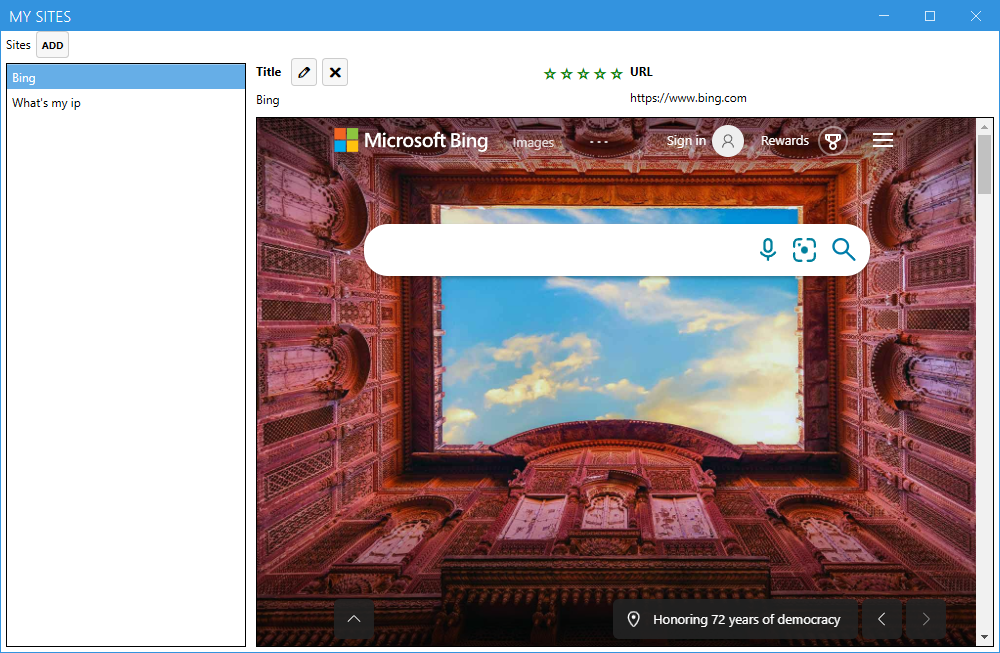

# WebSite Ratings Sample

These two samples are referenced by the [.NET Upgrade Assistant](https://docs.microsoft.com/dotnet/core/porting/upgrade-assistant-winforms-framework) article.

- The .NET Framework version of the app is available in the *framework* folder.
- The .NET 6 version of the app is available in the *net* folder.

This app uses a SQLite database to store a list of websites. Each website can have a rating of 1-5 stars.

